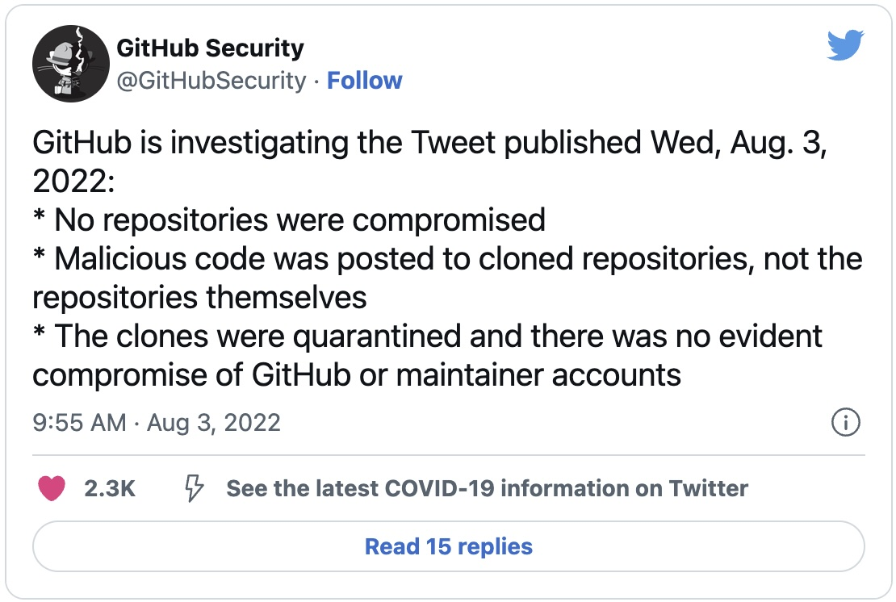

theme: Plain Jane
footer: 
slide-transition: true
build-list: true

[.header: alignment(left)]

<br>
<br>
<br>
# Git Commit Spoofing in Open Source<br>No False Alarm
## Gabriel L. Manor @ Permit.io Meet & Greet, January 2024

---

[.header: alignment(center)]

# Social Media Overflow Attack

---

^ Original tweet

[.text: color(#fff)]


[.column]


[.column]
c

---

^ original tweet with GH tweet

[.column]


[.column]


---

^ Let's Reproduce


---

[.header: alignment(center)]

# Git Phising

## The attacker **fake** the repository and **spoof** the malicious commit

# Multi Vector Attack

---

^ Single factor attack - Dependabot pretend - Pretendabot

## Git Phishing as a Single Vector Attack


Source: https://io.permit.io/pretendabot

---

[.footer: ]
[.header: alignment(left)]


<br>
<br>
<br>
<br>

# Gabriel L. Manor
## Director of DevRel @ Permit.io
### Not an ethical hacker, zero awards winner, dark mode hater.

---

^ First problem with Git - collaboration vs security

[.header: alignment(center)]

# Collaboration *vs.* Security

---

[.autoscale: true]
[.build-lists: true]

# Collaboration - Default Security Features

- Encryption
- Strong Auth
- Fine-grained Access Control
- Data Erasure
- Least Privileged
- Content Scanning

---

# Git - Default Security Features

[.build-lists: true]

- Nothing

---

[.header: alignment(center)]

# Public *!=* Open


---

^ Another default configuration problem - Alexa 1M example

### The Ultimate `View Source` Breach - Git Misconfiguration


Source: https://io.permit.io/alexa\_1m\_git

---

^ Git isn't only code, but also organizations - they are lack in security too Daimler

## Open-House Strategy - Daimler Code Leak


Source: https://io.permit.io/daimler-git

---


---


Source: https://io.permit.io/mercedes-fail-again

---

^ Supply chain vector - codecov breach

# Supply Chain Attack - Codecov Breach


---

[.header: alignment(center)]

# Should We Stop Using Git?

---

[.header: alignment(center)]

# Should We Stop Using Planes?


---

[.column]


[.column]


io.permit.io/cis-git

---

^ Make sure every code you owned managed in SCM and associate with task
Define a code review strategy (2 users), make sure there is no way to bypass it
Enable branch protection with all the relevant security and stability tests
Do not allow force pushes and push directly to branches
Verify commits are signed to users before push
Monitor continuously for ghost branches and make sure branches are up to date before merge
Make sure there are code owners for sensitive code

[.autoscale: true]

# Code Changes

[.column]
- Sign Commits
- Branch Protection with Tests
- Monitor Old Branches
- Changes are Correlated to Tasks

[.column]
- Create Code Owners
- No Force Pushes
- Code Review Strategy

---

^ Carefully manage public repositories, make sure security.md included
Keep least privilege principle on all CRUD actions of repositories
Monitor constantly all the repositories and their forks
Do not leave inactive repositories
Pay extra attention for delete of issues and repos

[.autoscale: true]

# Repository Management
- Security.md
- Least Privilege
- Monitor Forks
- Delete Inactive Repos
- Inspect Delete of Issues & Branches

---

^ Consistently monitor users and teams, make sure you delete inactive users
Users are created only by invitation and require strong identity, access is restricted to IP addresses.
MFA enabled for users and sensitive actions.
Know your administrators, manage their permissions carefully.
Detect anomalous code operations.
Make sure notifications not sends anywhere.

[.autoscale: true]

# Contribution Access

[.column]
- Contribution Access
- Monitor Team's Activities
- Detect Operations Anomaly
- Only Strong Identity Users
- Clean Inactive Users

[.column]
- User Invited to Contribute
- Notifications Control
- Least Privilege Administration
- Enable MFA for Users and Actions

---

^
- Give external application least privilege permissions.
- Only admins allowed to install applications.
- Stale applications are removed completely
- Detect secrets and sensitive credentials in code
- Scan 3rd party libraries for vulnerabilities and licensing
- Scan IaC and CI instructions for misconfiguration
- Scan code for vulnerabilities

[.autoscale: true]

# Code Risks & Third Party

[.column]
- Least Privilege to External Application
- Only Admin Install Applications
- Remove Stale Applications
- Secret & Credential Detection

[.column]
- Vulnerability Scanning
- License Scanning
- IaC & CI Misconfiguration Scanning
- Third Party Assessment

---

^ Pipelines has single responsibility
Configuration is immutable and automated
Everything logged
Access is limited

[.autoscale: true]

# Build Environment

- Single Responsibility Pipelines
- Automated Configuration
- Log Everything
- Limit Access
- Immutable Settings

---

[.autoscale: true]

# Build Workers

[.column]
- Control the network connectivity
- Automate security scanning
- Single use per worker

[.column]
- Workers not pulling data
- All workers configuration saved in SCM
- Workers are monitored

---

[.autoscale: true]

# Pipeline Instructions & Integrity

[.column]
- Restrict Process Triggering Access
- Track Configuration
- Static Scan Configurations
- Secure Output Storage

[.column]
- Define Input and Outputs
- Sign Artifacts
- Lock Dependencies
- Create SBOM

---


---

[.header: alignment(center)]

# **Never**
# Use a Self-Installed Git Server

---

[.header: alignment(left)]

# Default Config Files
## Implement a `Must Have` Policy

[.build-lists: true]

- .gitignore
- SECURITY.md
- LICENSE
- README.md


---

^ Aqua security tool exmaple

Video demo

---

# Chainbench - Git Security Benchmark Tool

[.autoscale: true]
[.build-lists: true]
- Audit and benchmark your Git security posture
- Open source, extensible
- Can run in either organization or repository level
- Run in CI/CD pipelines (GitHub Action available)
- Maintained by Aqua Security

github.com/aquasecurity/chain-bench

---


github.com/step-security

---

# Git - Infrastructure as Code


---


---

```go
default allow := false

allow if {
	some grant in user_is_developer

	input.action == operation.type
	input.environment == operation.destination
}
```

---


[.header: alignment(left)]


<br>
<br>
# Thank You :pray:
## Show your love to OPAL with a GitHub Star :star: :point_right:
### Find more about OPAL on opal.ac
#### Follow me on Twitter @gemanor
