theme: Plain Jane
footer: 
slide-transition: true

[.header: alignment(left)]

 
 
 
#[fit] The Developers’ Framework for Content Creation
## Gabriel L. Manor @ All Things Open 2024

---

[.footer: ]
[.header: alignment(left)]

[.autoscale: true]

## Gabriel L. Manor

**Experience**
Permit.io | VP, Developer Relations
Jan 2023 - Present

Jit | Technical Leader, CTO Office
Mar 2022 - Dec 2022

Palo Alto Networks | Principal Software Engineer
Feb 2021 - Mar 2022

Cisco | Senior Software Engineer, Technical Leader
May 2015 - Feb 2021

Orange | Web & Mobile Developer
Dec 2012 - May 2015

Freelance | Software Developer
Jan 2008 - Dec 2012

---

^ Chart with my blogs

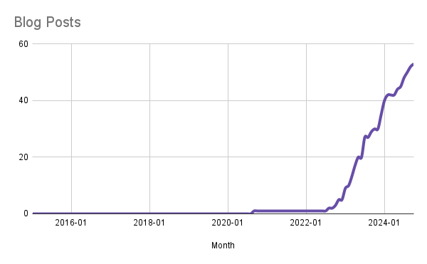

---

^ I started getting paid for writing content and it helped me to think better

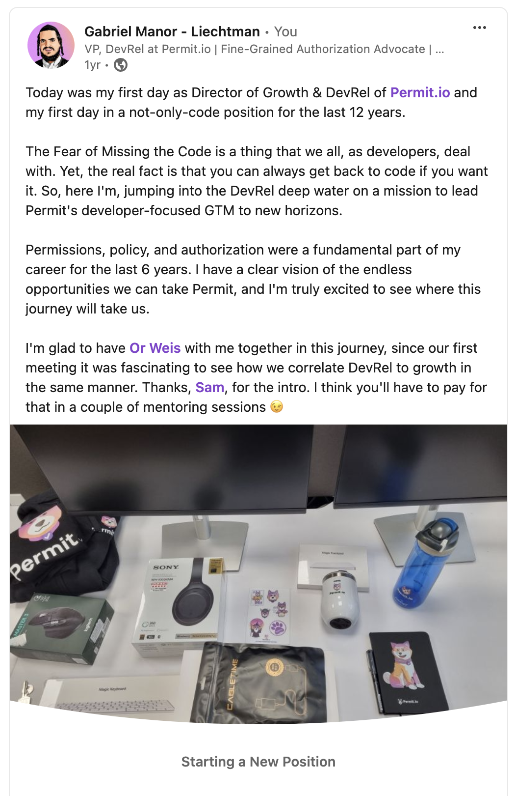

---

^ The Four Enemies: Focus, Consistency, Creativity, Distribution

#[fit] Focus, Consistency, Creativity, Distribution

---

^ Focus - Text

#[fit] **Focus**, Consistency, Creativity, Distribution

---

^ Colorize tasks - Content lifecycle - Kanban

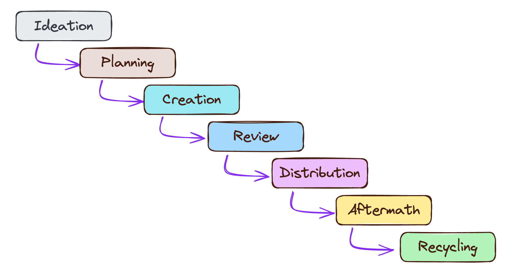

---

^ Short and atomic - Text and flat icons / Emoji
For example, don't sit and write an artile. Set time to write very raw draft, seperate time to edit, etc.

# ⏰ Shorten Your Tasks ⏰

---

^ Respect breaks - Escobar meme

---

^ Consistency - Text

#[fit] Focus, **Consistency**, Creativity, Distribution

---

^ Know your personality - Curators, Explainers, and Visionaries with pictures

# **Who Are You?**

[.text: alignment(center)]

[.column]
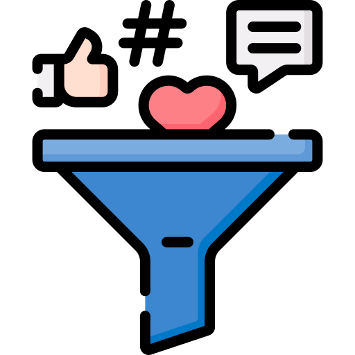
# Curator

_Scott Hanselman_

[.column]

# Explainer

_Alex Xu_

[.column]

# Visionary

_Kelsey Hightower_

---

^ Comfort zone-based consistency - Templating from the article

# Comfort-Zone Based Consistency

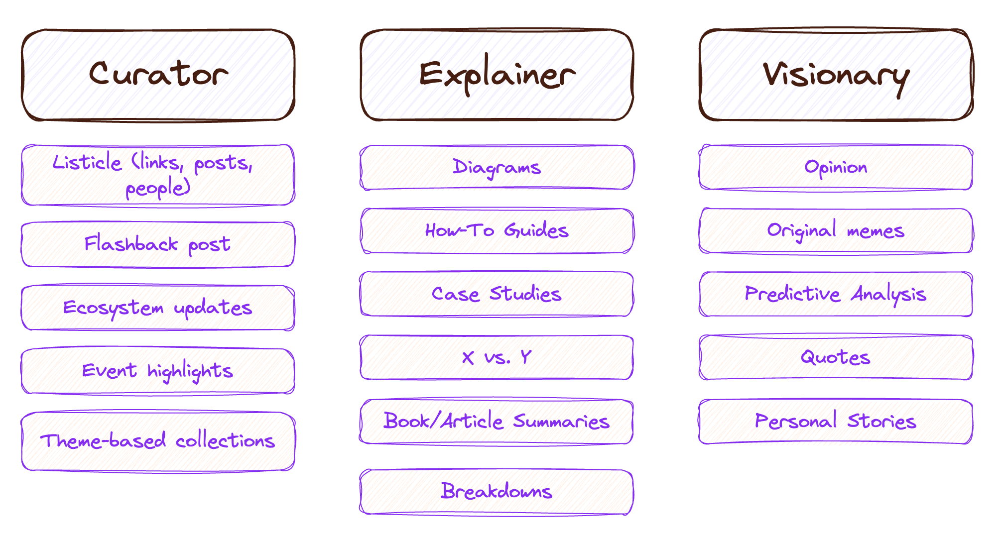

---

[.header: alignment(left)]

Find Your Low-Hanging Fruits

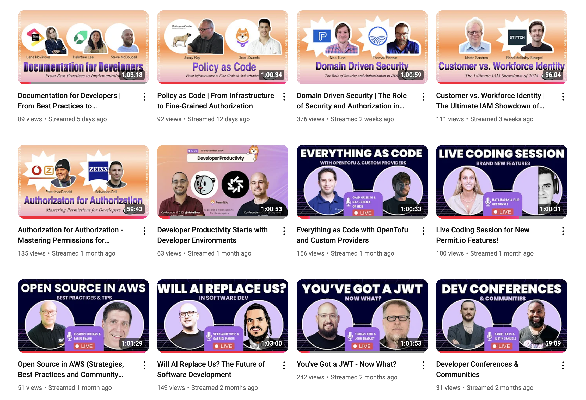

---

^ Kill the FOMO - text and emoji

# Kill the FOMO :gun::gun::gun:

---

^ Creativity

#[fit] Focus, Consistency, **Creativity**, Distribution

---

^ Content sequence - chart from the article
Active listener and a passive creator

# Content Sequence
## 👂 Active Listening, Passive Creation ✏️

---

^ Find the right tools (Notion, recording, etc.) - chart of my article tooling with recorder

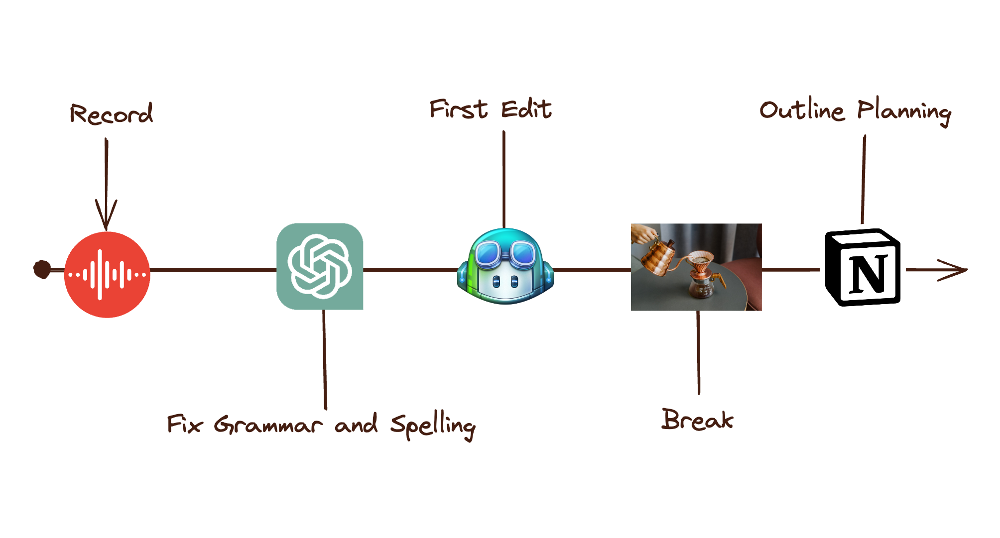

---

^ Cheap thrills -  (listicles for distribution growth) - screenshot from dev.to

[.header: alignment(left)]

# Cheap Thrills

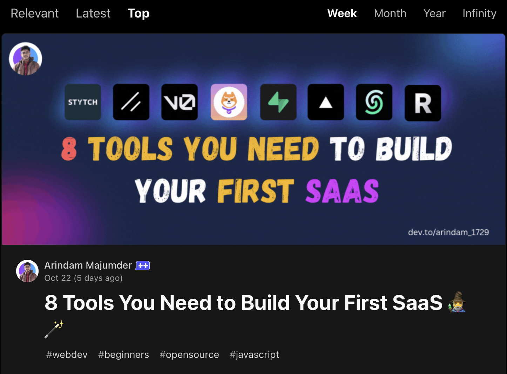

---

^ Distribution

#[fit] Focus, Consistency, Creativity, **Distribution**

---

^ Be open, share your progress

# 💡 One Channel at a Time 💡
## 🌱 Cross-Pollination Growth 🌱

---

# Be Open, Share Your Progress

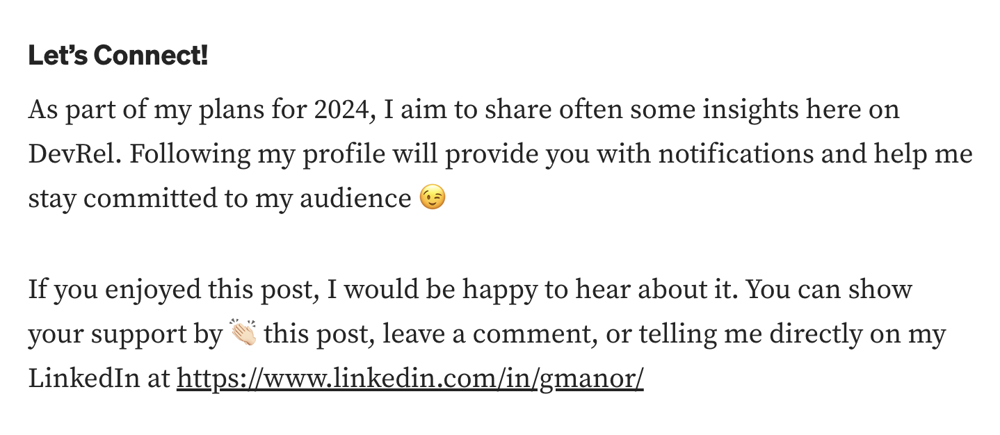

---

^ Haters gonna hate - screenshot from Reddit

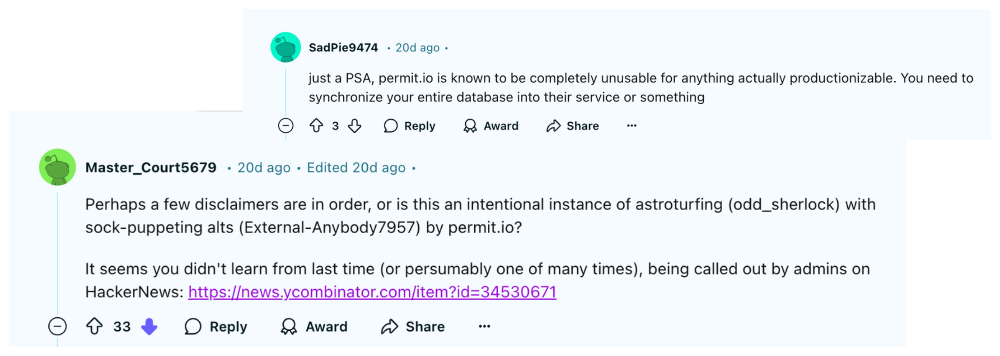

---

^ Cringe isn’t (always) a bad thing - meme

[.header: alignment(left)]

# Cringe isn’t (always) a bad thing

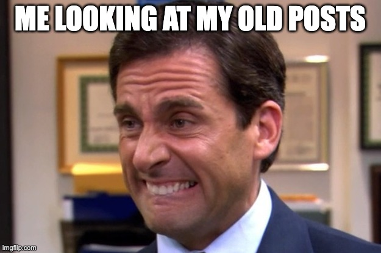

---

[.autoscale: true]
[.header: alignment(left)]

[.column]
## Focus
- Colorize tasks
- Short and atomic tasks
- Respect breaks

## Consistency
- Know your personality
- Comfort-zone based consistency
- Document the Objectives
- Kill the FOMO

[.column]
## Creativity
- Content sequence
- Cheap thrills
- Find the right tools

## Distribution
- One channel at a time
- Be open, share your progress
- Haters gonna hate
- Cringe isn’t (always) a bad thing

---

[.header: alignment(left)]

 
 

# Thank You :pray:
## Read the article :point_right:
### linkedin.com/in/gemanor
### Twitter **@gemanor**
