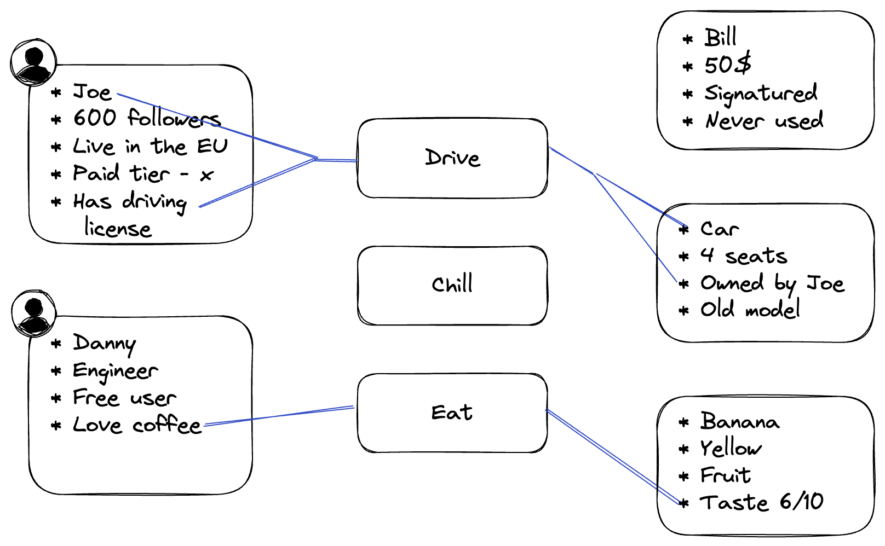

theme: Plain Jane
footer: 
slide-transition: true
header-emphasis: color(#9B5EE5)

[.header: alignment(left)]

^I'm lucky that it is virtual because if not, you'll bite me for using Shift Left

<br>


# Application Code of Conduct – Full Stack Policy as Code
## Gabriel L. Manor

---


^ My name is Gabriel and I'm happy to be with you. First covid, then AI

> AI Is Going to Replace Us
-- Every Developer in 2023


---

^ AI will not replace us


---

^ We should be focused in the business value we deliver, not the technical value

[.header: alignment(left)]
# Agile New Mission


---

^ Case study, access control in the application level

## _Case Study_
# Application-Level Access Control

---

|  | Authentication | Authorization |
| --- | --- | --- |
| Definition | Verifies the identity of a user or system. | Determines what a user or system can do. |
| Purpose | Grants access to the system. | Controls access to resources. |
| Focus | "Who you are." | "What you can do." |
| Process | Verifies credentials (e.g., username/password). | Checks permissions and privileges. |
| Examples | Logging in with a username and password. | Granting read or write access to a file. |
| Goal | Establishes trust and identity. | Ensures appropriate access and usage. |
| Applied to | Users, systems, or devices. | Resources, data, or functionalities. |
| Scope | Typically performed once per session. | Performed for every access attempt. |


---

^ We already out source authentication


---

^ We also should start out source auhtorization

# The Auth Comfort Zone

[.header: alignment(left)]
[.column]
## Authentication 😌
_Verify who the user is_

```javascript
if (!user) {
    return;
}
```

[.column]
## Authorization 😔
_Check what a user can do_

```javascript
if (!allowed(
        user,
        action,
        resource
    )) {
    return;
}
```

---

^ My name is Gabriel, Unfortunatly my last couple of years was around Authorization ___


[.footer: ]
[.header: alignment(left)]


<br>
<br>
<br>
<br>

## Gabriel L. Manor
### Director of DevRel @ Permit.io
#### 🏅 Struggling with authorization for the last 8y
##### Not an ethical hacker, zero awards winner, dark mode hater.

---


^ Jessie got the ticket, looked at their framework, he knows clean code, he implemented nice middleware that support annotations on the API endpoints with the roles, at the end of the sprint they support RBAC and everyone was happy.

```javascript
// Middleware
if (req.user.roles.indexOf(role) === -1) {
    return res.send(403);
}

// Endpoint
@authz('admin')
const Document = () => {
    ...
}
```

---

^ After another week, a new feature added, paid users. Beside of roles, now there is a cross-role concept of paid users, and Jessie need to add it to the RBAC. Not that hard, just support in multiple decorators.

```javascript
// Middleware
const hasRole = roles.filter((r) => (
    req.user.roles.indexOf(role) > -1
))
if (!hasRole) {
    return res.send(403);
}

// Endpoint
@authz('admin')
@authz('paid')
const Document = () => {
    ...
}
```

---

^ But the week after, the PM come and ask for multiple tier of paid users, we want to have different operational for paid users.
Jessie add a nice support in multiple attributes to support such if

```javascript
// Middleware
if (args.length === 2 && req.user[args[0]] !== args[1]) {
    return res.send(403);
}
if (req.user.roles.indexOf(role) > -1) {
    return res.send(403);
}

// Endpoint
@authz('admin')
@authz('location', 'eu')
const Document = () => {
    ...
}
```

---

^The next feature that affect Jessie, was the addition of new attributes to the resources, as it now european users can access only to the european resources. Jessie started to feel the pain, the decorators model isn't work anymore, something should change in the endpoint level itself.

```javascript
// Middleware
if (typeof args[0] === 'object') {
    return AuthzDesicion(args[0])
}
if (args.length === 2 && req.user[args[0]] !== args[1]) {
    return res.send(403);
}
if (req.user.roles.indexOf(role) > -1) {
    return res.send(403);
}

// Endpoint
@authz('admin')
@authz('location', 'eu')
@authz({
    ...
})
const Document = () => {
    ...
}
```

---

^ And this is the first problem we have with implementing authorization.
Instead of designing the permissions model, implementing it independly to the application, people are usually start with the application itself, and designing the generic RBAC into it. Do you remember this ticket? That was the first mistake.

# Implement RBAC to an Application

---

# ~~Implement RBAC to Application~~
# Enforce Permissions in Applications

---

^ Every permissions desicion, starts with the same question

[.header-emphasis: color(#9B5EE5)]
# [fit] User _|_ Action _|_ Resource


---

^ Every permissions desicion, starts with the same question

[.header-strong: color(#000000ff)]
[.header-emphasis: color(#9B5EE5)]
# [fit] Does _[User]_ Allowed to Perform _[Action]_ on _[Resource]_
# [fit] Does a Monkey Allowed to Eat a Banana

---


^ There are 4 commoly used permissions models today, when we want to add AuthZ to application, we should be familiar with them and choose how to implement it with no matte rof the framework or tech stack we use.

[.header: alignment(left)]

## ACL - Access Control List

## RBAC - Role-Based Access Control

## ABAC - Attribute-Based Access Control

## ReBAC - Relationship-Based Access Control

---

^ ACL is the most simple model, it's a list of users and the resources they can access. It's usually implemented in the application level itself, and it's not scalable at all.
Not scalable, usually used in low-performance appliances

[.header: alignment(left)]
# ACL - Access Control List

[.column]


[.column]
* EOL model
* Widely used in IT systems/networks
* No segmentation/attribution support
* Hard to scale

---

^ RBAC is the most common model, it's a list of roles and the resources they can access. It's usually implemented in the application level itself, and it's not scalable at all.

[.header: alignment(left)]
# RBAC - Role Based Access Control

[.column]


[.column]
* The widely-used model for app authorization
* 🤓 Easy to define, use and audit
* No resource inspection
* Limited scalablity

---

^ ABAC is the most complex model, it's a list of rules that define the access to the resources. It's usually implemented in the application level itself, and it's not scalable at all.

[.header: alignment(left)]
# ABAC - Attribute Based Access Control

[.column]


[.column]
* The most robust model for inspection and desicion making
* Configuration could be hard
* Easy to handle multiple data sources
* 🚀 Highly scalable

---

^ ReBAC is the most scalable model, it's a list of roles and the resources they can access. It's usually implemented in the application level itself, and it's not scalable at all.

[.header: alignment(left)]
# ReBAC - Relationship Based Access Control

[.column]


[.column]
* Best fit for consumer-style applications
* Support in reverse indices and search for allowed data
* Easy to scale for users (>1b) hard in desicion's performance
* Expensive in management and maintainance

---

^ Now that Jessie is happy with the understanding of the need in ABAC model, he redesing the middleware in the application so it support the new model, and he is happy again.

```javascript
// Middleware
if (typeof args[0] === 'object') {
    return AuthzDesicion(args[0])
}
if (args.length === 2 && req.user[args[0]] !== args[1]) {
    return res.send(403);
}
if (req.user.roles.indexOf(role) > -1) {
    return res.send(403);
}

// Endpoint
@authz('admin')
@authz('location', 'eu')
@authz({
    ...
})
const Document = () => {
    ...
}
```

---

^ But a week after, a bug came, a user get access to a resource he is not aimed to.


---

^ Jessie was the first to analyze the bug and he discover that a user remove one of the decorator and do the check himself instead of using the framework.

```javascript
// Middleware
if (typeof args[0] === 'object') {
    return AuthzDesicion(args[0])
}
if (args.length === 2 && req.user[args[0]] !== args[1]) {
    return res.send(403);
}
if (req.user.roles.indexOf(role) > -1) {
    return res.send(403);
}

// Endpoint
@authz('admin')
const Document = () => {
    const enrichedUser = getSocialData(req.user);
    if (enrichedUser.lastGeolocation !== 'eu') {
        return;
    }
    ...
}
```

---

^ There is no way to deal with bad developers, but this is the actually the second (and maybe even mainly) problem we have with implementing authorization.
The mixing of policy code inside the application.

[.code-highlight: 15-19]
```javascript
// Middleware
if (typeof args[0] === 'object') {
    return AuthzDesicion(args[0])
}
if (args.length === 2 && req.user[args[0]] !== args[1]) {
    return res.send(403);
}
if (req.user.roles.indexOf(role) > -1) {
    return res.send(403);
}

// Endpoint
@authz('admin')
const Document = () => {
    const enrichedUser = getSocialData(req.user);
    if (enrichedUser.lastGeolocation !== 'eu') {
        return;
    }
    ...
}
```

---

^ You are tired of problems, right? Let's find together a new way to implement authorization.

[.build-lists:true]

# [fit] Authorization Top 5 Best-Practices

- Agnostic to the permissions model
- Seperate policy from code
- Support the whole stack
- Support in the whole authorization lifecycle (author, analyze, audit)
- Unified policy management

---

^ As always, every better software solution, start with a contract. contracts are the best way to make software better, and what better of designing a contract of how to configure policies?

# [fit] Contracts Creates Better Relationships


### 👩🏽‍💻 _Especially in Human <> Machine Relationships_ 🤖

---

^ Today we will cover three permissions contracts that together can solve any kind of authorization problem.

<br>

[.column]
## Open Policy Agent


[.column]
## AWS<br>Cedar


[.column]
## Google Zanzibar


---

^ OPA, stands for Open Policy Agent, is a CNCF project that was created by Styra, it's a general purpose policy engine that can be used to enforce authorization policies in microservices architecture.
OPA contract core is Rego, a policy multi-prupose language that can be used to define policies in a declarative way.


[.column]
```haskell
package app.rbac

import future.keywords.contains
import future.keywords.if
import future.keywords.in

default allow := false

allow if user_is_admin

allow if {
	some grant in user_is_granted
	input.action == grant.action
	input.type == grant.type
}

user_is_admin if "admin" in data.user_roles[input.user]

user_is_granted contains grant if {
	some role in data.user_roles[input.user]
	some grant in data.role_grants[role]
}
```

[.column]
```haskell
package app.abac

import future.keywords.if

default allow := false

allow if user_is_owner

allow if {
	user_is_employee
	action_is_read
}

allow if {
	user_is_employee
	user_is_senior
	action_is_update
}

allow if {
	user_is_customer
	action_is_read
	not pet_is_adopted
}

user_is_owner if data.user_attributes[input.user].title == "owner"

user_is_employee if data.user_attributes[input.user].title == "employee"

user_is_customer if data.user_attributes[input.user].title == "customer"

user_is_senior if data.user_attributes[input.user].tenure > 8

action_is_read if input.action == "read"

action_is_update if input.action == "update"

pet_is_adopted if data.pet_attributes[input.resource].adopted == true
```

---

^ OPA pros and cons

[.header: alignment(left)]
# Open Policy Agent

* 👍 Wide ecosystem
* 👍 Rego is comprehensive and robust
* Rego is complex 🤔
* Data cache replica
* Enforcement plugins

---

^ AWS Cedar is a policy engine and language that was created by AWS, it's a general purpose policy engine that can be used to enforce authorization policies in microservices architecture.


[.column]
```javascript
permit(
    principal in Role::"admin",
    action in [
        Action::"task:update",
        Action::"task:retrieve",
        Action::"task:list"
    ],
    resource in ResourceType::"task"
);
```

[.column]
```javascript
permit (
    principal,
    action in
        [Action::"UpdateList",
         Action::"CreateTask",
         Action::"UpdateTask",
         Action::"DeleteTask"],
    resource
)
when { principal in resource.editors };
```

[.column]
```javascript
permit (
    principal,
    action,
    resource
)
when {
    resource has owner &&
    resource.owner == principal
};
```

---

^ AWS Cedar pros and cons

[.header: alignment(left)]
# AWS Cedar

* 👍 First desgined as application authz language
* 👍 Backed by AWS 
* Just released 🤔
* ReBAC via ABAC
* Benchmark winner

---

^ Google Zanzibar is a standard created by Google for their scalable systems they need. I mostly like the implementation of OpenFGA to it, but it's not a contract, it's an implementation.


---

OpenFGA Implementation


```json
{
  "schema_version": "1.1",
  "type_definitions": [{
      "type": "user"
    }, {
      "type": "document",
      "relations": {
        "reader": {"this": {}},
        "writer": {"this": {}},
        "owner": {"this": {}}
      },
      "metadata": {
        "relations": {
          "reader": {
            "directly_related_user_types": [{"type": "user"}]
          },
          "writer": {
            "directly_related_user_types": [{"type": "user"}]
          },
          "owner": {
            "directly_related_user_types": [{"type": "user"}]
          }
        }
      }
    }
  ]
}
```


---

^ Google Zanzibar pros and cons

[.header: alignment(left)]
# Google Zanzibar - OpenFGA

* Simple ReBAC
* Complex RBAC/ABAC
* Reverse indices support
* Backed by OKTA
* Stateful

---

^ After we understand the contract, let's understand the right components for the modern policy architecture.

# Next Station: Architecture

---

^ This is a diagram of all the policy components architecutre

[.header: alignment(left)]
# The Policy System Building Blocks

[.column]


[.column]
* Policy Enforcement Point
* Policy Decision Point
* Policy Retrieval Point
* Policy Information Point
* Policy Administration Point

---

^ PEP is the policy enforcement point, it's the place where the policies are enforced. It's usually a library that allow the user to enforce the policies.

[.autoscale: true]

# PEP - Policy Enforcement Point

[.column]


[.column]
* Enforce policy decisions in the application
* An abstract representation of `check` function
    `check(user, action, resource)`
* Policy contract agnostic
* Could be in application code or as a plugin
* In ReBAC should include search/list allowed object endpoint


---

^ PDP is the policy decision point, it's the place where the policies are evaluated. It's usually a service that allow the user to evaluate the policies.

[.autoscale: true]

# PDP - Policy Desicion Point

[.column]


[.column]
* Decision engine
* Stateless and cache enabled
* Serve request in <10ms
* Should run as a sidecar to the application

---

^ PRP is the policy retrieval point, it's the place where the policies declared stored. It's usually git repository that use automated CI/CD to play with the PAP/PDP.

[.autoscale: true]

# PRP - Policy Retrieval Point

[.column]


[.column]
* Policy config storage
* GitOps enabled git repository
* Use IaC principles
* Branches represents environments

---

^ PIP is the policy information point, it's the place where the policies are stored. It's usually a database or a file system that allow the user to store the policies.

[.autoscale: true]

# PIP - Policy Informantion Point

[.column]


[.column]
* Every kind of data to enrich the policy desicion making
* Traditionally - IDM
* Currently - data fetchers
* Pub/Sub with PDP

---

^ PAP is the policy administration point, it's the place where the policies are configured and managed. It's usually a UI or a CLI tool that allow the user to configure the policies.

[.autoscale: true]

# PAP - Policy Administration Point

[.column]


[.column]
* Keep the PDP/PIP/PRP synced
* The PDP "backend"
* Make sure all the PDP data is up to date
* System configuration one-stop-shop
* Scale PDPs

---

^ Now, that we understand the each of the components, let see how could we orchestrate a modern policy architecture with all open source tools.

[.autoscale: true]

[.column]


[.column]
* PEP - Call the PDP APIs (HTTP/REST)
* PDP - Cedar Agent
    `https://github.com/permit-policy`
    `https://github.com/permitio/cedar-agent`
* PAP - OPAL server
    `https://github.com/permitio/opal`
* PRP - Git Repository
* PIP - OPAL Client data fetchers

---

^ With OPAL, you can integrate any kind of policy engines and contracts (already supported out of box are OPA and Cedar). This is your actual way to connect all the pieces together into a modern policy architecture.


---

^ As we solved all the problems of policy implementation with contracts, let see how would what are the PEP options we do have.
In the modern world, we already have PEP SDKs and plugins exists for every part in the stack.

[.autoscale: true]
[.text-emphasis: color(#9B5EE5)]

# PEP Deployment Strategies

* Application level
    * HTTP API calls _|_ Middlewares _|_ SDKs _|_ API Gateway plugins
* Persistence Layer
    * DB access plugins
* Adminssions
    * K8s controllers _|_ TF plugins

---

^ For frontend, we have CASL

# CASL - The Frontend PEP SDK

```javascript
import { createMongoAbility, AbilityBuilder } from '@casl/ability';

// define abilities
const { can, cannot, build } = new AbilityBuilder(createMongoAbility);

can('read', ['Post', 'Comment']);
can('manage', 'Post', { author: 'me' });
can('create', 'Comment');

// check abilities
const ability = build();

ability.can('read', 'Post') // true
```

---

^ Another cool OSS we develop, is a PEP helper for feature toggling standards.


#### https://github.com/permitio/optoggles

---

# Demo time 🍿

---


---

^ What we learned?

[.header: alignment(left)]


<br>
<br>
# Thank You :pray:
## Let's keep in touch at our Authorization Community
## _io.permit.io/chat\_with\_gabriel_