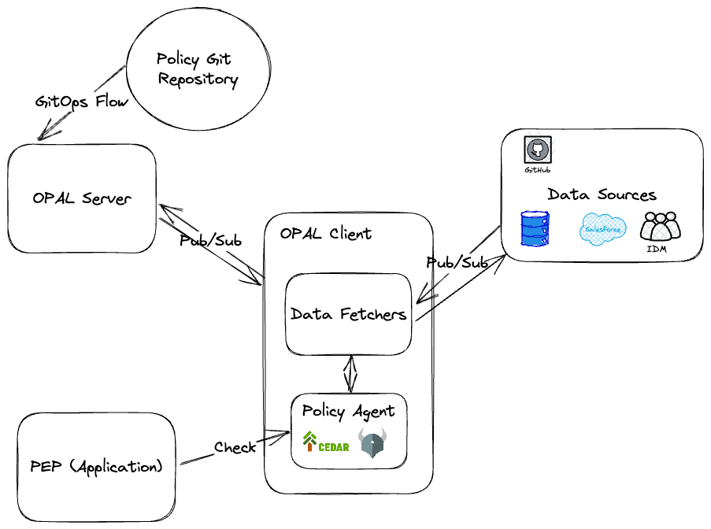

theme: Plain Jane
footer: 
slide-transition: true
header-emphasis: color(#9B5EE5)

[.header: alignment(left)]

^I'm lucky that it is virtual because if not, you'll bite me for using Shift Left

<br>


# GitOps as a Key Enabler for Agile Infrastructure Management
## Gabriel L. Manor

---

^ I first met Agile in 2016, we had a huge monolith

[.footer: ]


---

^ Our goal was to reduce release cycle from 6m to 4m


---

^ We reduced to 4m, in plan but the reality was 6m release cycle
* We broke our user stories in 6m way
* Our tests was in a quality that let us be continous
* Installation of VM is a thing that our customers wasn't be able to do in less than 6m
* We we're focus on tools, but not the product


---

^ What make us to move, is the horizontal scale that cloud enforces us


---

^ What I learned from it? First thing in planning agility, is inspecting the technical aspects of it

# Agile is About Continous Movement

---

# Agile Must Evolve with the Technical Aspects

---

^ Today I'm going to share how a technical solution make us happy with agile

[.footer: ]
[.header: alignment(left)]


<br>
<br>
<br>
<br>

## Gabriel L. Manor
### Director of DevRel @ Permit.io
#### Not an ethical hacker, zero awards winner, dark mode hater.

---

^ This is our actual organization on github, let's see what we have here.


---

^ So, we have our backend, which is a very big mono repo of all our cloud services. If we look deep into it we can see dozens of deployent points we have here. We have helm charts of our multiple microservices, chats of customized services like Reddit, charts for feature flag protected services, and we also have IaC for all the other cloud services we depend on such as static object storage, CDN, secret manager and more.

[.header: alignment(left)]
# Permit's Backend Repository

[.column]
[.list: bullet-character(-)]
- :rocket: Microservices
- :rocket: Internal Services
- :rocket: 3rd Party Dependencies
- :rocket: Custom Dependencies
- :rocket: Cloud Services in IaC

[.column]


---

^ So, just on one repo we have 10 deployment point that we need to control.

# 1 Repository
# :point_down:
# >10 Deployment Points

---

^ Then look on more repositories, we have here. Take as an example a repository called OPAL, this is an open source tool and library that we are maintaining, a management layer for open policy agents. What are the deployment point for it? So there are the OSS deployments which are the  docker registery, and a production branch on GitHub. Creative deployment environments, ah? But not only that, the OPAL is also used by our propierty product as a backbone for policy management, so we also want to have a deployment point in our production environment.

[.header: alignment(left)]
# OPAL
[.text: alignment(center), text-scale(1.1)]


[.column]
:snake: PiPy

[.column]
:package: Server

[.column]
:package: Client

[.column]
:hatching_chick: Canary

---

^ And the game is on, we also enabled feature flags to control deployments of the canary versions of into some clients and ourselves. And it's not finished here.


[^1]: Source - Attlassian

---

^ We have also the frontend repository, which also relay on multiple environment we release it to control different feature flags for various users and so on.
And we have more a open source libraries libraries that deployed to various application and library registries. And we have our special repsoitories where we maintain infrastructure as code for users who want to have their environment seperated from our general SaaS offering.

[.build-lists: true]
[.header: alignment(left)]
[.list: bullet-character(-)]
# We're Not Done Yet
- :rocket: Frontend
- :rocket: OSS Side Cars
- :rocket: SDKs
- :rocket: Customer's IaC

---

^ Isn't that amazing? Even if we are not looking on multi-stages deployements we have more than 50 deployment points in our organization. Each of them potentially could have insecure code in it.
Is it possible to faciliate this chaos, maybe, if we want to look this way...

# 1 Organization
# :point_down:
# >50 :rocket: Launch Facilities

---

^ We need to find a way in our chaos of 50 launch facitilies


---

^ Let's think technical, what if we had a system that knews to streamline all our facilities to one process

# Time to Think Technical

---

^ The system is: Git

[.header: alignment(left)]

# Git


---

^ And the process of streamlining our deployments to be agile, is GitOps
Ok, fine, working groups, give me the point


---


GitOps Working Group Website - _opengitops.dev_

---

^ The key of streamlining the process, is following an Inversion of Control pattern but for deployment. If you think of the standard pipelines you have now they are taking the code at some step and pushing it to an environment, and this is what we want to achieve. Using code in git that declare infrastructure that our pipelines pulling into the relevant environment.

[.text: alignment(left)]
> We pushed the change to production
-- Developer

---

[.header: alignment(left)]
[.header-strong: #fff]
[.text-strong: #fff]
[.text: alignment(left)]
> **We** pulled
> We ~~pushed~~ the change to production
-- Better Developer

---

^ The GitOps pattern is the only way to ensure we are managing into a a question of What should be in Production, and not what is in production. Because if we only know what is in production we take all this automated DevSecOps infrastructure we work hard to implement and waste it by one command runs from a special interchange we have no control of.

# What is in production.

---

# ~~What is in production.~~
# What should be in production!

---

^ OPAL, a GitOps enabled git controller

# OPAL - The GitOps Enabled Policy Controller

[.column]


[.column]
```javascript
permit(
    principal in Role::"admin",
    action in [
        Action::"task:update",
        Action::"task:retrieve",
        Action::"task:list"
    ],
    resource in ResourceType::"task"
);
```


---

# GitOps Best Practices

---

# No Deploy Buttons

---

# Enforce Automated Tests and Checks


---

# [fit] Build Modular Pipelines
## Avoid Monolithic Pipelines


---

# Use Preview Environments


---

# [fit] Do Everything as Code
## Yes, Everything
### Yes, Even Your Git Infrastructure

---


# Encourage Frequent Merges

---

# Deploy Quickly, Deploy Often


---

# Define and Document a Conflict Strategy

---

# Time == Product Changes

---

# Use "Pull" Hooks for State Management

---

# Define Naming Conventions for Branches


---

# Every Developer Works on Separate Branches for Every Feature


---

# Link Logical Environments

---

# Separate Repos in Complex Environments

---

# Use Policy as Code to Control Pipelines

```haskell
package main

default allow = false

# The input is the request object that contains all the necessary information
# about the delivery request
allow {
    input.branch == "main"
    input.hasTestsPassed
    input.hasOneCollaboratorPerBranch
    input.hasRunDevSecOpsTools
}

# Define a rule to check if there is only one collaborator per branch
hasOneCollaboratorPerBranch {
    # Count the number of collaborators for each branch
    count(collaborator) == 1
    # For each branch
    input.branches[branch] == collaborator
}

# Define a rule to check if all DevSecOps tools have been run
hasRunDevSecOpsTools {
    # Check if all the required DevSecOps tools have been run
    input.DevSecOpsTools.runAllTools
}

# Define a rule to check if all tests have passed across the whole pipeline
hasTestsPassed {
    # Check if all the tests have passed in each stage of the pipeline
    input.pipeline.allTestsPassed
}
```

---

[.header: alignment(left)]


<br>
<br>
# Thank You :pray:
## Let's keep in touch at our Authorization Community
## _io.permit.io/chat\_with\_gabriel_