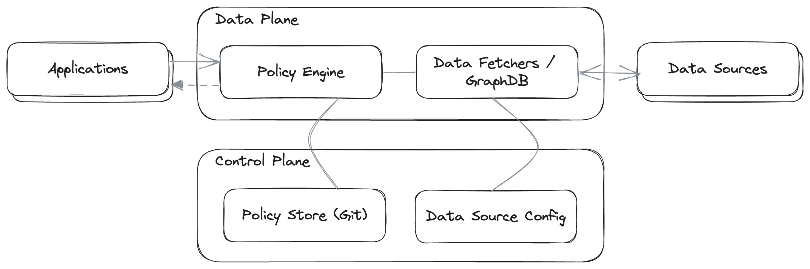

theme: Plain Jane
footer: 
slide-transition: true
[.code: auto(32)]

[.header: alignment(left)]

<br>
<br>
<br>
# Building Authorization with Node.js
## Gabriel L. Manor @ Conf42: JavaScript 2023

---

^ Asking what is the different between a passport and flight ticket.

[.header: alignment(left)]

# Find the Difference

[.column]


[.column]


---

^ The different is similar to authentication and authorization.
We use the passport as a form of idenity to authenticate that we are who we say we are.
We use the flight ticket as a form of authority to authorize us to board the plane.

|                        | Passport                     | Flight Ticket                            |
| ---------------------- | ---------------------------- | ---------------------------------------- |
| Form of                | Identity                     | Authority                                |
| Purpose                | Verifies identity            | Grants access to a flight                |
| Scope                  | Global                       | Flight-specific                          |
| Issued by              | Government                   | Airline desk, app, website, etc.         |
| Information            | Name, photo, birthdate, etc. | Name, flight number, seat, gate, etc.    |
| Validity               | Multiple years               | One flight                               |
| Used                   | Once per flight              | Multiple times per flight                |
| Uniqueness             | Unique to an individual      | Unique to a flight and passenger         |
| Changeable             | No                           | Yes                                      |
| Permissions            | One (to travel)              | Multiple (to board, to check bags, etc.) |
| Revocation granularity | All at once                  | One permission at a time                 |
| Transferable           | No                           | Yes                                      |

---

^ Let's look better on the differnce between authentication and authorization.

|                        | Authentication                              | Authorization                                        |
| ---------------------- | ------------------------------------------- | ---------------------------------------------------- |
| Purpose                | Verifies user identity                      | Determines user permissions                          |
| Scope                  | Applies to all users                        | Specific to each user's role or status               |
| Issued by              | Identity provider                           | Any kind of data                                     |
| Information            | Username, social identity, biometrics, etc. | User roles, permissions, policy, external data, etc. |
| Validity               | Until credentials change or are revoked     | Per permissions check                                |
| Used                   | Once per session (typically)                | Multiple times per session                           |
| Uniqueness             | Unique to an individual user                | Unique to a principal, action and resource           |
| Changeable             | Require session revocation                  | Yes (permissions can be updated, etc.)               |
| Permissions            | One (to access the system)                  | Multiple (to read, write, update, delete, etc.)      |
| Revocation granularity | All at once (user is denied access)         | One permission at a time                             |
| Transferable           | No (credentials should not be shared)       | Yes (policy can be applied to other users)           |

---

^ What are all the advanced use cases we need with autehntication?

[.autoscale: true]
[.build-lists: true]

# Authentication Advanced Features

- Multi-factor authentication
- Single sign-on / Social login / Passwordless
- User / account management
- Session management
- User registration / UI flows / customizations
- Account verification / recovery
- Audit / reporting / analytics / compliance
- Third party integrations

---

^ No one develop those features from scratch, we use OSS or cloud products


---

^ Authorization is a tumble weed


---

^ My name is gabriel and today we are going to talk about authorization.

[.footer: ]
[.header: alignment(left)]


<br>
<br>
<br>
<br>

## Gabriel L. Manor

### Director of DevRel @ Permit.io

#### Not an ethical hacker, zero awards winner, dark mode hater.

---


---

^ Everyone agrees this authorization pattern is a bad pattern

<br>
<br>

```js
function deleteUser(user_id) {
  let user = User.get(user_id);
  if (user.role === "admin") {
    user.delete();
  }
}
```

---

^ Problem 1: Every configuration change requires a code change.
The usual implementation of authorization in python is decorators with roles
The problem is our need to change the code for every time we need to add a new role or change the logic of the role.

```js
// Middleware
function rolesRequired(role) {
  return function (req, res, next) {
    if (req.user.role === role) {
      next();
    } else {
      res.status(403).send("Forbidden");
    }
  };
}

app.delete("/users/:id", rolesRequired("admin"), function (req, res) {
  let user = User.get(req.params.id);
  user.delete();
  res.send("User deleted successfully");
});
```

---

^ Problem 2: We need to support multiple permission models.
Another problem is where we need to support multiple permission models in our framework.
We need to change the code and it start to be a mess.

<br>

[.column]

```js
// Middleware
function rolesRequired(role) {
  return function (req, res, next) {
    if (req.user.role === role) {
      next();
    } else {
      res.status(403).send("Forbidden");
    }
  };
}

function permissionsRequired(permission) {
  return function (req, res, next) {
    if (req.user.permissions.includes(permission)) {
      next();
    } else {
      res.status(403).send("Forbidden");
    }
  };
}
```

[.column]

```js
// Business logic
app.delete(
  "/users/:id",
  rolesRequired("admin"),
  permissionsRequired("delete_user"),
  function (req, res) {
    let user = User.get(req.params.id);
    user.delete();
    res.send("User deleted successfully");
  }
);
```

---

^ Problem 3: Need for a data and conditions that are not part of the request - decorators are just not enought.

<br>

[.column]

```js
// Middleware
function rolesRequired(role) {
  return function (req, res, next) {
    if (req.user.role === role) {
      next();
    } else {
      res.status(403).send("Forbidden");
    }
  };
}
```

[.column]

```js
// Business logic
app.get(
  "/enable_workflow/:user_id",
  rolesRequired("admin"),
  function (req, res) {
    const { userId } = req.params;
    let user = User.get(userId);
    let tier = bs.getTier(userId);
    if (tier !== "paid") {
      res.status(403).send("User is not paid user");
    } else if (user.sms_enabled) {
      sms(user.phone_number, "Workflow is enabled");
      res.send("Workflow enabled successfully");
    }
  }
);
```

---

^ Problem 4: People are adding authorization logic in the business logic to support partial authorization.

<br>
<br>

```js
// Business logic
app.get(
  "/enable_workflow/:user_id",
  rolesRequired("admin"),
  permissionsRequired("enable_workflow"),
  function (req, res) {
    const { user_id } = req.params;
    let user = User.get(user_id);
    let step1 = workflow.run();
    let step2 = workflow.run();
    if (user.sms_enabled) {
      send_sms_to_list(user.phone_number, "Workflow is enabled");
    }
    res.send("Workflow enabled successfully");
  }
);
```

---

^ Problem 5: Testing is hard, we need multiple permissions for multiple environments.

[.header: alignment(left)]

<br>

[.column]

### Staging

```js
// Business logic
app.get(
    "/enable_workflow/:user_id",
    rolesRequired("admin"),
    permissionsRequired("enable_workflow"),
    function (req, res) {
        const { user_id } = req.params;
        let user = User.get(user_id);
        let step1 = workflow.run();
        ...
);
```

[.column]

### Production

```js
// Business logic
app.get(
    "/enable_workflow/:user_id",
    rolesRequired("superadmin"),
    permissionsRequired("enable_workflow"),
    function (req, res) {
        const { user_id } = req.params;
        let user = User.get(user_id);
        let step1 = workflow.run();
        ...
);
```

---

^ Problem 6: Every new framework/language required a new implementation.

[.header: alignment(left)]

[.column]

### Express

```js
app.get('/my_view', [
    rolesRequired('admin'),
    permissionsRequired('app_name.can_edit')
], function (req, res) {
    // Your view logic here
    ...
});
```

[.column]

## Flask

```python
app = Flask(__name__)
login_manager = LoginManager(app)

class User(UserMixin):
    def __init__(self, id, role):
        self.id = id
        self.role = role

@login_manager.user_loader
def load_user(user_id):
    return User(user_id, 'admin')

@app.route('/admin')
@login_required
def admin():
    if current_user.role != 'admin':
        abort(403)
    ...
```

---

^ Problem 7: No way to audit decisions. performance

<br>

```js
if (
  user.role === "admin" &&
  user.tier === "paid" &&
  user.sms_enabled &&
  user.phone_number
) {
  send_sms_to_list(user.phone_number, "Workflow is enabled");
}
```

---

^ What are the best practices we want a good authorization framework to support?

[.autoscale: true]
[.text: alignment(center)]

# Authorization Best Practices

[.column]

📜
Declarative

<br>

🎯
Agnostic

[.column]

🧩
Generic

<br>

🔌
Decoupled

[.column]

🌐
Unified

<br>

🕵🏼‍♀️
Easy to audit

---

# #1 Model

---

^ Every permissions desicion, starts with the same question

[.header-emphasis: color(#9B5EE5)]

# [fit] User _|_ Action _|_ Resource

---

^ Every permissions desicion, starts with the same question

[.header-strong: color(#000000ff)]
[.header-emphasis: color(#9B5EE5)]

# [fit] Does _[Principal]_ Allowed to Perform _[Action]_ on _[Resource]_

# [fit] Is a Monkey Allowed to Eat a Banana

---


---

^ There are 4 commoly used permissions models today, when we want to add AuthZ to application, we should be familiar with them and choose how to implement it with no matte rof the framework or tech stack we use.

[.header: alignment(left)]

## ACL - Access Control List

## RBAC - Role-Based Access Control

## ABAC - Attribute-Based Access Control

## ReBAC - Relationship-Based Access Control

---

^ ACL is the most simple model, it's a list of users and the resources they can access. It's usually implemented in the application level itself, and it's not scalable at all.
Not scalable, usually used in low-performance appliances

[.header: alignment(left)]

# ACL - Access Control List

[.column]


[.column]

- EOL model
- Widely used in IT systems/networks
- No segmentation/attribution support
- Hard to scale

---

^ RBAC is the most common model, it's a list of roles and the resources they can access. It's usually implemented in the application level itself, and it's not scalable at all.

[.header: alignment(left)]

# RBAC - Role Based Access Control

[.column]


[.column]

- The widely-used model for app authorization
- 🤓 Easy to define, use and audit
- No resource inspection
- Limited scalablity

---

^ ABAC is the most complex model, it's a list of rules that define the access to the resources. It's usually implemented in the application level itself, and it's not scalable at all.

[.header: alignment(left)]

# ABAC - Attribute Based Access Control

[.column]


[.column]

- The most robust model for inspection and desicion making
- Configuration could be hard
- Easy to handle multiple data sources
- 🚀 Highly scalable

---

^ ReBAC is the most scalable model, it's a list of roles and the resources they can access. It's usually implemented in the application level itself, and it's not scalable at all.

[.header: alignment(left)]

# ReBAC - Relationship Based Access Control

[.column]


[.column]

- Best fit for consumer-style applications
- Support in reverse indices and search for allowed data
- Easy to scale for users (>1b) hard in desicion's performance
- Expensive in management and maintainance

---

# #2 Author

---

^ As always, every better software solution, start with a contract. contracts are the best way to make software better, and what better of designing a contract of how to configure policies?

# [fit] Contracts Creates Better Relationships

### 👩🏽‍💻 _Especially in Human <> Machine Relationships_ 🤖

---

^ Today we will cover three permissions contracts that together can solve any kind of authorization problem.

<br>

[.column]

## Open Policy Agent


[.column]

## AWS<br>Cedar


[.column]

## Google Zanzibar - Open FGA


---

^ AWS Cedar is a policy engine and language that was created by AWS, it's a general purpose policy engine that can be used to enforce authorization policies in microservices architecture.


[.column]

```javascript
permit(
  principal in Role::"admin",
  action in
    [Action::"task:update", Action::"task:retrieve", Action::"task:list"],
  resource in ResourceType::"task"
);
```

[.column]

```javascript
permit (
    principal,
    action in
        [Action::"UpdateList",
         Action::"CreateTask",
         Action::"UpdateTask",
         Action::"DeleteTask"],
    resource
)
when { principal in resource.editors };
```

[.column]

```javascript
permit (
    principal,
    action,
    resource
)
when {
    resource has owner &&
    resource.owner == principal
};
```

---

# Generate Code from UI


---

# #3 Analyze

---

[.header: alignment(left)]

# Cedar Agent

[.column]


[.column]

- Policy decision maker
- Decentralized continer, run as a sidecar to applications
- Monitored and audited
- Focused in getting very fast decisions >10ms

---

# #4 Enforce

---

[.header: alignment(left)]

# Enforcing Authorization Policies

```python
# Call authorization service
# In the request body, we pass the relevant request information
allowed = requests.post('http://host.docker.internal:8180/v1/is_authorized', json={
    "principal": f"User::\"{user}\"",
    "action": f"Action::\"{method.lower()}\"",
    "resource": f"ResourceType::\"{original_url.split('/')[1]}\"",
    "context": request.json
}, headers={
    'Content-Type': 'application/json',
    'Accept': 'application/json'
})
```

---

^ For frontend, we have CASL

# CASL - Frontend Feature Toggling SDK

```javascript
import { createMongoAbility, AbilityBuilder } from '@casl/ability';

// define abilities
const { can, cannot, build } = new AbilityBuilder(createMongoAbility);

can('read', ['Post', 'Comment']);
can('manage', 'Post', { author: 'me' });
can('create', 'Comment');

// check abilities
const ability = build();

ability.can('read', 'Post') // true
```

---

# #5 Audit

---


---

^ After we understand the contract, let's understand the right components for the modern policy architecture.

# Authorization System Building Blocks



---

^ Sync engine - OPAL

[.autoscale: true]

# OPAL - Open Policy Administration Layer

[.column]


[.column]

- Open Source, Written in Python
- Sync decision points with data and policy stores
- Auto-scale for engines
- Centralized services such as Audit
- Unified APIs for the enforcement point
- Extensible for any kind of data source
- Supports OPA, Cedar (and soon to be announced more)
- Used by Tesla, Zapier, Cisco, Accenture, Walmart, NBA and thousands more

---

# OPAL Based Authorization Architecture


---

^ 
1. Show the docker compose of OPAL, explain, show running
2. Show the Cedar code
3. Show the Node.js code of enforcement
4. Call the Node.js app with allowed call
5. Call the Node.js app with denied call
6. Kill OPAL containers
7. Change the policy (ABAC)
8. Enrich the policy with new data (karma)
9. compose container
10. Show python application
11. Show ABAC calls


# 🍿 Demo Time 🍿

---


---

[.header: alignment(left)]


<br>
<br>
# Thank You :pray:
## Show your love to OPAL with a GitHub Star :star: :point_right:
### Find more about OPAL on opal.ac
#### Follow me on Twitter @gemanor
