theme: Plain Jane
footer: 
slide-transition: true
header-emphasis: color(#9B5EE5)

[.header: alignment(left)]

^I'm lucky that it is virtual because if not, you'll bite me for using Shift Left

<br>
<br>
<br>

# Discover the Power of Git for Your Infrastructure
## Gabriel L. Manor @ DevUp 2023

---

^ I first met Agile in 2016, we had a huge monolith

[.footer: ]


---

^ Our goal was to reduce release cycle from 6m to 4m


---

^ We reduced to 4m, in plan but the reality was 6m release cycle
* We broke our user stories in 6m way
* Our tests was in a quality that let us be continous
* Installation of VM is a thing that our customers wasn't be able to do in less than 6m
* We we're focus on tools, but not the product

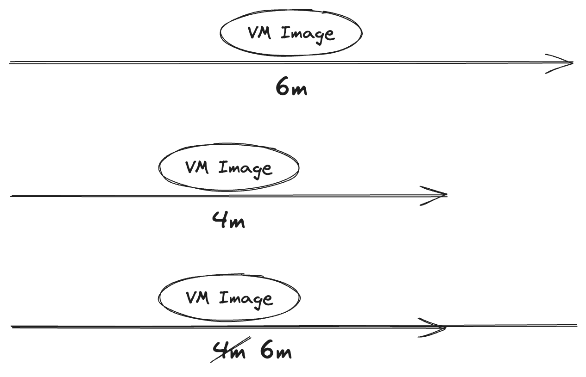

---

^ What make us to move, is the horizontal scale that cloud enforces us

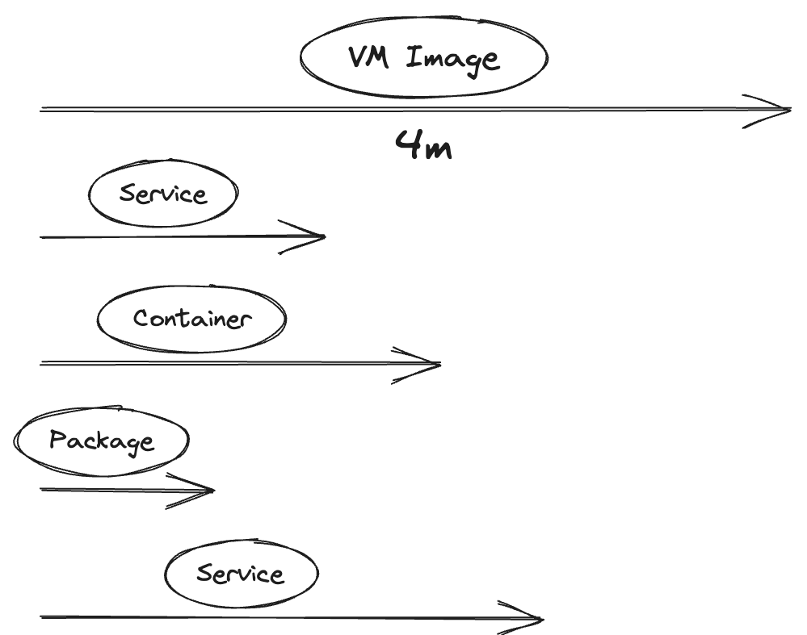

---

^ What I learned from it? First thing in planning agility, is inspecting the technical aspects of it

# Agile is About Continous Movement

---

# Agile Must Evolve with the Technical Aspects

---

^ Today I'm going to share how a technical solution make us happy with agile

[.footer: ]
[.header: alignment(left)]


<br>
<br>
<br>
<br>

## Gabriel L. Manor
### Director of DevRel @ Permit.io
#### Not an ethical hacker, zero awards winner, dark mode hater.

---

^ This is our actual organization on github, let's see what we have here.

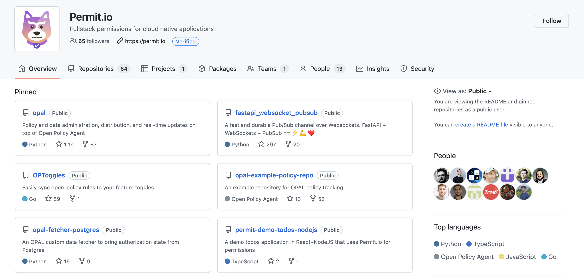

---

^ So, we have our backend, which is a very big mono repo of all our cloud services. If we look deep into it we can see dozens of deployent points we have here. We have helm charts of our multiple microservices, chats of customized services like Reddit, charts for feature flag protected services, and we also have IaC for all the other cloud services we depend on such as static object storage, CDN, secret manager and more.

[.header: alignment(left)]
# Permit's Backend Repository

[.column]
[.list: bullet-character(-)]
- :rocket: Microservices
- :rocket: Internal Services
- :rocket: 3rd Party Dependencies
- :rocket: Custom Dependencies
- :rocket: Cloud Services in IaC

[.column]


---

^ So, just on one repo we have 10 deployment point that we need to control.

# 1 Repository
# :point_down:
# >10 Deployment Points

---

^ Then look on more repositories, we have here. Take as an example a repository called OPAL, this is an open source tool and library that we are maintaining, a management layer for open policy agents. What are the deployment point for it? So there are the OSS deployments which are the  docker registery, and a production branch on GitHub. Creative deployment environments, ah? But not only that, the OPAL is also used by our propierty product as a backbone for policy management, so we also want to have a deployment point in our production environment.

[.header: alignment(left)]
# OPAL
[.text: alignment(center), text-scale(1.1)]


[.column]
:snake: PiPy

[.column]
:package: Server

[.column]
:package: Client

[.column]
:hatching_chick: Canary

---

^ And the game is on, we also enabled feature flags to control deployments of the canary versions of into some clients and ourselves. And it's not finished here.


[^1]: Source - Attlassian

---

^ We have also the frontend repository, which also relay on multiple environment we release it to control different feature flags for various users and so on.
And we have more a open source libraries libraries that deployed to various application and library registries. And we have our special repsoitories where we maintain infrastructure as code for users who want to have their environment seperated from our general SaaS offering.

[.build-lists: true]
[.header: alignment(left)]
[.list: bullet-character(-)]
# We're Not Done Yet
- :rocket: Frontend
- :rocket: OSS Side Cars
- :rocket: SDKs
- :rocket: Customer's IaC

---

^ Isn't that amazing? Even if we are not looking on multi-stages deployements we have more than 50 deployment points in our organization. Each of them potentially could have insecure code in it.
Is it possible to faciliate this chaos, maybe, if we want to look this way...

# 1 Organization
# :point_down:
# >50 :rocket: Launch Facilities

---

^ We need to find a way in our chaos of 50 launch facitilies


---

^ Let's think technical, what if we had a system that knews to streamline all our facilities to one process

# Time to Think Technical

---

^ The system is: Git

[.header: alignment(left)]

# Git


---

^ And the process of streamlining our deployments to be agile, is GitOps
Ok, fine, working groups, give me the point


---

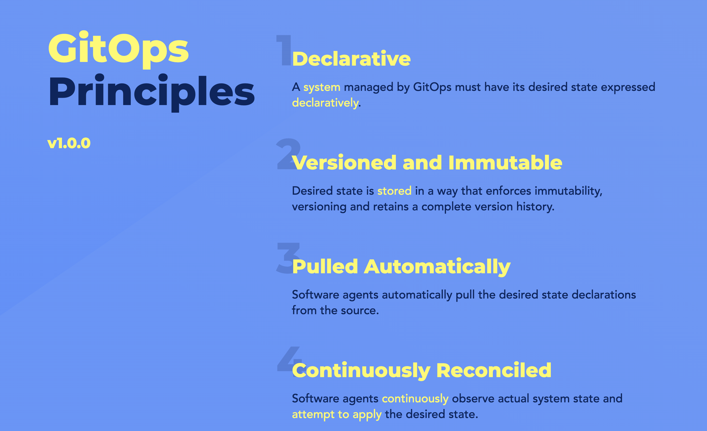

GitOps Working Group Website - _opengitops.dev_

---

^ The key of streamlining the process, is following an Inversion of Control pattern but for deployment. If you think of the standard pipelines you have now they are taking the code at some step and pushing it to an environment, and this is what we want to achieve. Using code in git that declare infrastructure that our pipelines pulling into the relevant environment.

[.text: alignment(left)]
> We pushed the change to production
-- Developer

---

[.header: alignment(left)]
[.header-strong: #fff]
[.text-strong: #fff]
[.text: alignment(left)]
> **We** pulled
> We ~~pushed~~ the change to production
-- Better Developer

---

^ The GitOps pattern is the only way to ensure we are managing into a a question of What should be in Production, and not what is in production. Because if we only know what is in production we take all this automated DevSecOps infrastructure we work hard to implement and waste it by one command runs from a special interchange we have no control of.

# What is in production.

---

# ~~What is in production.~~
# What should be in production!

---

^ OPAL, a GitOps enabled git controller

# OPAL - The GitOps Enabled Policy Controller

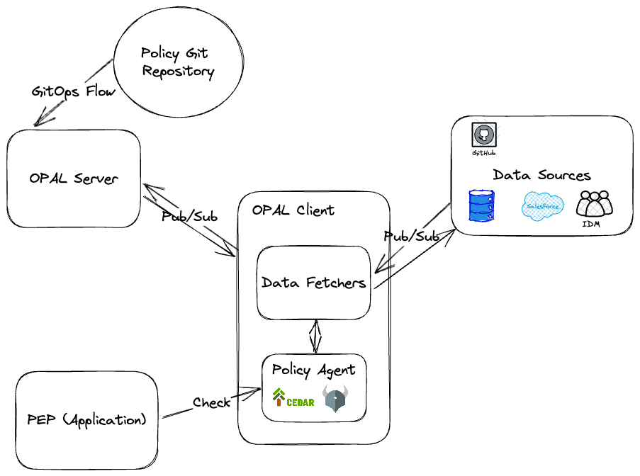

---

# 💡 GitOps Best Practices 💡

---

# No Deploy Buttons

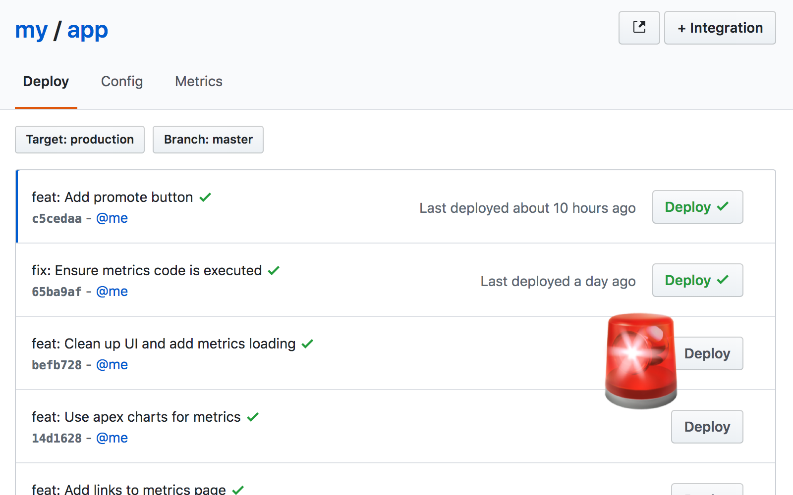

---

# Enforce Automated Tests and Checks


---

# [fit] Build Modular Pipelines
## Avoid Monolithic Pipelines


---

# Use Preview Environments


---

# [fit] Do Everything as Code
## Yes, Everything
### Yes, Even Your Git Infrastructure

---


# Encourage Frequent Merges


---

# Deploy Quickly, Deploy Often


---

# Define and Document a Conflict Strategy 🤝

---

# `Time == Product Changes`

---

# Use "Pull" Hooks for State Management

---

# Define Naming Conventions for Branches


---

# Every Developer Works on Separate Branches for Every Feature


---

# Link Logical Environments

---

# Separate Repos in Complex Environments

---

# Implement Access Control Strategies

---

# Ok, Fine, GitOps, but HOW?

---

^If you are in the Cloud Native world, you may heard about one of the two kings of the GitOps world. ArgoCD and Flux. Those two are mostly relevant for kubernetes clusters but their princple is exactly this depency injection like principle for everything runs in production or any other enviornemnt. The only thing they do is run in a real environment and check for new versions of code to pull it into the environment.

Don't Reinvent the Wheel


---

Use IaC Providers to Manage Git

[.column]


```ts
resource "github_repository" "example" {
  name        = "example"
  description = "My awesome codebase"

  visibility = "public"

  template {
    owner                = "github"
    repository           = "terraform-template-module"
    include_all_branches = true
  }
}
```

[.column]


```ts
import * as github from "@pulumi/github";

const repo = new github.Repository("demo-repo", {
  description: "Generated from automated test",
  visibility: "private",
});
```

---

^ The other flavor, is policy as code based desicion makers, and the most famous of them Open Policy Agent.


# Policy as Code
## Open Policy Agent

---

^ Open Policy agent is combined from some components where its basics are the agent itself, a piece of software that can sits everywhere and get deiscions and Rego a policy language that we can write rules with and letting the agent get deiscions based on the rules and data we transfer to.

<br>

[.column]
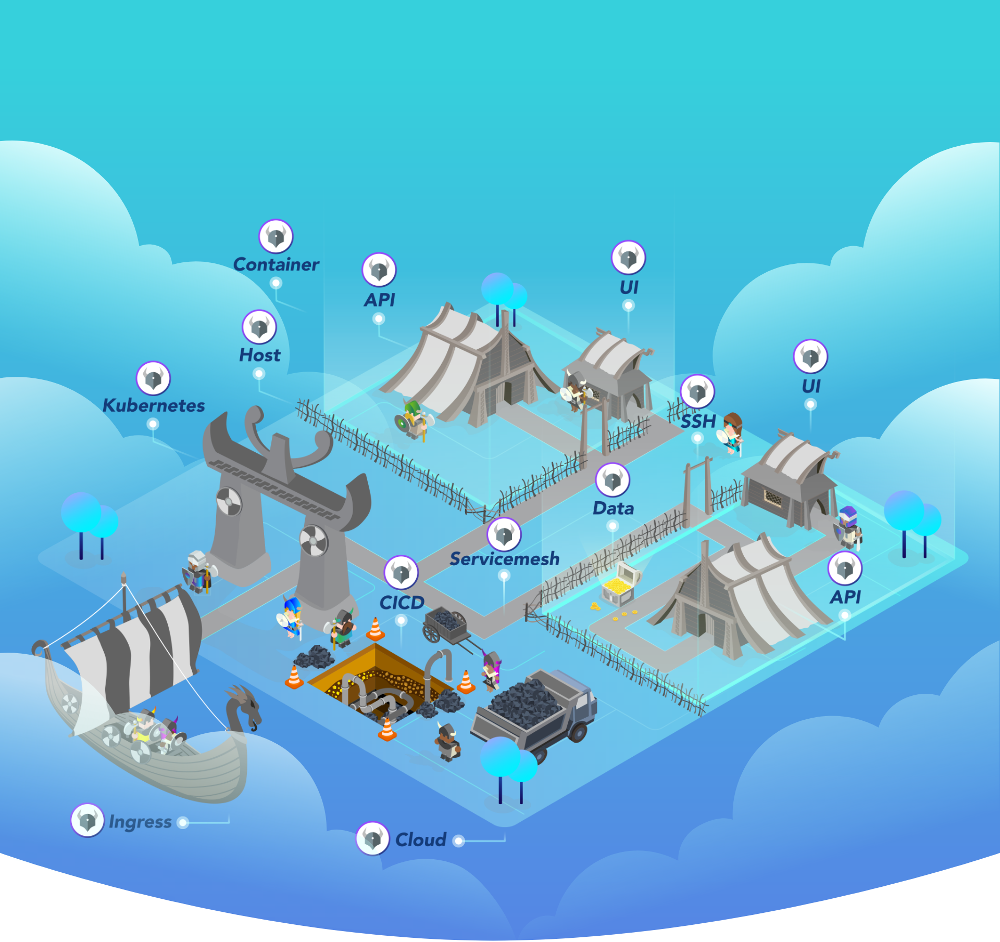

[.column]
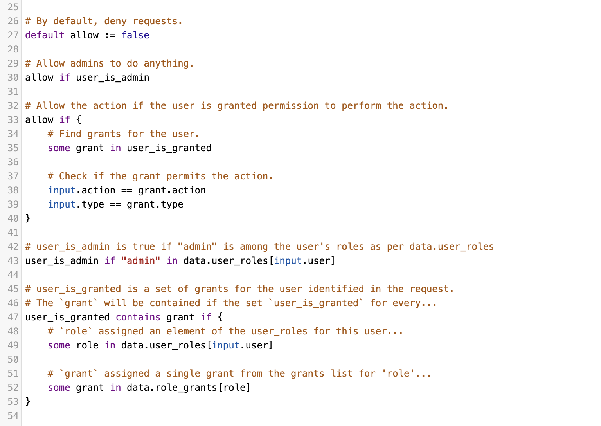

---

^ Once we have our policy implemented as part of our code, we just left to get a policy desicion that knows to take our rules and together with the deployment data the GitOps controller get the right desicions for our mapped deployment steps.


---

^ Let see how a simple deployment desicion can made with OPA.
First, we are having an agent run in our CI/CD. That can run by the GitOps controller in the last step of the deployment but also run on the steps themselves to ask the right question for every step in the CI/CD chain. The best practice is to run the agent as a side car to your application, and that true for CI/CD infrastructure too, just attach the container as a desicion point to the relevant step and asking it questions.


---

^ Now that we set with the agent, let look how we implementing policy on it. So the laguage that you use for writing policiy rules called Rego and this is a declerative language that helps you to write policy. Here is a very simple decleration that return true in case a user has _____ You can use playground.opa.com to try rego yourself.


---

^ How does deployment policy could look like for CI/CD and GitOps desicions? Well, simple as any other RBAC model.
The basic RBAC model assume we have three building blocks to ask a desicion question, `Does ___ allowed to perform ___ on ___` those three entities also known as Role, Action, and Resource.

[.header: alignment(center)]
[.text: alignment(center)]

<br>
<br>
`Does ___ allowed to perform ___ on ___`
<br>
<br>

[.column]
# :man_with_turban: 
## Role

[.column]
# :pencil: 
## Action

[.column]
# :notebook_with_decorative_cover:
## Resource

---

^ In the case of CI/CD, the developers and job initiators are the roles, the resources are the pull requests or other delerative plans we are trying to deploy, and the action is the deployment type, a cloud environment, package registry, and so on.


[.text: alignment(center)]
[.text-strong: #9B5EE5, Avenir Next Regular]
<br>
Does **developer** allowed to perform **deploy** to **production_environment**?
<br>
Does **production_branch_e2e_job** allowed to perform **image_push** to **docker_registry**?

---

^ Now, that we have policy queries as part of our GitOps structure, let try to write a simple rego query for our GitOps. Assuming that we have a medtech customer who enforce our deployment to be reviewed by three code approvals, we can write something like that _______, whenever the GitOps controller will have to deploy this environment they will run the check. Allowed? Great, not allowed? continue to ask for approvals or do other some actions.

```go
default allow := false

allow if {
	some grant in user_is_developer

	input.action == operation.type
	input.environment == operation.destination
}
```

---

^ I know, I know, you look into my eyes now and say `no medtech company care about three approvals, this is not a relevant desicion.` and you right. RBAC is too simple for the desicions our app will usually want to get. So let's get back again to look what we do in a real application when RBAC not working? We do ABAC.


---

^ Attribute based access control, is actually the next step for us of making smart permissions desicions. Instead of just asking Does Role allowed to perform Action on Resource, we are looking into the details of each of the blocks and made our desicions based on the attributes of each entity. 

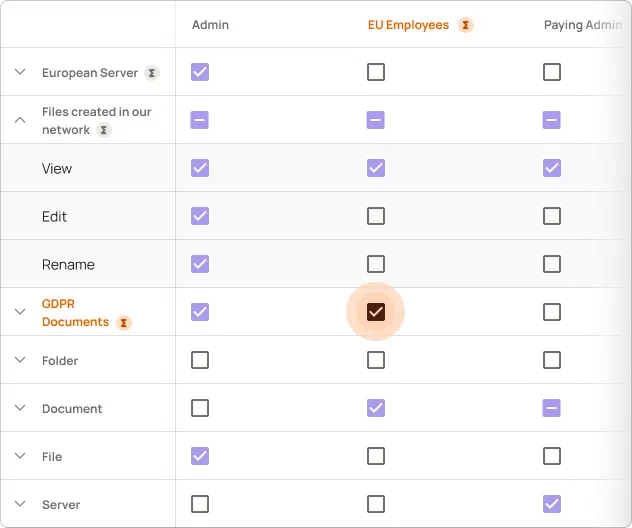

---

^ Let's look on some example for policy we can combined that fit the real world and see how smart could ABAC queries can work with those agent.
`Does (user.new) allowed to (deploy.production) a (code.critical)`
`Does (user) allowed to (deploy.docker) a (code.didn't_dast) and (code.has_public_opened_apis)`
`Does ()___`

[.text: alignment(center)]
[.text-strong: #9B5EE5, , Avenir Next Regular]
<br>
Does **(user.new)** allowed to **(deploy.production)** a **(code.critical)**?
<br>
Does **(user)** allowed to **(deploy.docker)** a **(code.didn't_dast)** and **(code.has\_public\_opened_apis)**?

---

^ Amazing, ah? But I know what you thinking `this regos are impressive, but how this guy know what code has public open APIs or that code considered critical`, right? the answer is static analysis.

# Static Analysis

---

^ If you are running any automated tool on your CI/CD, you must be aware of static analysis tools. There are tools specific for languages and stacks. There are tools that specific for security tests as SAST, and others for coding standards such as PyLint and ESLint.

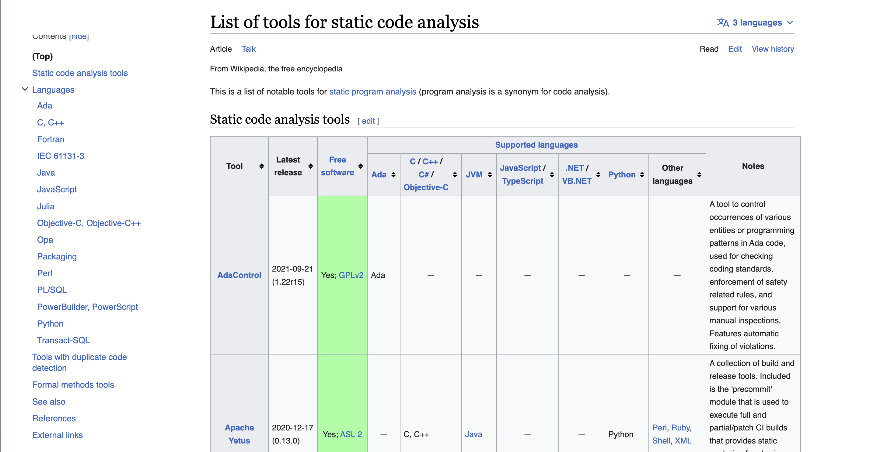

---

^ At a first look, we are thinking of them as a useful tools that answers a binary factor on our code quality, passed or failed. Actually the benefit we can get from them by tagging our resources, are meaningful. 

[.column]

:white_check_mark: Passed

[.code: auto(32)]
```javascript
const { Permit } = require("permitio");

const express = require("express");
const app = express();
const port = 4000;

const permit = new Permit({
  pdp: "http://localhost:7766",
  token: env.PERMIT_SDK
});

app.get("/", async (req, res) => {
  const user = {
    id: "03b45ca28e5b4ea3823de5431f2dc36d",
    firstName: "Joe",
    lastName: "Doe",
    email: "user@example.com",
  }

  const permitted = await permit.check(user.id, "action", "resource");
  if (permitted) {
    res.status(200).json({});
  } else {
    res.status(403).json({});
  }
});

app.listen(port, () => {
  console.log(`Example app listening at http://localhost:${port}`);
});
```

[.column]

:no_entry_sign: Failed

[.code: auto(32)]
```javascript
const { Permit } = require("permitio");

const express = require("express");
const app = express();
const port = 4000;

const permit = new Permit({
  pdp: "http://localhost:7766",
  token: env.PERMIT_SDK
});

app.get("/", async (req, res) => {
  const user = {
    id: "03b45ca28e5b4ea3823de5431f2dc36d",
    firstName: "Joe",
    lastName: "Doe",
    email: "user@example.com",
  }

  const permitted = await permit.check(user.id, "action", "resource");
  if (permitted) {
    res.status(200);
  } else {
    res.status(403);
  }
});

app.listen(port, () => {
  console.log(`Example app listening at http://localhost:${port}`);
});
```


---

^ You asked how I know code is critical? because I created a rule define what is critical code. How do I now code has opened APIs? Cause I tagged it when I ran the static analysis tool just after the delivery.

[.column]
[.code: auto(32)]
[.code-highlight: 1, 9, 12, 28]
[.code-highlight: 9]
[.code-highlight: 16]
[.code-highlight: 18]
```javascript
const { Permit } = require("permitio");

const express = require("express");
const app = express();
const port = 4000;

const permit = new Permit({
  pdp: "http://localhost:7766",
  token: env.PERMIT_SDK
});

app.get("/", async (req, res) => {
  const user = {
    id: "03b45ca28e5b4ea3823de5431f2dc36d",
    firstName: "Joe",
    lastName: "Doe",
    email: "user@example.com",
  }

  const permitted = await permit.check(user.id, "action", "resource");
  if (permitted) {
    res.status(200);
  } else {
    res.status(403);
  }
});

app.listen(port, () => {
  console.log(`Example app listening at http://localhost:${port}`);
});
```

[.list: bullet-character(-)]
[.column]
- import\_new\_library
- use\_environment\_variable
- has\_public\_api
- creating\_server

---

^ You tagged it? You created a rule? Yes, and it's just much more simple than you think.


---

^ The tool that I mostly like for having such custom rules is SemGrep, a very popular static analysis tool (also sponsored the conference here) that support wide range of programming languages and offer a very smart and simple way to create your own static analysis rules.

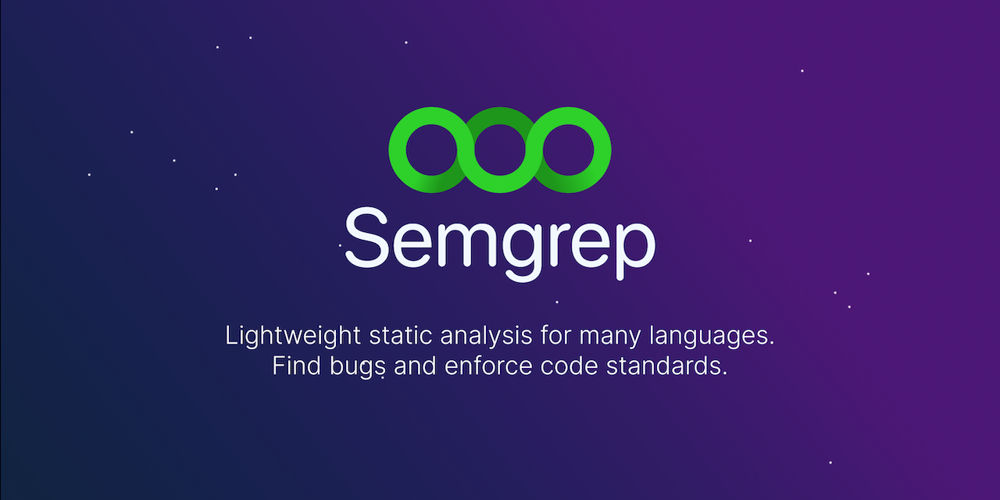

---

^ How do you get started? Let look on the example here, there is an online SemGrep tool to create custom rule and having such rule that check for any API that open to public is just such easy! _____ This is a very powerful way to tag our resources once and having better desicions ahead on time when we need to get them in OPA.

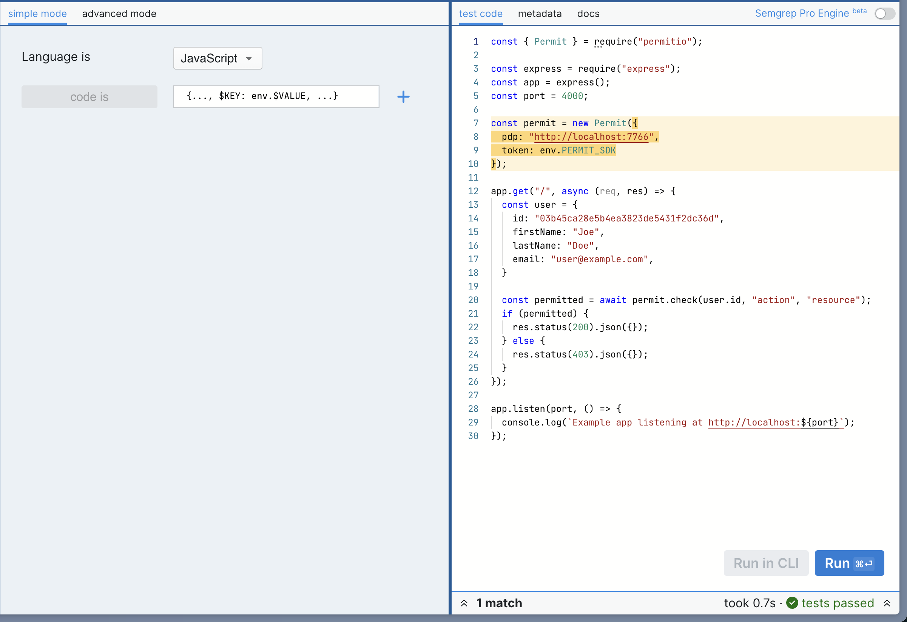

<br>
<br>
<br>


---

[.header: alignment(left)]


<br>
<br>
# Thank You :pray:
## Let's keep in touch at our Authorization Community
## _io.permit.io/chat\_with\_gabriel_