theme: Plain Jane
footer: 
slide-transition: true

[.header: alignment(left)]

 
 
 
# The Future Stack of Code Review
## Gabriel L. Manor
### JSNation 2023

---

^ Every team has the annoying person that no one want to get code review from.

---

^ The annoying person comments on code review

[.autoscale: true]
[.build-lists: true]

- This is not how I would do it
- This is not how I would do it, but it's ok
- This is not how I would do it, but it's ok, I guess
- This is not how I would do it, but it's ok, I guess, for now
- This is not how I would do it, but it's ok, I guess, for now, but you should change it later
- LGTM :+1:

---

^ I had such people in our team for 5 years, and I at some point I felt something wrong
It is not possible that we progress so much in our stack but the process of code review is still the same

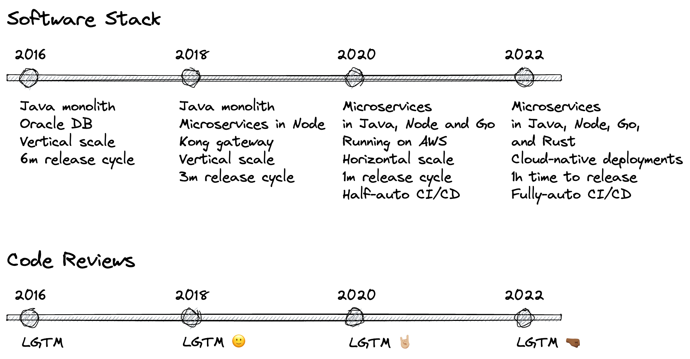

---

^ Why is code review so important?
I decided to do what I'm doing always when I feel something is wrong
Ask on twitter

[.header: alignment(left)]

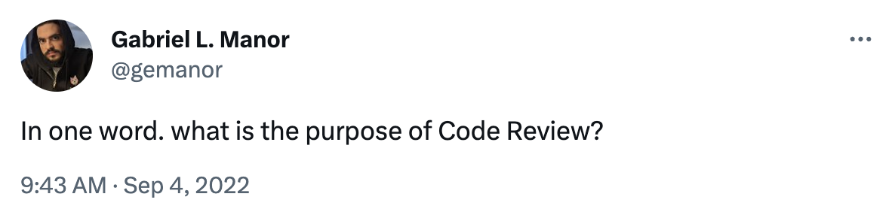
#### 🔗 bit.ly/cr-tweet

---

^ I got a lot of answers, here are some example.

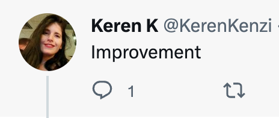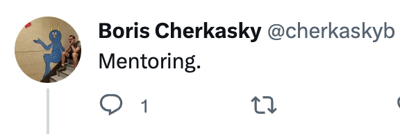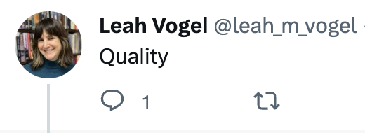
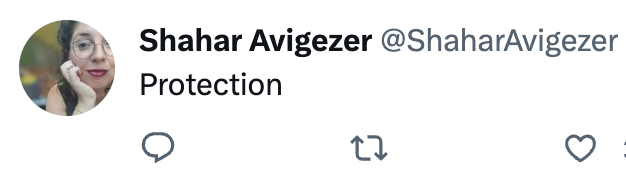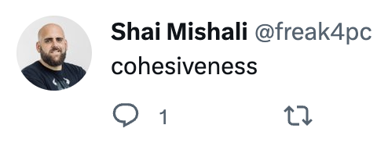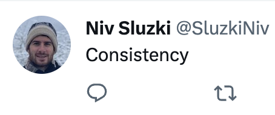

---

[.footer: ]
[.header: alignment(left)]

 
 
 
 

## Gabriel L. Manor
### Director of DevRel @ Permit.io
#### Not an ethical hacker, zero awards winner, dark mode hater.

---

^ The tweet lead me to think, what changed? What changed in the dev world that could also affect the process of code review?

# What Changed?

---

^ The aspects of modern code review are much more than the preivous and include also: code readability, clean code practices, performance, security.

# More to Protect

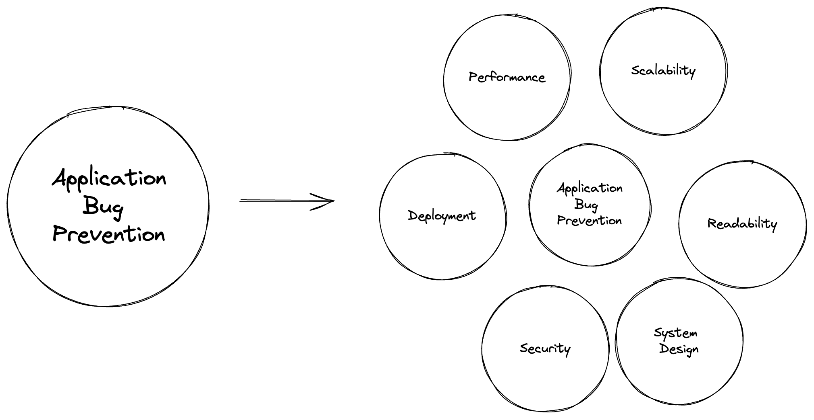

---

^ Developer isn't experienced anymore in one language, but in many languages. experise are frameworks and environments.

# Developers are Polyglots

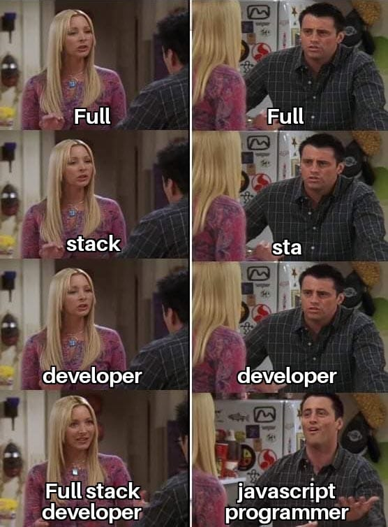

---

^ Code styling is not anymore strict to organization, users use more and more copy and paste and AI generated code as a base for their code.

# AI is Replacing Us 😜

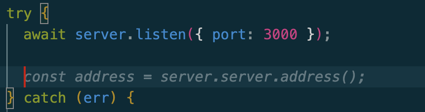

---

^ Why wouldn't we leverage the automation level we got on CI/CD to the code review process?

# The SDLC is Automated

---

# What Not Changed?

---

^ The most required piece of code review is the Human Magic (soft skills), let's focus on it instead of the boring stuff.

# The Human Wisdom

---

^ Code review is one of the aspect that mostly slow the developer velocity.
The conext switch is hard and it takes time to get back to the flow.

# Code Reviews are Velocity Enemies

---

^ We need to define a new code review process that deal better with the future stack required from code review.

[.autoscale: true]

# The New Stack of Code Review

1. Increase velocity
2. Code readibility
3. Security
4. Performance
5. Clean code (SOLID)
6. Collaboration
7. Scalablity
8. _________

---

^ Looking at all that, I tried to craft a list of best-practices for the modern code review process.

# Code Review Best Practices

---

# Know the Responsibilities

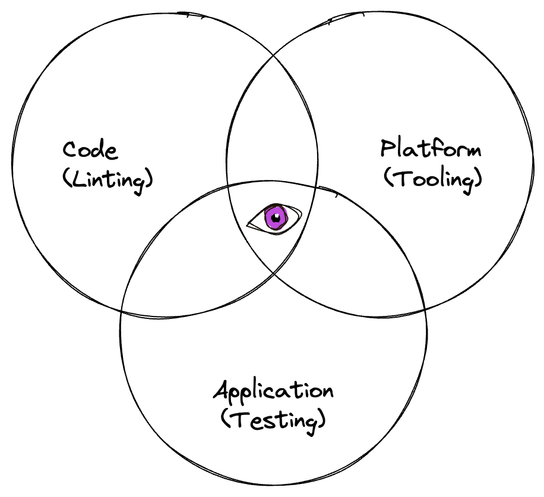

---

^ Code review should be 20% human, 80% automation

# 20% Human, 80% Automation

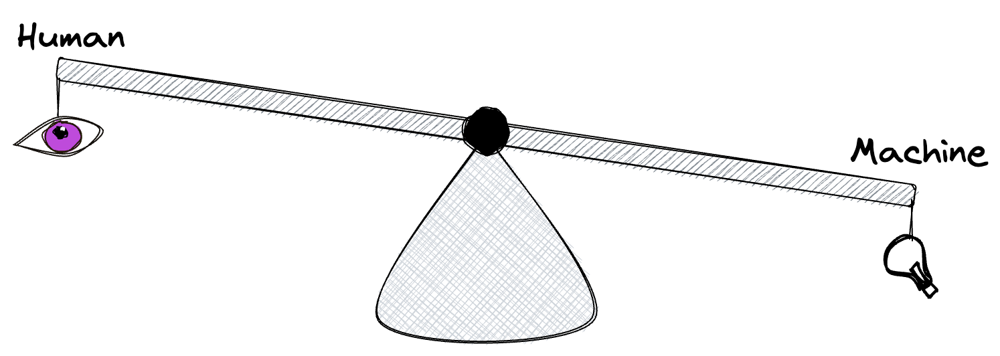

---

^ 2. Orchestrate all the required tools before the human get into picture to get better visibility. 

# Don't Waste People Time

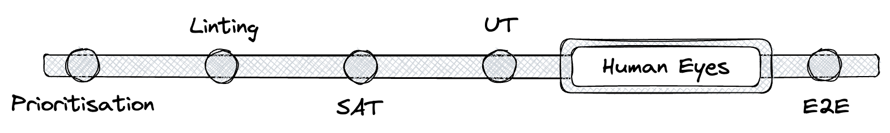

---

^ 3. For every comment think to your self `can I automate it for next time? create custom lint rules for it.

# Adopt _Can I Automate It?_ Mind
## Include Auto Remediation

---

^ Show custom lint example

# `Can I Automate It`
# Demo 🍿 Time

---

^ 5. Avoid neat-picking. Especially on code styling. Use auto formatting tools.

[.autoscale: true]
[.build-lists: true]

# Be a Mentch

- Convesations over Instructions
- Team over Individual
- Collaboration over Competition
- No nitpicking
- KISS

---

^ 6. Insert the reviewers of CR to the engineering statistics. A good PR is belong to the reviewer as well. (velocity, quality)

# Treat Code Reviews as Product Features

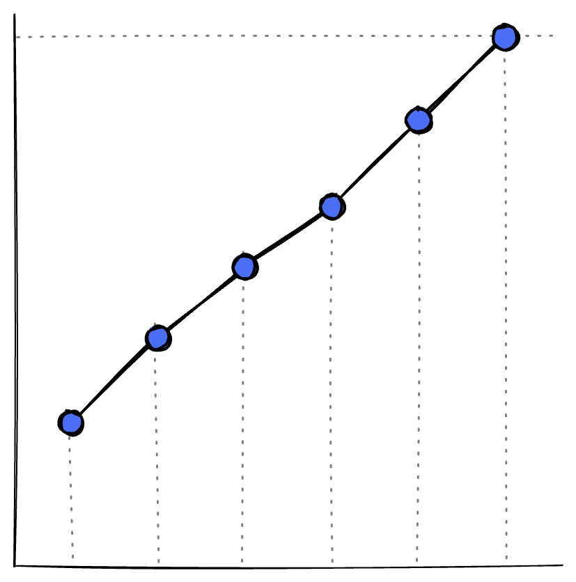

---

^ GitStream
7. Use tools to prioritise CRs

# Manage Priorities

 

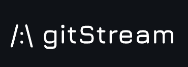

---

[.header: alignment(left)]

 
 
# Thank You :pray:
## Show your love to OPAL with a GitHub Star :star: :point_right:
### Find more about OPAL on opal.ac
#### Follow me on Twitter @gemanor
