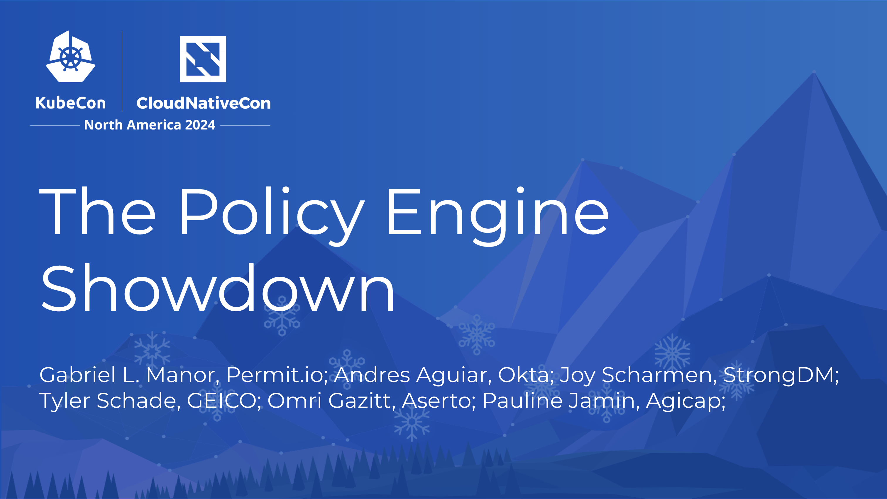
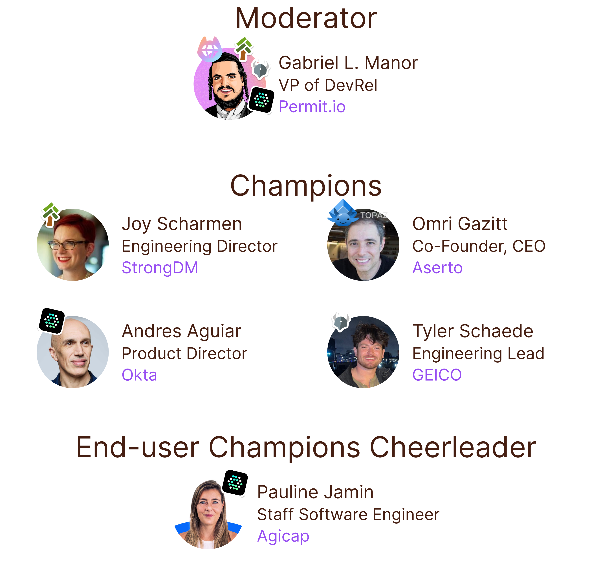

theme: Plain Jane
footer: 
slide-transition: true

[.header: alignment(left)]
[.footer: ]

---

[.autoscale: true]

^ TBD add pictures
- Moderator
    - Gabriel L. Manor - VP of DevRel at Permit.io
- Engine Fighters
    - Tyler Schade - Distinguished Engineer, GEICO - Open Policy Agent
    - Andres Aguiar - Director of Product Management, Okta - OpenFGA
    - Joy Scherman - Director of Engineering, StrongDM - Cedar
    - Omri Gazitt - Co-Founder, CEO, Aserto - Topaz
- End User Champions
    - Pauline Jamin - Staff Software Engineer, Agicap - OpenFGA

---

[.build-lists: true]

# Showdown Rules
- No winner
- Focus on `Do`

---

#[fit] ⏰ 30 Seconds Pitch Round ⏰

###[fit] +**30s bonus** for one positive statement about another engine

---

#[fit] **The Way They Work**

---

# Policy **vs.** Data

---

# Centralized **vs.** Decentralized

---

# Stateful **vs.** Stateless

---

# Correctness **vs.** Verification

---

# Multi Purpose **vs.** Single Purpose

---

#[fit] **The Way They Do**

---

# Data sync

---

# Structured **vs.** Unstructured Data

---

# Consistency
#[fit] Strong **|** Eventual **|** RyR

---

# Enforcement Points

---

# Ecosystem

---

# Queries

---

#[fit] **The Way They Run**

---

# Testing

---

# SDLC

---

# Benchmarking

---

# Scalability (Policy, and Data)

---

# Limitations

---

# Performance

---

#[fit] **The Way They Adopt**

---

# Adoption Curve

---

# Lift and Shift

---

# Dedicated Engineers

---

# Clean Code

---

[.header: alignment(left)]

 
 

# Thank You :pray:
## [Visit Engine Pages on GitHub](https://linktr.ee/policy_engines) :point_right:
### https://io.permit.io/policy-egnines
