theme: Plain Jane
footer: 
slide-transition: push(bottom)
autoscale: true

[.header: alignment(left)]

<br>
<br>
<br>
# [fit] The Future of Authorization in Applications
## Gabriel L. Manor

---


---


---

^ My name is Gabriel, and today we are gonna to talk about my way of implementing software solutions for permissions teach me about real life

[.footer: ]
[.header: alignment(left)]


<br>
<br>
<br>
<br>

## Gabriel L. Manor

### Engineering Director @ Permit.io

#### 🏆 Implementing Software Solution in His Perosnal Life

#### Not an ethical hacker, zero awards winner, dark mode hater.

---

^ Here's the main problems that make the connection work a complex task
1. The structure of the connection request is not clear, give example of the simplicity of making connection in the internet
2. Each part of the scructure has too many options to choose from
3. There's no time to waste when need to outreach someone
4. These three is making me hard to get the confidence

[.text: alignment(center)]
[.header: alignment(left)]

<br>
<br>
<br>
<br>

[.column]

Chaos

[.column]

Complexity

[.column]

Velocity

[.column]

Confidence

---

^ Another complexity factor is the cloud native and distributed architectures

# [fit] _Chaos_, Complexity, Velocity, Confidence

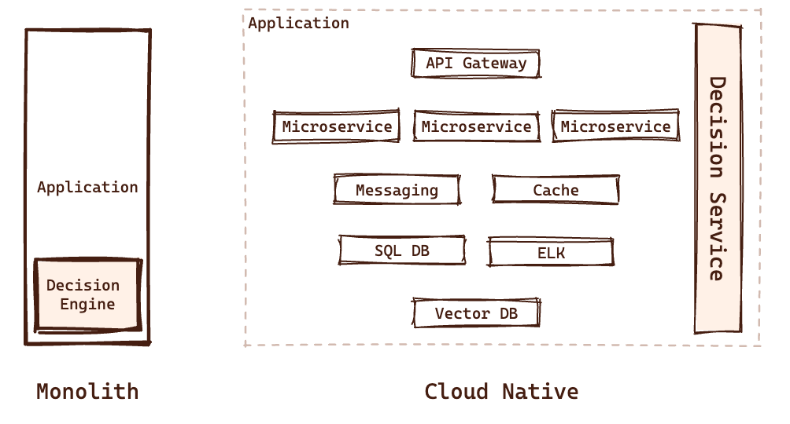

---

^ First complexity factor is the growing amounts of data we are processing in our applications

# [fit] Chaos, _Complexity_, Velocity, Confidence

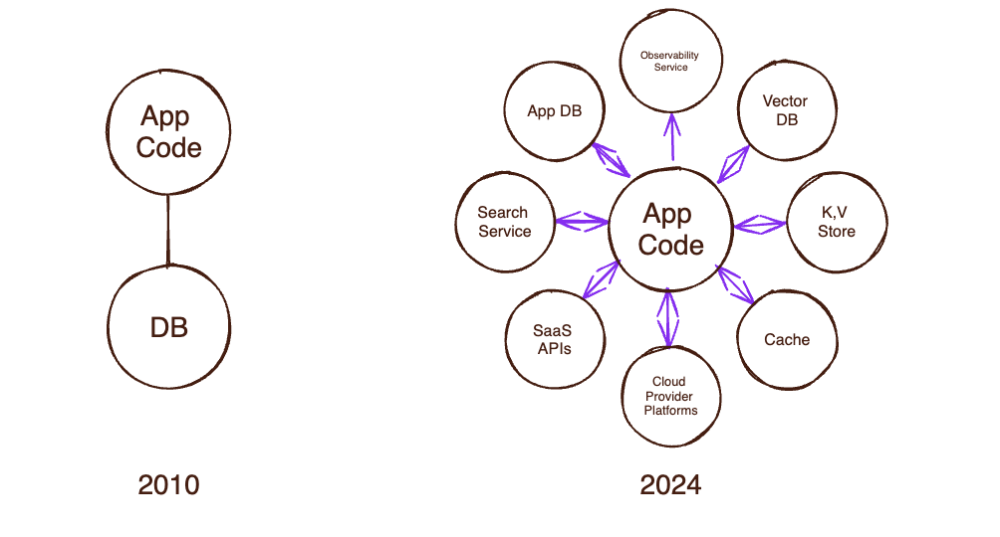

---

^ Such amount of data making the decisions harder.
1. The amount of data we need to get decision of
2. The decision themselves are more complex

## Decision Fatigue Syndrome

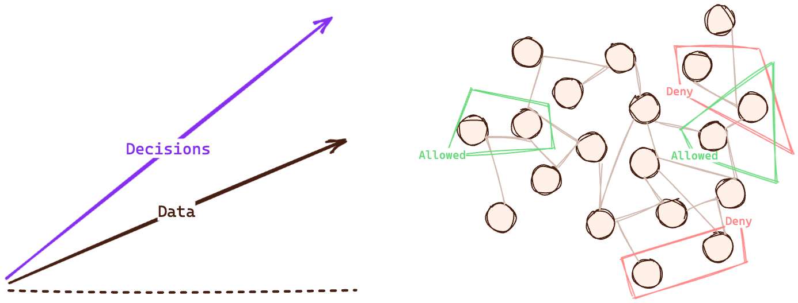

---

^ Third problem, is the way we deoploy software today

# [fit] Chaos, Complexity, _Velocity_, Confidence

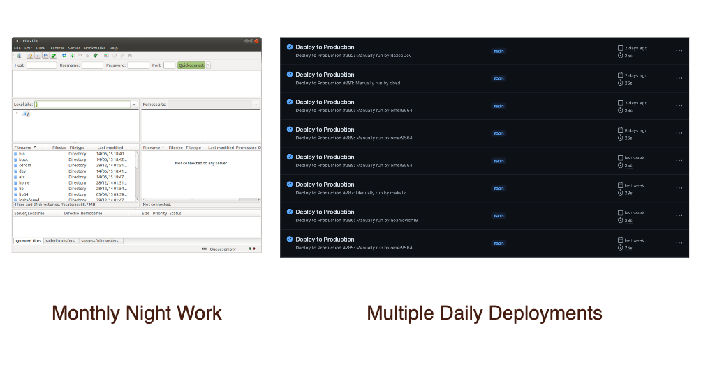

---

^ Fourth complexity factor is the stakeholders around our applications

# [fit] Chaos, Complexity, Velocity, _Confidence_


---

^ First, the internal roles that want to get more control in the application

# Application Code Stakeholders


---

^ But not only that, the users also wants to get control in permissions. For example, let's look at healthcare example that we all know
// #[fit] Digital Healthcare Exponential Requirement Growth

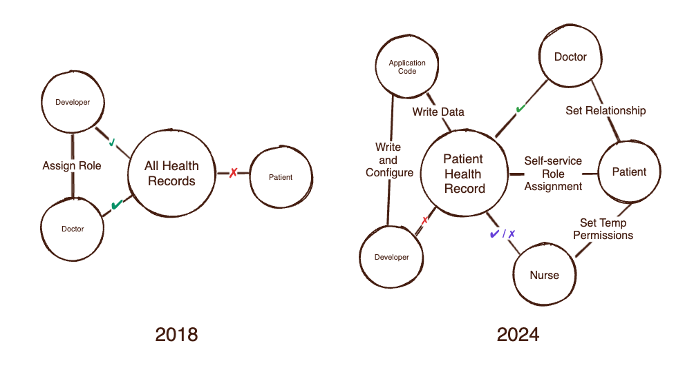

---

^ Not only real users, but also LLM and AI agents


---


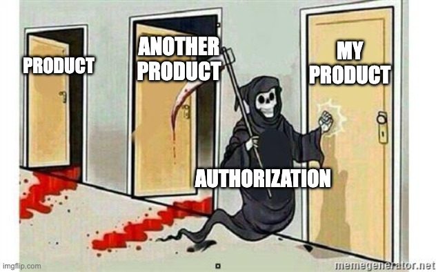

---

^ In software development, there is the same evolution to simplify complexity
- Machine Code
  - Imperative Languages
    - Design Patterns
    - Frameworks
      - Declarative Languages
        - Domain Specific Languages

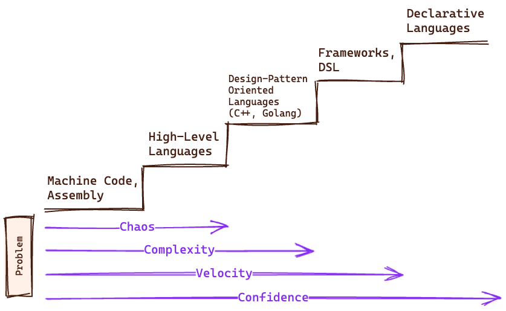

---

^ A very famous example for that is HTML


---

^ Here's an example of the confidence html bring us

[.column]

#### HTML

```html
<div>This is a div in HTML.</div>
```

[.column]

#### C++

```cpp
#include <windows.h>

// Function declarations
LRESULT CALLBACK WindowProcedure(HWND, UINT, WPARAM, LPARAM);
void DrawRectangle(HWND hwnd);

// Entry point
int WINAPI WinMain() {
    WNDCLASSW wc = {0};

    wc.hbrBackground = (HBRUSH)COLOR_WINDOW;
    wc.hCursor = LoadCursor(NULL, IDC_ARROW);
    wc.hInstance = hInst;
    wc.lpszClassName = L"myWindowClass";
    wc.lpfnWndProc = WindowProcedure;

    if (!RegisterClassW(&wc)) return -1;

    CreateWindowW(
        L"myWindowClass",
        L"Simple Div in C++",
        WS_OVERLAPPEDWINDOW | WS_VISIBLE,
        100,
        100,
        500,
        500,
        NULL,
        NULL,
        NULL,
        NULL
    );

    MSG msg = {0};
    while (GetMessage(&msg, NULL, 0, 0)) {
        TranslateMessage(&msg);
        DispatchMessage(&msg);
    }

    return 0;
}

// Window procedure
LRESULT CALLBACK WindowProcedure(HWND hwnd, UINT msg, WPARAM wp, LPARAM lp) {
    switch (msg) {
    case WM_DESTROY:
        PostQuitMessage(0);
        break;
    case WM_PAINT:
        DrawRectangle(hwnd);
        break;
    default:
        return DefWindowProcW(hwnd, msg, wp, lp);
    }
    return 0;
}

// Function to draw a rectangle
void DrawRectangle(HWND hwnd) {
    PAINTSTRUCT ps;
    HDC hdc = BeginPaint(hwnd, &ps);
    // Set up the rectangle dimensions
    RECT rect = { 50, 50, 250, 150 };
    // Set up the brush color
    HBRUSH brush = CreateSolidBrush(RGB(0, 0, 255));
    FillRect(hdc, &rect, brush);
    EndPaint(hwnd, &ps);
}
```

[.column]

#### Assembly

```wasm
section .data
    className db 'WinClass',0
    windowName db 'Window',0

section .bss
    hInstance resb 6
    msg resb 28
    hwnd resb 4
    wndClass resb 48

section .text
    global _start

_start:
    ; Get instance handle
    call [GetModuleHandle]
    mov [hInstance], eax

    ; Define window class
    mov eax, [hInstance]
    mov [wndClass+36], eax
    mov dword [wndClass+40], WindowProc
    mov dword [wndClass+44], 0x0003
    mov [wndClass], 0x00000000
    lea eax, [className]
    mov [wndClass+5], eax
    call [RegisterClass]

    ; Create window
    push 0
    push 0
    push 0
    push 0
    push 0
    push 0
    push 0x3f0000
    push windowName
    push className
    push 0x00cf0000
    call [CreateWindowEx]
    mov [hwnd], eax

    ; Show and update window
    push 1
    push [hwnd]
    call [ShowWindow]
    push [hwnd]
    call [UpdateWindow]

    ; Message loop
    .message_loop:
        push 0
        push 0
        push [hwnd]
        lea eax, [msg]
        push eax
        call [GetMessage]
        test eax, eax
        jz .exit
        lea eax, [msg]
        push eax
        call [TranslateMessage]
        lea eax, [msg]
        push eax
        call [DispatchMessage]
        jmp .message_loop

    .exit:
        mov eax, 1
        xor ebx, ebx
        int 0x80

; Window procedure
WindowProc:
    push ebp
    mov ebp, esp
    cmp dword [ebp+12], 0x000F
    je .wm_paint
    cmp dword [ebp+12], 0x0002
    je .wm_destroy

    ; Default processing
    push dword [ebp+16]
    push dword [ebp+12]
    push dword [ebp+8]
    call [DefWindowProc]
    jmp .done

    .wm_paint:
        ; Handle WM_PAINT message here to draw the rectangle
        ; This part involves setting up a device context, drawing commands, etc.

        jmp .done

    .wm_destroy:
        push 0
        call [PostQuitMessage]
        xor eax, eax
        jmp .done

    .done:
        mov esp, ebp
        pop ebp
        ret
```

---

^ But not only that, every very complex problem solved with such pattern

[.text: alignment(center)]
[.header: alignment(left)]

# Domain-Specific Declarative Languages

[.column]
<br>
🗃️
SQL
<br>
🔖
XML

[.column]
<br>
🧩
YAML
<br>
📚
LaTeX

[.column]
<br>
🎼
LilyPond
<br>
🥒
Gherkin

[.column]
<br>
💬
CEL
<br>
🔧
HCL

---

[.header: alignment(center)]

# Chaos 👉 Structure

---

^ The first step in modeling, is understanding where we need permissions in our stack
- Admission - What a Developer Can Do?
- Infrastructure - What Services Can Do?
- Application
  - Data - What Data Can Application Users Access?
  - Application code - What Application Users Can Perform?
  - UI (feature flags) - What Application Users Can See?

# Authorization Layers

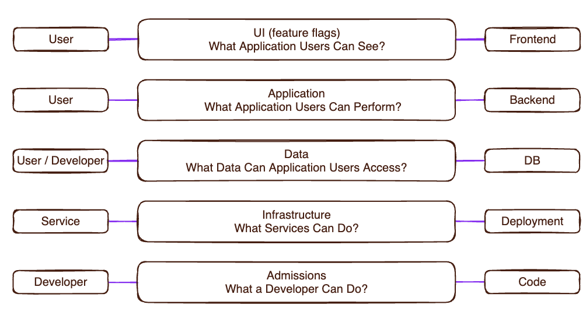

---

^ First step to solve the structure problem, is to decouple policy from code

#Abstract Authorization Service Model

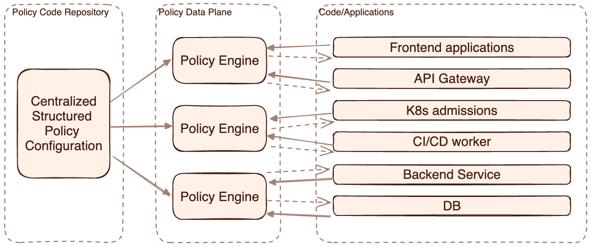

---

^ DDD is a great example of the need in a specific authorization domain

# Application-Level Domain-Driven Model


---

[.header: alignment(center)]

# Complexity 👉 Design Patterns

---

# Abstract Decision Components

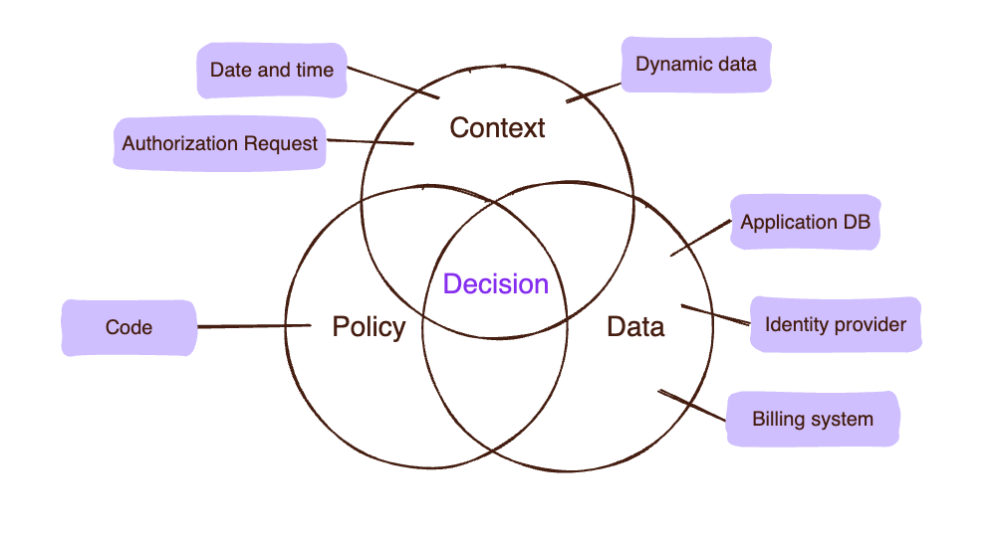

---

^ Third step, is to understand our needs. It could be binary gating or filtering

# Authorization Decision Types

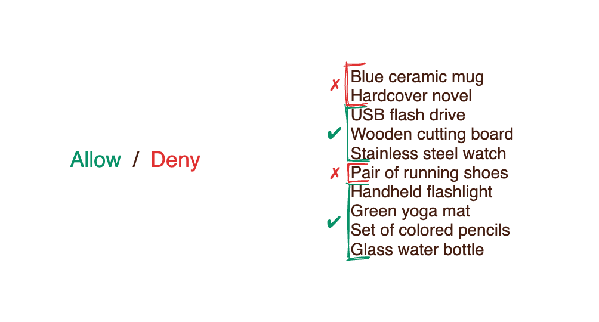

---

^ For binary gating most important thing to rememer, is that our enforcement point should keep the same format with the model we choose

# Binary Check Function

```javascript
check({ user }, { action }, { resource }, { context });
```

---

# Binary Check Function

```javascript
check({ user }, { action }, { resource }, { context });
```

```python
response = requests.post('http://host.docker.internal:8180/v1/is_authorized', json={
    "principal": f"User::\"{user}\"",
    "action": f"Action::\"{method.lower()}\"",
    "resource": f"ResourceType::\"{original_url.split('/')[1]}\"",
    "context": request.json
})
```

```js
const response = await fetch(
  "http://host.docker.internal:8180/v1/is_authorized",
  {
    method: "POST",
    body: JSON.stringify({
      principal: `User::\"${user}\"`,
      action: `Action::\"${method.toLowerCase()}\"`,
      resource: `ResourceType::\"${originalUrl.split("/")[1]}\"`,
      context: body,
    }),
  }
);
```

---

^ For filtering, the best option is to have a function for partial evaluation queries

[.code: alignment(left)]

# Partial Evaluation Flow

```js
permit (
    principal == PhotoApp::User::"stacey",
    action == PhotoApp::Action::"viewPhoto",
    resource
)
when { resource in PhotoApp::Account::"stacey" };
```

⬇⬇⬇

```js
evaluate("pictures", "staty", "viewPhoto");
```

⬇⬇⬇

```sql
SELECT *
FROM photos
WHERE owner = 'Stacey';
```

---

[.header: alignment(center)]

# Velocity 👉 Frameworks

---

^ The second step in modeling, is understanding our permissions model

[.text: alignment(center)]

## Permission Models

<br>

[.column]


PBAC

[.column]


RBAC

[.column]


ABAC

[.column]


ReBAC

---

^ PBAC is the less recommended one for application
See the example of policy rules, when an actual data is evolving, it getting hard. PBAC works well when we are working only with the context of the request.

# Policy Based Access Control

✔ No External Data Policies

```
allow developers to deploy to production only on weekends

deny developers from creating S3 buckets with the name "prod"

allow developers to create S3 buckets only if their name starts with "dev-"
```

<br>

✗ External Data Policies

```
allow developers to deploy S3 buckets only if the next billing cycle is less than $100
```

---

^ RBAC pros and cons

# Role Based Access Control

- Leverage user roles to determine permissions
- Commonly used as a term for authorization
- Very simple to implement and audit
- Flexible to use in different domains
- Hard to consider external data in policies
- Limited granularity in resource permissions

---

^ RBAC is the most common one for application

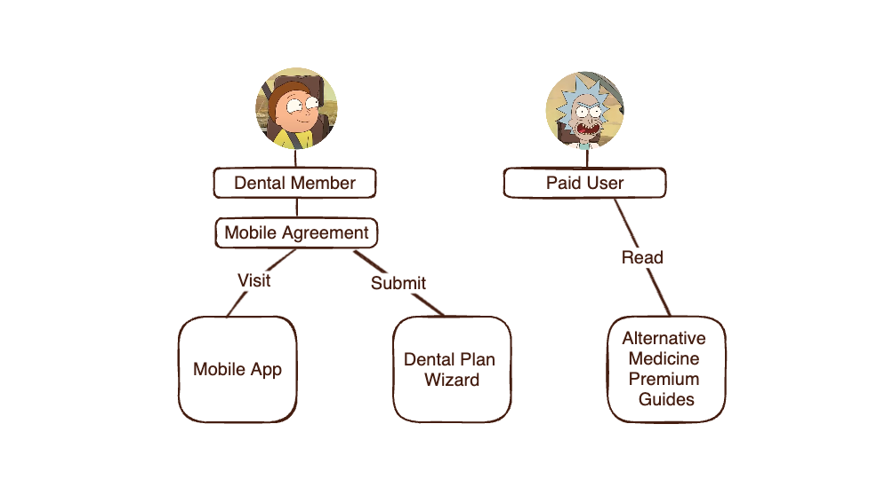


---

^ ReBAC pros and cons

# Relationship Based Access Control

- Assign instance-level roles to users
- Leverage entity relationships to derive role permissions
- Built to support modern data models in efficient way
- Require centralized graph to calculate decisions
- Limited granularity in user and resource inspection

---


^ What is google Zanzibar? It's a paper that propose a new approach to model permissions in a graph

[.header: alignment(center)]

#[fit] Google Multi Domain Authorization Challenge

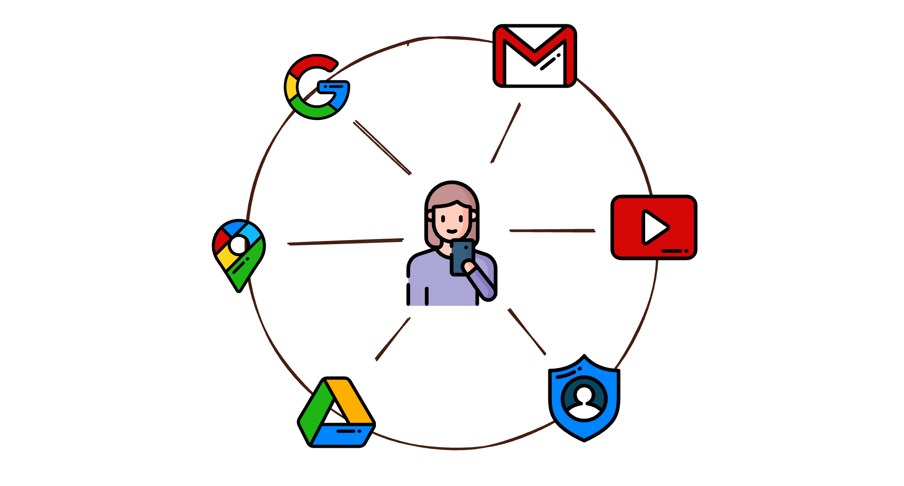

---

^ Gogole Zaanzibar principles, why OPA and Cedar hard with it

# Google Zanzibar Principles

* Relationship Tuples
* Role Derivation
* Tuples Graph
* Relationship Based ACLs

---

^ RBAC is the most common one for application

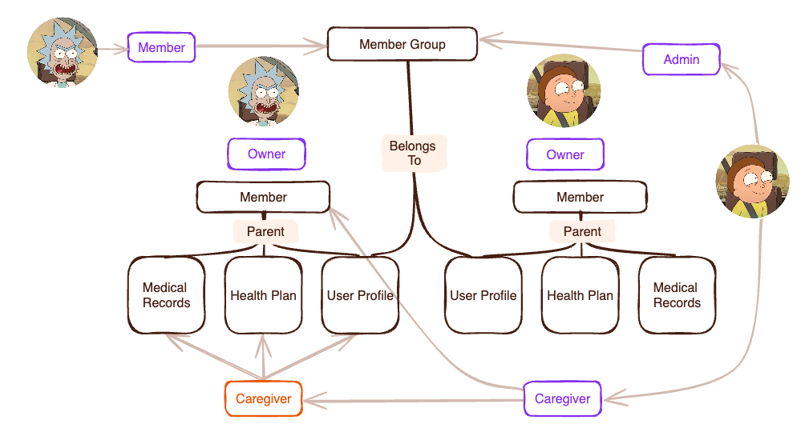


---

^ ABAC pros and cons

# Attribute Based Access Control

- Leverage entities' attributes to model permissions
- Use attribute conditions in the policies
- Most flexible structured policy model
- Complex to build and audit in imperative languages
- Usually used as extension to RBAC and ReBAC systems

---

^ RBAC is the most common one for application

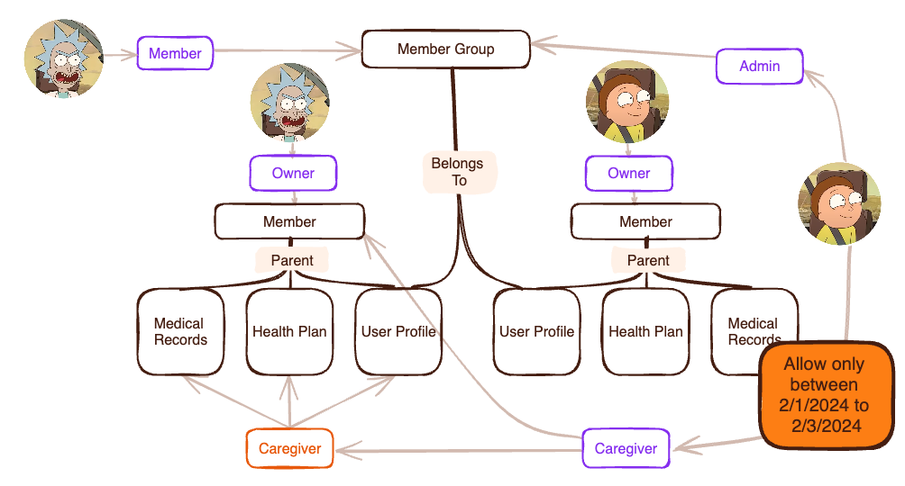

---

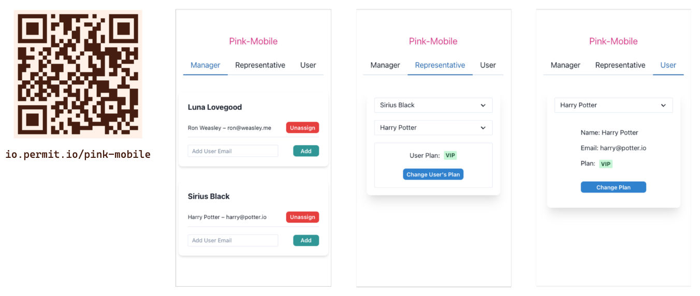

---

[.text: alignment(center)]

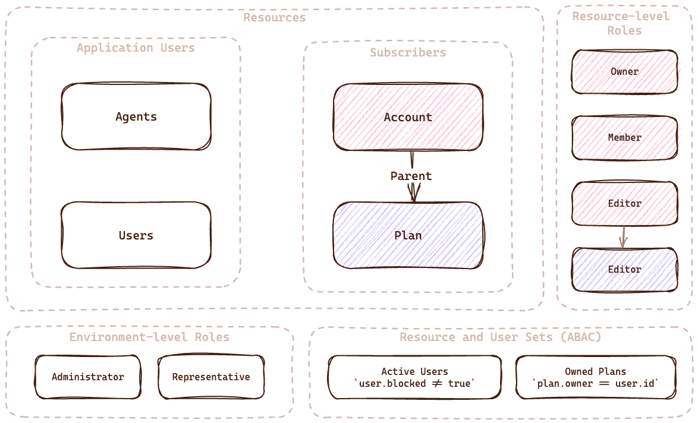

RBAC, ReBAC, ABAC Modeling Example

---

#[fit] Confidence 👉 Domain-Specific Declarative Code

---

^ This is where policy languages comes to the rescue, explain why it is solving the problems

```typescript
// Users can edit their own info, admins can edit anyone's info
permit (
    principal,
    action,
    resource in HealthCareApp::InfoType::"accountinfo"
)
when {
    resource.subject == principal ||
    principal in HealthCareApp::Role::"admin"
};

//A patient may create an appointment for themselves, or an administrator can do it
permit (
    principal,
    action == HealthCareApp::Action::"createAppointment",
    resource
)
when {
    (context.referrer in HealthCareApp::Role::"doctor"  && resource.patient == principal) ||
    principal in HealthCareApp::Role::"admin"
};
```

---

^ So, we might solve the structure problem with proper architecture, but imperative code still getting complex

#[fit] Domain-Specific Declarative Code Advantages

[.column]
- Performance
- Reusability
- Versioning
- Testing

[.column]
- Maintainance
- Readability
- Validation

---

^ What are the option that we have today? I choose three languages that represent different approaches. OPA multi purpose language, Cedar for application-level, and OpenFGA for decisions evolve lot of data

[.header: alignment(center)]

<br>

[.column]


## Open Policy Agent

[.column]
<br>


## AWS<br>Cedar

[.column]


## OpenFGA

---

```haskell
allow {
    input.user.role == "viewer"
    validate_department(input.user, input.document)
    validate_classification(input.user.role, input.document.classification)
    validate_dynamic_rules(input.user, input.document)
}

validate_department(user, document) {
    user.department == document.department
}

validate_classification(user_role, doc_classification) {
    role_permissions[user_role][_] == doc_classification
}

validate_dynamic_rules(user, document) {
    dynamic_rules[_](user, document)
}
```

---

^ Now, that we are understanding the basics, let see how the different approaches of the policy languages are working. Let's start with OPA

# Open Policy Agent

- Started as a multi-purpose policy engine
- Using Rego as a policy language
- As part of their GTM, they are focusing on Kubernetes admission
- Works great for application-level authorization (<10 ms for decision)
- Hard to deal with large (>2gb) sets of data
- Need some tweak for efficient ReBAC support

---

^ Since OPA is multi purpose, it's the easiest one to enforce permissions on multiple domains

# OPA Multi Domain Support

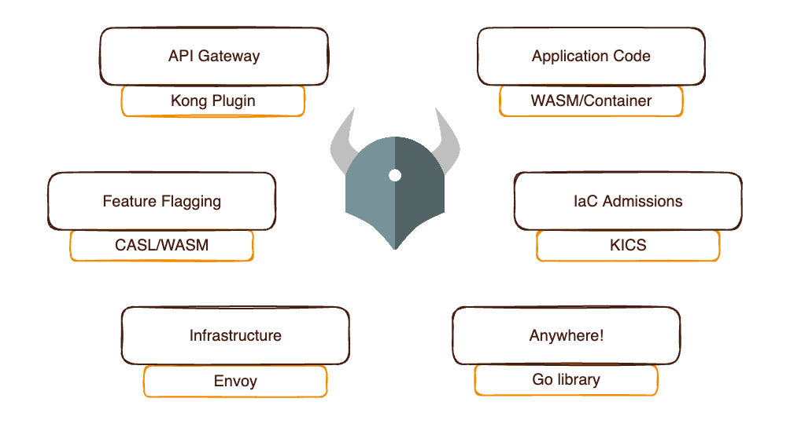

---

^ Here you can see how clear and stragiht forward is the Cedar code

```javascript
permit (
    principal == PhotoApp::User::"stacey",
    action == PhotoApp::Action::"viewPhoto",
    resource
)
when { resource in PhotoApp::Account::"stacey" };
```

---

^ Cedar is simpler than OPA, but do not support ReBAC in easy way and aim to be perfect for application level

# AWS Cedar

- Started as a language for application-level authorization
- Not like AWS IAM, it's a language that can be used in any application
- AWS released it as open source, but also offer it as a service (AVP)
- Use Dafny language to provide scientific proof for correctness and performance
- (Still) hard to deal with unstructured data - no real ReBAC support
- Faster option for ABAC decisions
- Support audit, static analysis, and partial evaluation out of box

---

^ OpenFGA do not support ABAC, but it's ReBAC configuration support policy as code

```yaml
model
  schema 1.1

type organization
  relations
    define member: [user] or owner
    define owner: [user]
    define repo_admin: [user, organization#member]
    define repo_reader: [user, organization#member]
    define repo_writer: [user, organization#member]

type repo
  relations
    define admin: [user, team#member] or repo_admin from owner
    define maintainer: [user, team#member] or admin
    define owner: [organization]
    define reader: [user, team#member] or triager or repo_reader from owner
    define triager: [user, team#member] or writer
    define writer: [user, team#member] or maintainer or repo_writer from owner

type team
  relations
    define member: [user, team#member]

type user
```

---

^ OpenFGA is the one on the list that combines the configuration as code approach with Policy as Graph that proposed in Google Zanzibar paper

# OpenFGA

- Open source implementation of Google Zanzibar that fit any scale
- Configured with JSON/YAML/DSL
- Need to deploy one centralized platform for decision making
- Backed and maintained by Auth0 and use by them for authorization
- Contain many application-specific features

---

^ So let's summarise the different approaches and platforms

[.header: alignment(center)]

[.column]


###[fit] Open Policy Agent

- Multi-domain support
- Complex language
- Great for large-scale enterprise

[.column]

<br>


### AWS Cedar

- Simplest language
- Application oriented
- Not support ReBAC
- Best to start with

[.column]


### OpenFGA

- Best for ReBAC
- No new language
- Hard to desentrelize
- No ABAC support

---

^ The choosing in the right policy model for you is a task that driven by the nature of the application

| **Company**                          | **Language**      | **Models**        |
| ------------------------------------ | ----------------- | ----------------- |
|  Netflix | Rego              | RBAC, ABAC, ReBAC |
|  AirBnB   | Himeji (Zanzibar) | ReBAC             |
|  Uber       | CEL               | ABAC              |
|  Google   | Zanzibar          | ReBAC             |
|  Reddit   | Rego              | RBAC, ABAC        |
|  AWS      | Cedar             | RBAC, ABAC        |

---

^ Here is the diagram of OPAL architecture

# OPAL - Open Policy Administration Layer

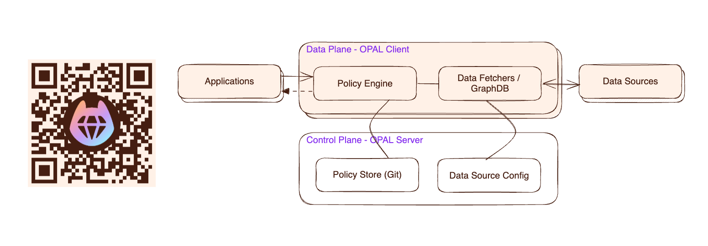

### An End-to-End *Batteries Included* Authorization Service

---

^ Luckily, there is a cool open source tool that can help us to implement such architecture
- Aim to provide e2e authorization service for applications
- Provide plugin infrastructure to plug any policy engine
- Use GitOps principles to manage policy configuration
- Support data sharding to provide ReBAC support in policy engines
- Use Server/Client architecture for centralized configuration and decentralized enforcement
- Provide pub/sub mechanism for policy and data changes
- Data sources configured in the server, and the client fetch them
- Provide extensible system for data fetchers to support any type data source

# OPAL Specifications

[.column]

- End-to-End Authorization
- Policy Engine Plugins
- GitOps Policy Flow
- Data Sharding ReBAC
- Centralized Config

[.column]

- Decentralized Decision
- Pub/Sub Policy & Data Updates
- Extensible Data Fetchers
- Plugable Data Sources


---

# Thank You :pray:
#[fit] Join OPAL Slack Community *io.permit.io/opal-slack*
