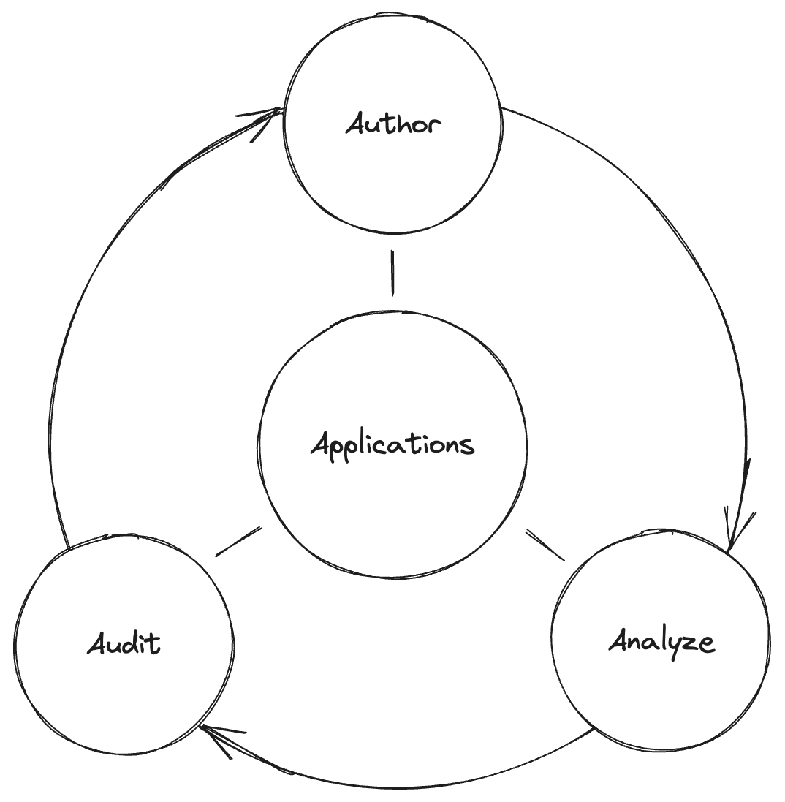
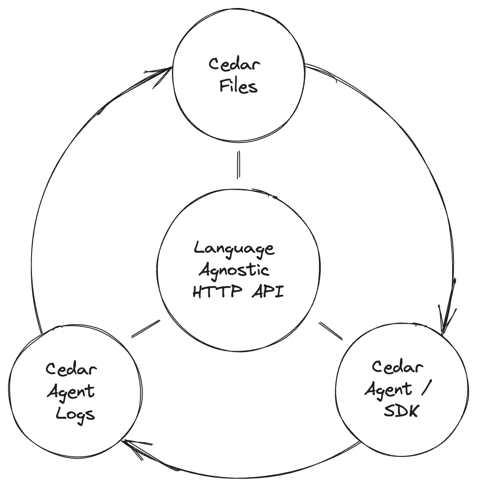
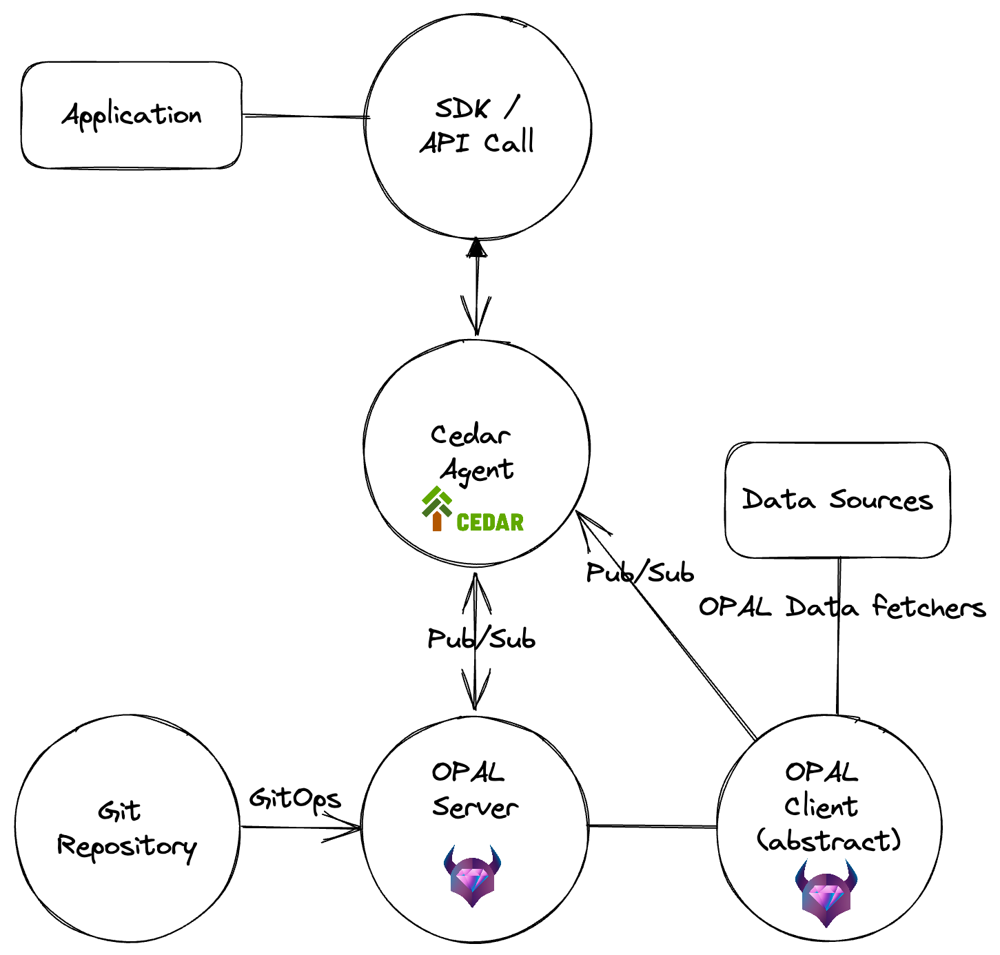
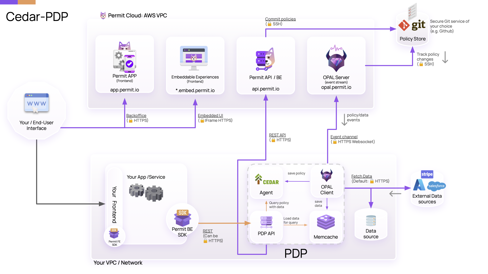

theme: Plain Jane
footer: 
slide-transition: true
header-emphasis: color(#9B5EE5)

[.header: alignment(left)]

^I'm lucky that it is virtual because if not, you'll bite me for using Shift Left

<br>


# Continuous Access Control with OPAL and Cedar
## Gabriel L. Manor

---

^ What is shift left? let the audience answer

# _Shift_ Left

---

^ I asked ChatGPT, look at the measures it is not the right thing. Measure create antgonism between the teams, it's not the right thing

<br>

> _Shift_ left in security refers to _integrating_ security practices and considerations earlier in the software development lifecycle, emphasizing proactive _measures_ and reducing vulnerabilities.
-- ChatGPT

---

^ Looking at this picture, non of that tools are influence the software development, they are just measure it


---

^ The next phase of shift left is influecning software product over measure them

# ~~Measure~~
# Influence

---

^ Case study, access control in the application level

## _Case Study_
# Application-Level Access Control

---

[.footer: ]
[.header: alignment(left)]


<br>
<br>
<br>
<br>

## Gabriel L. Manor
### Director of DevRel @ Permit.io
#### Not an ethical hacker, zero awards winner, dark mode hater.

---

^ Authentication is already in a good state from the security prespective. 
The code is not change often and can easly done by 3rd party products.


---

^ Authorization not

# The Auth Comfort Zone

[.header: alignment(left)]
[.column]
## Authentication 😌
_Verify who the user is_

```javascript
if (!user) {
    return;
}
```

[.column]
## Authorization 😔
_Check what a user can do_

```javascript
if (!allowed(
        user,
        action,
        resource
    )) {
    return;
}
```

---

^ Typical authorization journey - code samples
^ Jessie got the ticket, looked at their framework, he knows clean code, he implemented nice middleware that support annotations on the API endpoints with the roles, at the end of the sprint they support RBAC and everyone was happy.

```javascript
// Middleware
if (req.user.roles.indexOf(role) === -1) {
    return res.send(403);
}

// Endpoint
@authz('admin')
const Document = () => {
    ...
}
```

---

^ After another week, a new feature added, paid users. Beside of roles, now there is a cross-role concept of paid users, and Jessie need to add it to the RBAC. Not that hard, just support in multiple decorators.

```javascript
// Middleware
const hasRole = roles.filter((r) => (
    req.user.roles.indexOf(role) > -1
))
if (!hasRole) {
    return res.send(403);
}

// Endpoint
@authz('admin')
@authz('paid')
const Document = () => {
    ...
}
```

---

^ But the week after, the PM come and ask for multiple tier of paid users, we want to have different operational for paid users.
Jessie add a nice support in multiple attributes to support such if

```javascript
// Middleware
if (args.length === 2 && req.user[args[0]] !== args[1]) {
    return res.send(403);
}
if (req.user.roles.indexOf(role) > -1) {
    return res.send(403);
}

// Endpoint
@authz('admin')
@authz('location', 'eu')
const Document = () => {
    ...
}
```

---

^The next feature that affect Jessie, was the addition of new attributes to the resources, as it now european users can access only to the european resources. Jessie started to feel the pain, the decorators model isn't work anymore, something should change in the endpoint level itself.

```javascript
// Middleware
if (typeof args[0] === 'object') {
    return AuthzDesicion(args[0])
}
if (args.length === 2 && req.user[args[0]] !== args[1]) {
    return res.send(403);
}
if (req.user.roles.indexOf(role) > -1) {
    return res.send(403);
}

// Endpoint
@authz('admin')
@authz('location', 'eu')
@authz({
    ...
})
const Document = () => {
    ...
}
```

---

^ This is not influenced by security, is influenced by implementation

# Implement RBAC to an Application

---

# ~~Implement RBAC to an Application~~
# Enforce Permissions in Applications

---

^ Let's get a reminder in permissions model
^ There are 4 commoly used permissions models today, when we want to add AuthZ to application, we should be familiar with them and choose how to implement it with no matte rof the framework or tech stack we use.

[.header: alignment(left)]

## ACL - Access Control List

## RBAC - Role-Based Access Control

## ABAC - Attribute-Based Access Control

## ReBAC - Relationship-Based Access Control

---

^ ACL is the most simple model, it's a list of users and the resources they can access. It's usually implemented in the application level itself, and it's not scalable at all.
Not scalable, usually used in low-performance appliances

[.header: alignment(left)]
# ACL - Access Control List

[.column]


[.column]
* EOL model
* Widely used in IT systems/networks
* No segmentation/attribution support
* Hard to scale

---

^ RBAC is the most common model, it's a list of roles and the resources they can access. It's usually implemented in the application level itself, and it's not scalable at all.

[.header: alignment(left)]
# RBAC - Role Based Access Control

[.column]


[.column]
* The widely-used model for app authorization
* 🤓 Easy to define, use and audit
* No resource inspection
* Limited scalablity

---

^ ABAC is the most complex model, it's a list of rules that define the access to the resources. It's usually implemented in the application level itself, and it's not scalable at all.

[.header: alignment(left)]
# ABAC - Attribute Based Access Control

[.column]


[.column]
* The most robust model for inspection and desicion making
* Configuration could be hard
* Easy to handle multiple data sources
* 🚀 Highly scalable

---

^ ReBAC is the most scalable model, it's a list of roles and the resources they can access. It's usually implemented in the application level itself, and it's not scalable at all.

[.header: alignment(left)]
# ReBAC - Relationship Based Access Control

[.column]


[.column]
* Best fit for consumer-style applications
* Support in reverse indices and search for allowed data
* Easy to scale for users (>1b) hard in desicion's performance
* Expensive in management and maintainance


---

^ Althouh we influence the model, homebrowen is not enough because we should influence the DevEx. Independent decision code sample


```javascript
// Middleware
if (typeof args[0] === 'object') {
    return AuthzDesicion(args[0])
}
if (args.length === 2 && req.user[args[0]] !== args[1]) {
    return res.send(403);
}
if (req.user.roles.indexOf(role) > -1) {
    return res.send(403);
}

// Endpoint
@authz('admin')
@authz('location', 'eu')
@authz({
    ...
})
const Document = () => {
    ...
}
```

---

^ But a week after, a bug came, a user get access to a resource he is not aimed to.


---

^ Jessie was the first to analyze the bug and he discover that a user remove one of the decorator and do the check himself instead of using the framework.

```javascript
// Middleware
if (typeof args[0] === 'object') {
    return AuthzDesicion(args[0])
}
if (args.length === 2 && req.user[args[0]] !== args[1]) {
    return res.send(403);
}
if (req.user.roles.indexOf(role) > -1) {
    return res.send(403);
}

// Endpoint
@authz('admin')
const Document = () => {
    const enrichedUser = getSocialData(req.user);
    if (enrichedUser.lastGeolocation !== 'eu') {
        return;
    }
    ...
}
```

---

^ There is no way to deal with bad developers, but this is the actually the second (and maybe even mainly) problem we have with implementing authorization.
The mixing of policy code inside the application.

[.code-highlight: 15-19]
```javascript
// Middleware
if (typeof args[0] === 'object') {
    return AuthzDesicion(args[0])
}
if (args.length === 2 && req.user[args[0]] !== args[1]) {
    return res.send(403);
}
if (req.user.roles.indexOf(role) > -1) {
    return res.send(403);
}

// Endpoint
@authz('admin')
const Document = () => {
    const enrichedUser = getSocialData(req.user);
    if (enrichedUser.lastGeolocation !== 'eu') {
        return;
    }
    ...
}
```

---

^ The good authorization system life cycle, should influenced by secuirty
* Posture
* Compliance
* External functions

[.header: alignment(left)]
## The Autonomous Authorization Lifecycle

<br>



---

^ We also need to worry for DevEx, they will not use it if we have stuff like that
Decouple policy from code while keeping developers easy

[.build-lists: true]
[.header: alignment(left)]
# Security 🤝 DevEx

[.column]
* Cross-platform enforcement
* Performance-aware system
* Zero-effort deployment
* Decentralized architecture
* Seamless data and configuration syncing

[.column]

<br>


---

^ You are tired of problems, right? Let's find together a new way to implement authorization.

# [fit] Best-Practices for Secure Authorization System

- Agnostic to the permissions model
- Decouple policy from code
- Influenced by security
- DevEx in first mind
- Centralized lifecycle control

---

^ Everything starts with contract
^ As always, every better software solution, start with a contract. contracts are the best way to make software better, and what better of designing a contract of how to configure policies?

# [fit] Contracts Creates Better Relationships


### 👩🏽‍💻 _Especially in Human <> Machine Relationships_ 🤖

---

^ Contract is the way we configure and getting decisions

# [fit] Configuration 🤝 Execution

---

^ Today we will cover three permissions contracts that together can solve any kind of authorization problem.

<br>

[.column]
## Open Policy Agent


[.column]
## AWS<br>Cedar


[.column]
## Google Zanzibar


---

^ OPA, stands for Open Policy Agent, is a CNCF project that was created by Styra, it's a general purpose policy engine that can be used to enforce authorization policies in microservices architecture.
OPA contract core is Rego, a policy multi-prupose language that can be used to define policies in a declarative way.


[.column]
```haskell
package app.rbac

import future.keywords.contains
import future.keywords.if
import future.keywords.in

default allow := false

allow if user_is_admin

allow if {
	some grant in user_is_granted
	input.action == grant.action
	input.type == grant.type
}

user_is_admin if "admin" in data.user_roles[input.user]

user_is_granted contains grant if {
	some role in data.user_roles[input.user]
	some grant in data.role_grants[role]
}
```

[.column]
```haskell
package app.abac

import future.keywords.if

default allow := false

allow if user_is_owner

allow if {
	user_is_employee
	action_is_read
}

allow if {
	user_is_employee
	user_is_senior
	action_is_update
}

allow if {
	user_is_customer
	action_is_read
	not pet_is_adopted
}

user_is_owner if data.user_attributes[input.user].title == "owner"

user_is_employee if data.user_attributes[input.user].title == "employee"

user_is_customer if data.user_attributes[input.user].title == "customer"

user_is_senior if data.user_attributes[input.user].tenure > 8

action_is_read if input.action == "read"

action_is_update if input.action == "update"

pet_is_adopted if data.pet_attributes[input.resource].adopted == true
```

---

^ OPA pros and cons

[.header: alignment(left)]
# Open Policy Agent

* 👍 Wide ecosystem
* 👍 Rego is comprehensive and robust
* Rego is complex 🤔
* Data cache replica
* Enforcement plugins

---

^ Google Zanzibar is a standard created by Google for their scalable systems they need. I mostly like the implementation of OpenFGA to it, but it's not a contract, it's an implementation.


---

OpenFGA Implementation


```json
{
  "schema_version": "1.1",
  "type_definitions": [{
      "type": "user"
    }, {
      "type": "document",
      "relations": {
        "reader": {"this": {}},
        "writer": {"this": {}},
        "owner": {"this": {}}
      },
      "metadata": {
        "relations": {
          "reader": {
            "directly_related_user_types": [{"type": "user"}]
          },
          "writer": {
            "directly_related_user_types": [{"type": "user"}]
          },
          "owner": {
            "directly_related_user_types": [{"type": "user"}]
          }
        }
      }
    }
  ]
}
```

---

^ Google Zanzibar pros and cons

[.header: alignment(left)]
# Google Zanzibar - OpenFGA

* Simple ReBAC
* Complex RBAC/ABAC
* Reverse indices support
* Backed by OKTA
* Stateful

---


^ AWS Cedar is a policy engine and language that was created by AWS, it's a general purpose policy engine that can be used to enforce authorization policies in microservices architecture.


[.column]
```javascript
permit(
    principal in Role::"admin",
    action in [
        Action::"task:update",
        Action::"task:retrieve",
        Action::"task:list"
    ],
    resource in ResourceType::"task"
);
```

[.column]
```javascript
permit (
    principal,
    action in
        [Action::"UpdateList",
         Action::"CreateTask",
         Action::"UpdateTask",
         Action::"DeleteTask"],
    resource
)
when { principal in resource.editors };
```

[.column]
```javascript
permit (
    principal,
    action,
    resource
)
when {
    resource has owner &&
    resource.owner == principal
};
```

---

^ AWS Cedar pros and cons

[.header: alignment(left)]
# AWS Cedar

* 👍 First desgined as application authz language
* 👍 Backed by AWS 
* Just released 🤔
* ReBAC via ABAC
* Benchmark winner

---

^ Cedar is the balance between search based and zanzibar
* Support one level of reverse indices
* Can store data in edge

# Cedar
## Best of Both Worlds

---

^ The three principles that Cedar follows

[.header-emphasis: color(#9B5EE5)]

# [fit] Does _[User]_ Allowed to Perform _[Action]_ on _[Resource]_
# [fit] Is a Monkey Allowed to Eat a Banana


```rust
permit(
    principal,
    action,
    resource
);
```

---

^ Cedar entity format

[.header: alignment(left)]
# Cedar Entities

[.column]

```json
...
{
    "attrs": {},
    "parents": [
        {
            "id": "admin",
            "type": "Role"
        }
    ],
    "uid": {
        "id": "admin@blog.app",
        "type": "User"
    }
},
...
```

[.column]

```json
...
{
    "attrs": {},
    "parents": [],
    "uid": {
        "id": "article",
        "type": "ResourceType"
    }
},
{
    "attrs": {},
    "parents": [],
    "uid": {
        "id": "put",
        "type": "Action"
    }
},
...
```

[.column]

```json
...
{
    "attrs": {},
    "parents": [],
    "uid": {
        "id": "admin",
        "type": "Role"
    }
},
...
```

---

^ Policy lifecycle and the Cedar related implementations



---

^ Cedar agent

# Cedar Agent

[.column]


[.column]
* Policy decision maker
* Decentralized continer, run as a sidecar to applications
* Monitored and audited
* Focused in getting very fast decisions >10ms

---

^ Policy store

# Policy Store
* Usually a Git repository
* Uses Git features, such as branching and version control
* Immutable versioning
* Use IaC principles for permissions management

---

^ Data store

# Data Store
* Any data we need for policy execution
* Traditionally - IDM
* Currently - multiple sources
* In Cedar, transformed to Cedar entities

---

^ Sync engine - OPAL

# OPAL - Open Policy Administration Layer

[.column]


[.column]
* Sync decision points with data and policy stores
* Auto-scale for engines
* Centralized services such as Audit
* Unified APIs for the enforcement point

---

^ Enforcement points - SDK vs Agent

# Enforcement Points

[.column]
```python
# Call authorization service
# In the request body, we pass the relevant request information
response = requests.post('http://host.docker.internal:8180/v1/is_authorized', json={
    "principal": f"User::\"{user}\"",
    "action": f"Action::\"{method.lower()}\"",
    "resource": f"ResourceType::\"{original_url.split('/')[1]}\"",
    "context": request.json
}, headers={
    'Content-Type': 'application/json',
    'Accept': 'application/json'
})
```

[.column]
```javascript
// Call the authorization service (Decision Point)
const response = await fetch('http://host.docker.internal:8180/v1/is_authorized', {
    method: 'POST',
    headers: {
        'Content-Type': 'application/json',
        'Accept': 'application/json',
    },
    // The body of the request is the authorization request
    body: JSON.stringify({
        "principal": `User::\"${user}\"`,
        "action": `Action::\"${method.toLowerCase()}\"`,
        "resource": `ResourceType::\"${originalUrl.split('/')[1]}\"`,
        "context": body
    })
});
```

---

# A Cedar-Based Authorization System




---


# Demo time 🍿

---




---

[.header: alignment(left)]


<br>
<br>
# Thank You :pray:
## Show your love to Cedar-agent with a GitHub Star :star: :point_right: