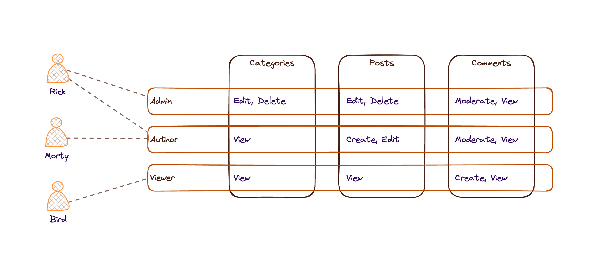
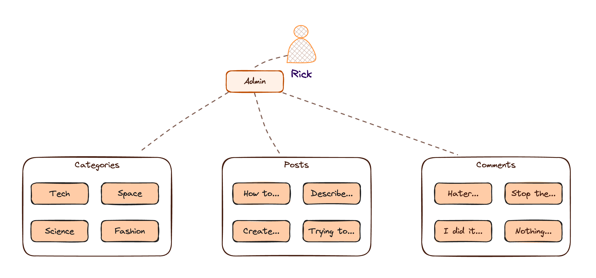
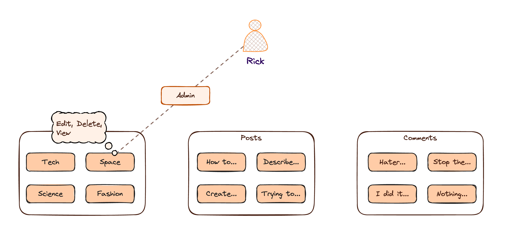
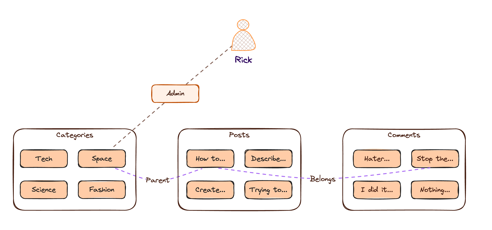
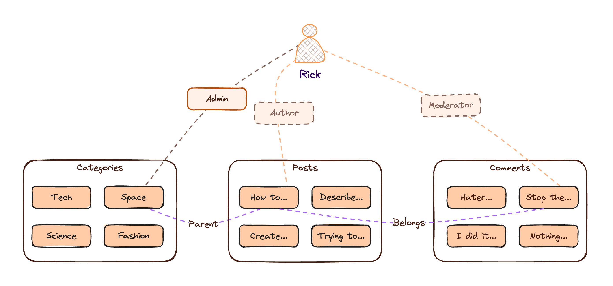
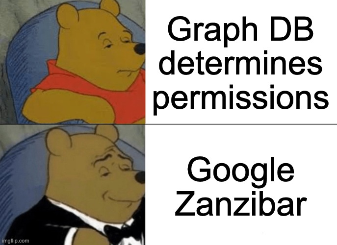

theme: Plain Jane
footer: 
slide-transition: true
[.header: alignement(center)]

#[fit] **Relationship Based Access Control**

---

^ ReBAC or relationship-based access control is a permission model that leverage the well-known RBAC (role-based access control) model to create a better method to determine what our users can or cannot do in our application

---

^ Also known as Authorization

# **Fine-Grained Authorization**

---

^ With ReBAC instead of assigning roles to users and set the policy of what they can or cannot do seperately.

---

^ The roles are assigned as a relationship between spesific users and specific resource instances. So, instead of allowing admin to perform actions on all the categories, we are assigning a specific role on one category.

---

^ Then we are leveraging the relationship between the resources themselves to derive the permissions for more and more instances in different resource.

---

^ So, if a post is a child to a category and we have comment on that post, we can derive various permissions on all the related resources.
Leveraging the relationships between users and resources and resources themselves grant us fine-grained authorization in a simple way to audit and manage

---

^ ReBAC started to gain popularity in 2019 when Google released a paper called Google Zanzibar that describes the way Google implemented fine-grained authorization in their systems.

[.footer: ]

---

^ Every Zanzibar insipred ReBAC system contains a graph DB that store the relationship tuples between users and resources and policy that define the role dervations.

---

^  Using these principles help us to model an efficient ReBAC system.
Want to get more with ReBAC? find the links below the video to the most intuitive ReBAC system out there

