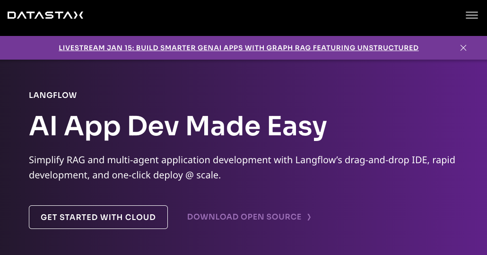

theme: Plain Jane
footer: 
slide-transition: true

[.header: alignment(left)]

 
 
 
#[fit] Leveraging Open Source for Brand Building
### Gabriel L. Manor @ DevTech Marketing Pros winter meetup

---

[.footer: ]
[.header: alignment(left)]

[.autoscale: true]

 
 
 
 

## Gabriel L. Manor
### VP of DevRel @ Permit.io
#### Somewhere between developer and marketer, zero awards winner, dark mode hater.

---

# **What is Open Source?**
# Measurable Metrics
# Growth Guide

---

^ Surprise of finding ourselves being open source on the commercial product

---

[.column]

[.column]
 

 

---

^ We are not going to talk about Open Core today - it might be good for your brand, but bad for your monetization and long-term bad for your brand

---

^ The two types of non-open-core products - Top of the funnel vs. Bottom of the funnel

 

[.column]
### Foundation

[.column]
### Tooling

---

^ The DX 80/20 principle - open Source project ideation

[.text: alignment(center)]

www.medium.com/@gemanor

---

^ How to choose the idea for your OSS project (check for adopt -> monetize and compare)

# Ideation - Expectation vs. Reality

---

^ Open Source is an enabler for content distribution

---

^ Standardization instead of OSS
Google Zanzibar / JWT (screenshot from Reddit)

---

# What is Open Source?
# **Measurable Metrics**
# Growth Guide

---

^ SEO
Okta with SCIM/JWT - screenshot

# SEO

 

 

---

^ Community engagement
Rohans article

# Community Engagement

---

^ Ecosystem dependencies
Datastax?

# Ecosystem Dependencies

---

[.header: alignment(left)]

# Other Growth Metrics

- LLMO
- Trust / Credibility
- Brand awareness
- Talent acquisition
- Thought leadership

---

# What is Open Source?
# Measurable Metrics
# **Growth Guide**

---

^ Stars and empty calories

---

^ Empty calories

---

^ Collaborators and used by

  

---

^ GitHub trending, choosing a language

---

# Discord **vs.** Slack

---

[.header: alignment(left)]

# Cringe isn’t (always) a bad thing

---

# Reduce Noise

[.text: alignment(center)]
www.ranger.app

---

# Bounties

[.text: alignment(center)]

[.column]

www.quira.sh

[.column]

www.algora.io

---

# Online Hackathons

 

---

^ Conclusion - GH traffic quality

---

[.header: alignment(left)]

 
 

# Thank You :pray:
## Let's connect :point_right:
### linkedin.com/in/gemanor
### Twitter **@gemanor**
