theme: Plain Jane
footer: 
slide-transition: push(bottom)
autoscale: true

[.header: alignment(left)]

<br>
<br>
<br>
# [fit] The Future of Authorization in Applications
## Gabriel L. Manor @ CyberWise, Lithuania, 2024

---

TBD sorry to dissapoint you

---

TBD The way to predict the future is to look at problems, as humans we built to solve problems and the way we solve them is evolving

---

TBD add the autentication is not authorization grafiti

---

TBD add the authentication slide from PyCon and explain the same happened in authorization

---

^ My name is Gabriel, and today we are gonna to talk about my way of implementing software solutions for permissions teach me about real life

[.footer: ]
[.header: alignment(left)]


<br>
<br>
<br>
<br>

## Gabriel L. Manor

### Engineering Director @ Permit.io

#### 🏆 Implementing Software Solution in His Perosnal Life

#### Not an ethical hacker, zero awards winner, dark mode hater.

---

^ Another complexity factor is the cloud native and distributed architectures

# [fit] _Chaos_, Complexity, Velocity, Confidence

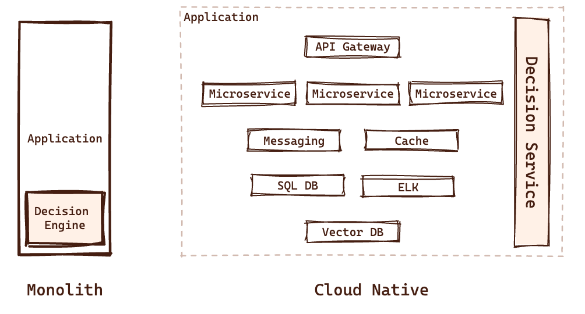

---

^ First complexity factor is the growing amounts of data we are processing in our applications

# [fit] Chaos, _Complexity_, Velocity, Confidence

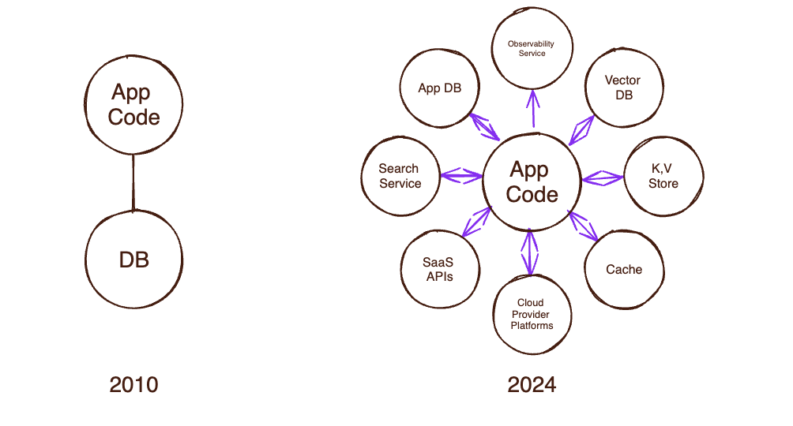

---

^ Such amount of data making the decisions harder.
1. The amount of data we need to get decision of
2. The decision themselves are more complex

## Decision Fatigue Syndrome

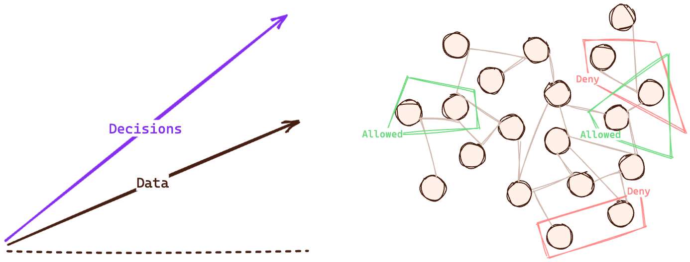

---

^ Third problem, is the way we deoploy software today

# [fit] Chaos, Complexity, _Velocity_, Confidence


---

^ Fourth complexity factor is the stakeholders around our applications

# [fit] Chaos, Complexity, Velocity, _Confidence_


---

^ First, the internal roles that want to get more control in the application

# Application Code Stakeholders

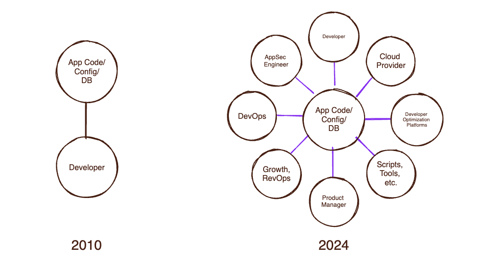

---

^ But not only that, the users also wants to get control in permissions. For example, let's look at healthcare example that we all know
// #[fit] Digital Healthcare Exponential Requirement Growth


---

^ Not only real users, but also LLM and AI agents


---

TBD add the graph diagram of the Modern authorization

---

# Authentication

---

# Token-Based Authentication

---

TBD add the diagram from the https://www.permit.io/blog/what-is-token-based-authentication

---

TBD add the token based diagram from the https://www.permit.io/blog/what-is-token-based-authentication

---

# JWT - JSON Web Tokens

---

# **JSON** Web Token

---

# JSON **Web** Token

---

# JSON Web **Token**

---

OAuth TBD add the diagram from https://www.permit.io/blog/oauth-tokens-definitive-guide

---

# Subjects

---

# Subjects > Users

TBD add user to service flow (flaticon excalidraw)

---

# Subjects > Services

TBD add service to service flow (flaticon excalidraw)

---

# Subjects > Non-Human Identities

TBD add three icons of Bots, LLMs, and Evil Bots

---

# Configurators

Add a graph diagram of the configurators TBD (center modern authorization service)

---

# Models

---

# Coarse-Grained Authorization
## Subject-Centric

---

^ RBAC pros and cons

# Role Based Access Control

- Leverage user roles to determine permissions
- Commonly used as a term for authorization
- Very simple to implement and audit
- Flexible to use in different domains
- Hard to consider external data in policies
- Limited granularity in resource permissions

---

^ RBAC is the most common one for application


---

# Fine-Grained Authorization
## Policy-Centric

---

# Fine-Grained Authorization > Policy as Graph

---

^ What is google Zanzibar? It's a paper that propose a new approach to model permissions in a graph

[.header: alignment(center)]

#[fit] Google Multi Domain Authorization Challenge

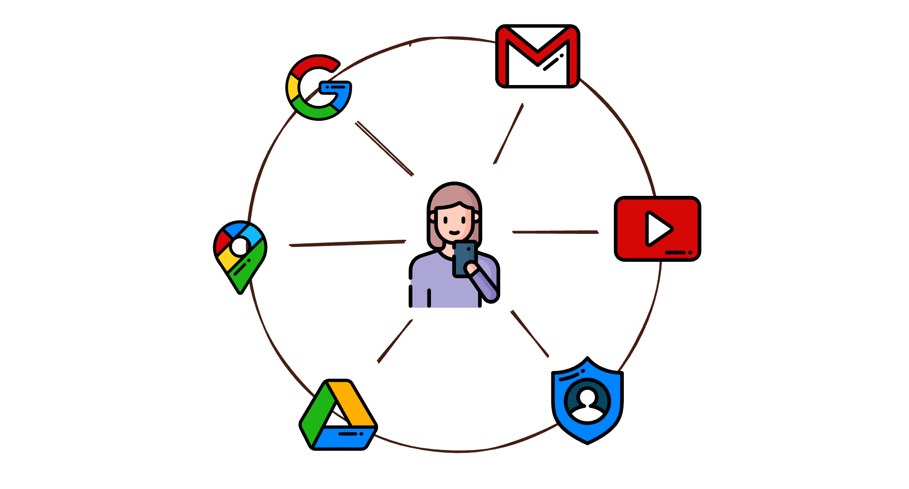

---

^ ReBAC pros and cons

# Relationship Based Access Control

- Assign instance-level roles to users
- Leverage entity relationships to derive role permissions
- Built to support modern data models in efficient way
- Require centralized graph to calculate decisions
- Limited granularity in user and resource inspection


---

^ Gogole Zaanzibar principles, why OPA and Cedar hard with it

# Google Zanzibar Principles

* Relationship Tuples
* Role Derivation
* Tuples Graph
* Relationship Based ACLs

---

^ RBAC is the most common one for application

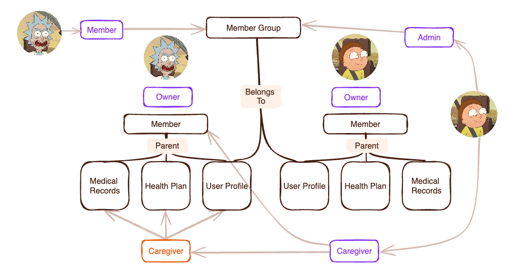

---

^ OpenFGA do not support ABAC, but it's ReBAC configuration support policy as code

```yaml
model
  schema 1.1

type organization
  relations
    define member: [user] or owner
    define owner: [user]
    define repo_admin: [user, organization#member]
    define repo_reader: [user, organization#member]
    define repo_writer: [user, organization#member]

type repo
  relations
    define admin: [user, team#member] or repo_admin from owner
    define maintainer: [user, team#member] or admin
    define owner: [organization]
    define reader: [user, team#member] or triager or repo_reader from owner
    define triager: [user, team#member] or writer
    define writer: [user, team#member] or maintainer or repo_writer from owner

type team
  relations
    define member: [user, team#member]

type user
```

---

^ OpenFGA is the one on the list that combines the configuration as code approach with Policy as Graph that proposed in Google Zanzibar paper

# OpenFGA

- Open source implementation of Google Zanzibar that fit any scale
- Configured with JSON/YAML/DSL
- Need to deploy one centralized platform for decision making
- Backed and maintained by Auth0 and use by them for authorization
- Contain many application-specific features

---

# Fine-Grained Authorization > Policy as Code

---

^ ABAC pros and cons

# Attribute Based Access Control

- Leverage entities' attributes to model permissions
- Use attribute conditions in the policies
- Most flexible structured policy model
- Complex to build and audit in imperative languages
- Usually used as extension to RBAC and ReBAC systems

---

^ RBAC is the most common one for application

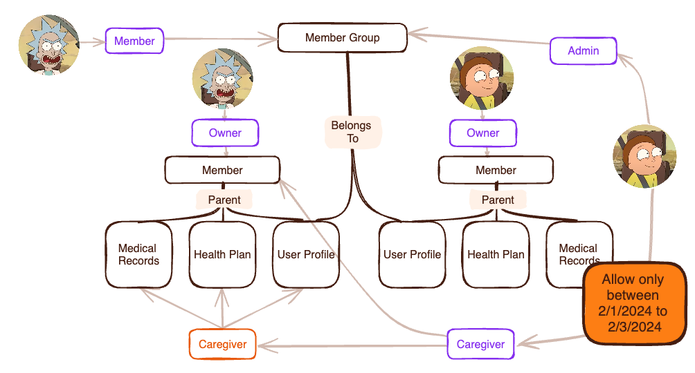

[.header: alignment(center)]

---

^ This is where policy languages comes to the rescue, explain why it is solving the problems

```typescript
// Users can edit their own info, admins can edit anyone's info
permit (
    principal,
    action,
    resource in HealthCareApp::InfoType::"accountinfo"
)
when {
    resource.subject == principal ||
    principal in HealthCareApp::Role::"admin"
};

//A patient may create an appointment for themselves, or an administrator can do it
permit (
    principal,
    action == HealthCareApp::Action::"createAppointment",
    resource
)
when {
    (context.referrer in HealthCareApp::Role::"doctor"  && resource.patient == principal) ||
    principal in HealthCareApp::Role::"admin"
};
```

---

^ Cedar is simpler than OPA, but do not support ReBAC in easy way and aim to be perfect for application level

# AWS Cedar

- Started as a language for application-level authorization
- Not like AWS IAM, it's a language that can be used in any application
- AWS released it as open source, but also offer it as a service (AVP)
- Use Dafny language to provide scientific proof for correctness and performance
- (Still) hard to deal with unstructured data - no real ReBAC support
- Faster option for ABAC decisions
- Support audit, static analysis, and partial evaluation out of box

---

# Fine-Grained Authorization > Next Generation Access Control

---

^ Since OPA is multi purpose, it's the easiest one to enforce permissions on multiple domains

# OPA Multi Domain Support

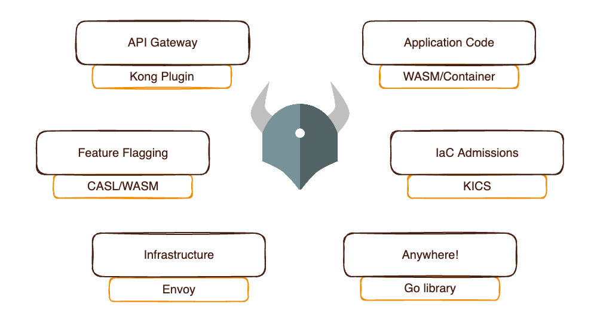

---


```haskell
allow {
    input.user.role == "viewer"
    validate_department(input.user, input.document)
    validate_classification(input.user.role, input.document.classification)
    validate_dynamic_rules(input.user, input.document)
}

validate_department(user, document) {
    user.department == document.department
}

validate_classification(user_role, doc_classification) {
    role_permissions[user_role][_] == doc_classification
}

validate_dynamic_rules(user, document) {
    dynamic_rules[_](user, document)
}
```

---

^ Now, that we are understanding the basics, let see how the different approaches of the policy languages are working. Let's start with OPA

# Open Policy Agent

- Started as a multi-purpose policy engine
- Using Rego as a policy language
- As part of their GTM, they are focusing on Kubernetes admission
- Works great for application-level authorization (<10 ms for decision)
- Hard to deal with large (>2gb) sets of data
- Need some tweak for efficient ReBAC support

---

^ The choosing in the right policy model for you is a task that driven by the nature of the application

| **Company**                          | **Language**      | **Models**        |
| ------------------------------------ | ----------------- | ----------------- |
|  Netflix | Rego              | RBAC, ABAC, ReBAC |
|  AirBnB   | Himeji (Zanzibar) | ReBAC             |
|  Uber       | CEL               | ABAC              |
|  Google   | Zanzibar          | ReBAC             |
|  Reddit   | Rego              | RBAC, ABAC        |
|  AWS      | Cedar             | RBAC, ABAC        |

---


# Chaos 👉 Structure

---

^ The first step in modeling, is understanding where we need permissions in our stack
- Admission - What a Developer Can Do?
- Infrastructure - What Services Can Do?
- Application
  - Data - What Data Can Application Users Access?
  - Application code - What Application Users Can Perform?
  - UI (feature flags) - What Application Users Can See?

# Authorization Layers


---

^ First step to solve the structure problem, is to decouple policy from code

#Abstract Authorization Service Model

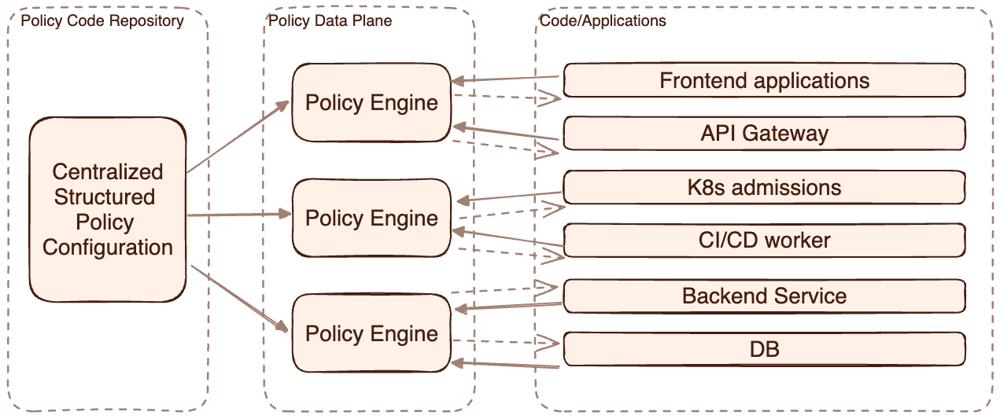

---

^ DDD is a great example of the need in a specific authorization domain

# Application-Level Domain-Driven Model

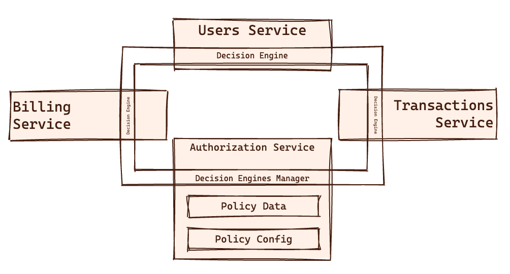

---

[.header: alignment(center)]

# Complexity 👉 Design Patterns

---

# Abstract Decision Components

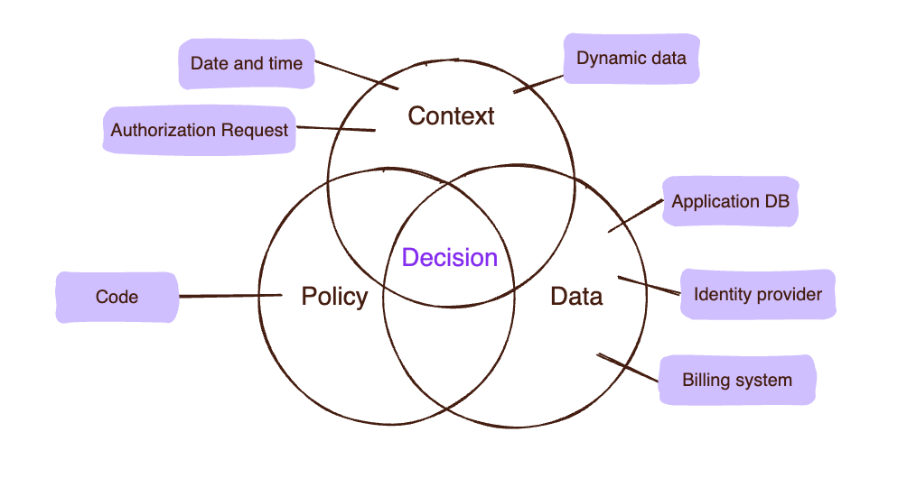

---

^ Third step, is to understand our needs. It could be binary gating or filtering

# Authorization Decision Types

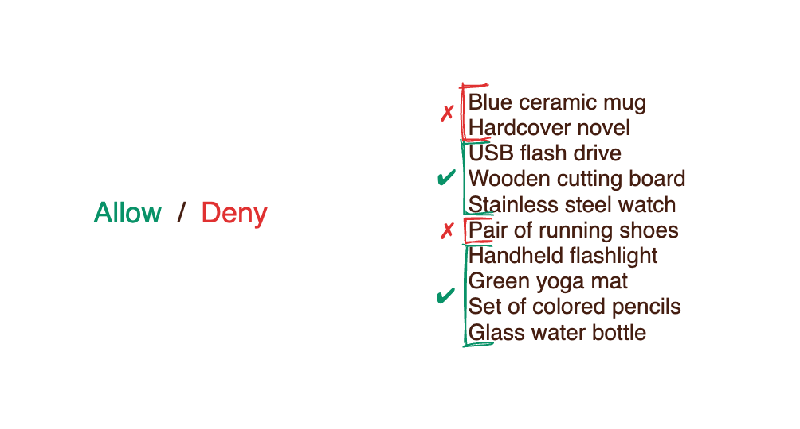

---

^ For binary gating most important thing to rememer, is that our enforcement point should keep the same format with the model we choose

# Binary Check Function

```javascript
check({ user }, { action }, { resource }, { context });
```

---

# Binary Check Function

```javascript
check({ user }, { action }, { resource }, { context });
```

```python
response = requests.post('http://host.docker.internal:8180/v1/is_authorized', json={
    "principal": f"User::\"{user}\"",
    "action": f"Action::\"{method.lower()}\"",
    "resource": f"ResourceType::\"{original_url.split('/')[1]}\"",
    "context": request.json
})
```

```js
const response = await fetch(
  "http://host.docker.internal:8180/v1/is_authorized",
  {
    method: "POST",
    body: JSON.stringify({
      principal: `User::\"${user}\"`,
      action: `Action::\"${method.toLowerCase()}\"`,
      resource: `ResourceType::\"${originalUrl.split("/")[1]}\"`,
      context: body,
    }),
  }
);
```

---

^ For filtering, the best option is to have a function for partial evaluation queries

[.code: alignment(left)]

# Partial Evaluation Flow

```js
permit (
    principal == PhotoApp::User::"stacey",
    action == PhotoApp::Action::"viewPhoto",
    resource
)
when { resource in PhotoApp::Account::"stacey" };
```

⬇⬇⬇

```js
evaluate("pictures", "staty", "viewPhoto");
```

⬇⬇⬇

```sql
SELECT *
FROM photos
WHERE owner = 'Stacey';
```

---

^ Here is the diagram of OPAL architecture

# OPAL - Open Policy Administration Layer

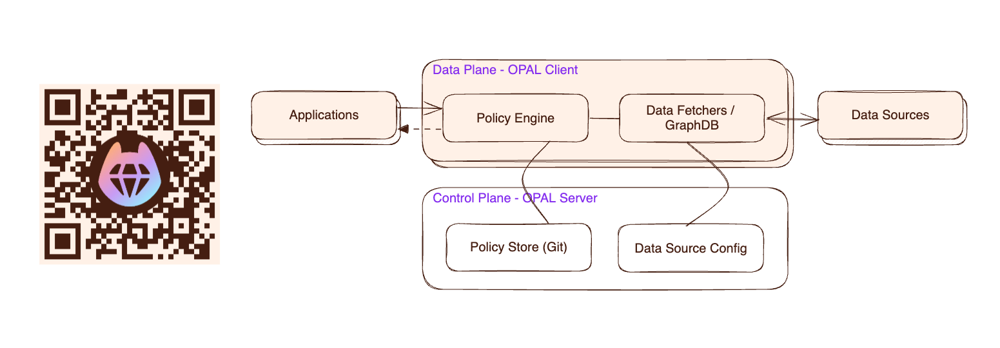

### An End-to-End *Batteries Included* Authorization Service

---

^ Luckily, there is a cool open source tool that can help us to implement such architecture
- Aim to provide e2e authorization service for applications
- Provide plugin infrastructure to plug any policy engine
- Use GitOps principles to manage policy configuration
- Support data sharding to provide ReBAC support in policy engines
- Use Server/Client architecture for centralized configuration and decentralized enforcement
- Provide pub/sub mechanism for policy and data changes
- Data sources configured in the server, and the client fetch them
- Provide extensible system for data fetchers to support any type data source

# OPAL Specifications

[.column]

- End-to-End Authorization
- Policy Engine Plugins
- GitOps Policy Flow
- Data Sharding ReBAC
- Centralized Config

[.column]

- Decentralized Decision
- Pub/Sub Policy & Data Updates
- Extensible Data Fetchers
- Plugable Data Sources

---

^ Let's dive into an example project with OPAL
- OPAL Dockerfile with explenation of each row
- Cedar code in the fake git repository
- Multiple applications and their check function
- Do calls and see the results in live
- OPAL Fetcher example file

[.header: alignment(center)]

# 🍿 Demo Time 🍿

---

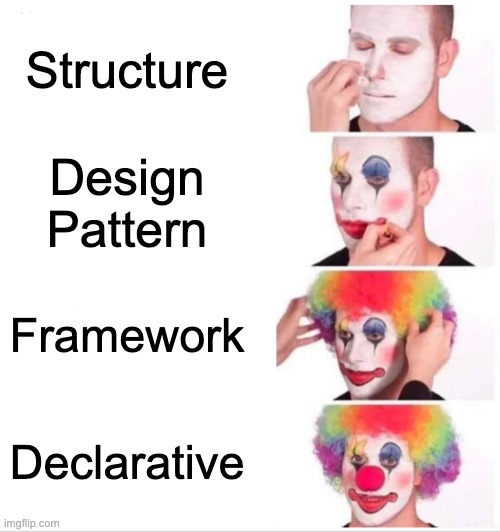

---


--
# Thank You :pray:
## Share Your Thoughts and Get the Slides 👉
### Join OPAL Slack Community *io.permit.io/opal-slack*
