theme: Plain Jane
footer: 
slide-transition: true


[.header: alignment(left), color(#fff)]


<br>
<br>
<br>
# Empowering the Guardians of Your Code Kingdom
## Gabriel L. Manor

---

^Hello everyone, Thank you for joining me today.
A week ago, I've got a phone call from the event comitee that asks me to join here with the talk I submitted some time ago, since I didn't have much time to prepare for it, there's going to be lot of midjourney and pseudo smart quotes but no worries, we're gonna have fun time.

### :alarm_clock: Last-Minute Disclaimer


---

^I want to do it a bit interactive, so let's start with a question I would like you to answer.
I just tweeted this question, and I'm asking you to take out your phone and I'm fine that you listening for me to me with your phone in your hand, and answer that question.
The answers will be presented here at the screen during the talk.
The reason for that is I want us to streamline together what we need to do to get better application security.
So... If you add one thing to do for better AppSec, What was it?
At the end of my talk, we will try to take the tools we learned and try to streamline it into one answer.
Ok, I'll keep this for some more time. Are you answering?

[.text-strong: #9B5EE5, Avenir Next Regular]
> If you could **only** take one **action** to **improve** your application’s **security** - what would it be?
-- :mega: Answer now [io.permit.io/owasp_dublin](io.permit.io/owasp_dublin) :mega:


---

^Talking about AppSec, this year we are celebrating 20 years for OWASP's top 10, and that's a great chance to compare those lists and see what has changed over the years.


[.header: text-scale(2), alignment(center)]
# :birthday::birthday::birthday:
## 20 Years!

---

^This comparison tells me a story, a story of how our application security shifted over the years. Looking at the items, they are all related to code. Yet, buffer overflow, error handling and DoS are not on the list anymore, why? does they not exists, they are, the answer is that we had externalize our environment to other services.

[.header: alignment(left)]
# Externalizing Environments
[.autoscale: true]
[.column]
## 2003
Unvalidated Input
:purple_heart: Broken Access Control
Broken Authentication and Session Management
Cross Site Scripting
**Buffer Overflow**
Injection Flaws
**Improper Error Handling**
Insecure Storage
**Application Denial of Service**
Insecure Configuration Management

[.column]
## 2023
:purple_heart: Broken Access Control
Cryptographic Failures
Injection
Insecure Design
Security Misconfiguration
Vulnerable and Outdated Components
Identification and Authentication Failures
Software and Data Integrity Failures
Security Logging and Monitoring Failures
Server-Side Request Forgery

---

^In the other hand, we have definitions like Insecure design and security misconfiguration that related directly to the environment where we run our code. I'm confused, is AppSec about the environment or not? And the answer, of course, is yes. We want to declare and configure our environment.

[.header: alignment(left)]
# Declaring Environments
[.autoscale: true]
[.column]
# 2003
Unvalidated Input
:purple_heart: Broken Access Control
Broken Authentication and Session Management
Cross Site Scripting
Buffer Overflow
Injection Flaws
Improper Error Handling
Insecure Storage
Application Denial of Service
Insecure Configuration Management

[.column]
# 2023
:purple_heart: Broken Access Control
Cryptographic Failures
Injection
**Insecure Design**
**Security Misconfiguration**
Vulnerable and Outdated Components
Identification and Authentication Failures
Software and Data Integrity Failures
Security Logging and Monitoring Failures
Server-Side Request Forgery

---

^ Same story about narrowing Unvalidated input, Injection flaws, and CSS to one Injection error. Again, we want to declare our environment and externalize anything we can.

[.header: alignment(left)]
# Moving Up the Stack
[.autoscale: true]
[.column]
# 2003
**Unvalidated Input**
:purple_heart: Broken Access Control
Broken Authentication and Session Management
**Cross Site Scripting**
Buffer Overflow
**Injection Flaws**
Improper Error Handling
Insecure Storage
Application Denial of Service
Insecure Configuration Management

[.column]
# 2023
:purple_heart: Broken Access Control
Cryptographic Failures
Injection
Insecure Design
Security Misconfiguration
Vulnerable and Outdated Components
Identification and Authentication Failures
Software and Data Integrity Failures
Security Logging and Monitoring Failures
Server-Side Request Forgery

---

^ But, Yet, with all that changes... one thing haven't changed over the years. The most effective way you can keep your application secure is about avoid deployment of insecure application, right? If you're not allowing your people to deploy insecure application, you'll never get insecure application. That's it.

## What is the most effective way to avoid insecure applications?

---

## What is the most effective way to avoid insecure applications?
# Do not deploy it!

---

^ Who remember here this screen? Well, so this spectecular screen back in the days that we have only one permission factor to deploy application and what it was with that factor, the credentials to our FTP server, this single hosting server was the only place where we deliver our whole application.


---

^ What amazing days was back then that we had one gateway to control the deployment of our application, if we were sure who is the person doing the deployment we can be sure sure that our application is secure.

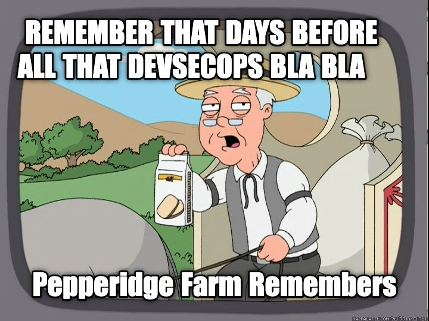

---

^ But, is that secure? How safe was that point where all our code, all our potential very insecure code sits in one or 10 jars or php file, in one server. How safe is that one person with password that we whispher (or not) to all team members around have the permission to deploy our application?

> Okay, I'll send you the certificate but please promise me you will only patch the relevant code and remove it afterwards.
-- Every development leader back in 2003

---

^ And you can say, we are in a better world today. Why? Because we have a lot of tools that check all our software development lifecycle. We are orchestrating stacks of automated tool to verify that. Nothing going insecure, right? So let me tell you, It's not.

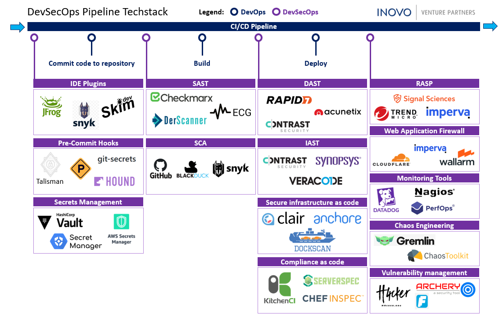

---

^ To understand why is not, let take a look into a typical code organization of a modern cloud product, but before I introduce you to my organization let me introduce myself.


---

^ My name is Gabriel and I'm the director of DevRel in permit.io. Permit is a startup based on Israel that create full stack authorization solution. Our product do everything around the authorization from implementing  small RBAC model to end-user application to streamline giant cross-platform policy models in production infrastructure. If you need something around authorization, we might offer it.

[.footer: ]
[.header: alignment(left)]


<br>
<br>
<br>
<br>

## Gabriel L. Manor
### Director of DevRel @ Permit.io
#### Not an ethical hacker, zero awards winner, dark mode hater.

---

^ This is our actual organization on github, let's see what we have here.


---

^ So, we have our backend, which is a very big mono repo of all our cloud services. If we look deep into it we can see dozens of deployent points we have here. We have helm charts of our multiple microservices, chats of customized services like Reddit, charts for feature flag protected services, and we also have IaC for all the other cloud services we depend on such as static object storage, CDN, secret manager and more.

[.header: alignment(left)]
# Permit's Backend Repository

[.column]
[.list: bullet-character(-)]
- :rocket: Microservices
- :rocket: Internal Services
- :rocket: 3rd Party Dependencies
- :rocket: Custom Dependencies
- :rocket: Cloud Services in IaC

[.column]


---

^ So, just on one repo we have 10 deployment point that we need to control.

# 1 Repository
# :point_down:
# >10 Deployment Points

---

^ Then look on more repositories, we have here. Take as an example a repository called OPAL, this is an open source tool and library that we are maintaining, a management layer for open policy agents. What are the deployment point for it? So there are the OSS deployments which are the  docker registery, and a production branch on GitHub. Creative deployment environments, ah? But not only that, the OPAL is also used by our propierty product as a backbone for policy management, so we also want to have a deployment point in our production environment.

[.header: alignment(left)]
# OPAL
[.text: alignment(center), text-scale(1.1)]


[.column]
:snake: PiPy

[.column]
:package: Server

[.column]
:package: Client

[.column]
:hatching_chick: Canary

---

^ And the game is on, we also enabled feature flags to control deployments of the canary versions of into some clients and ourselves. And it's not finished here.

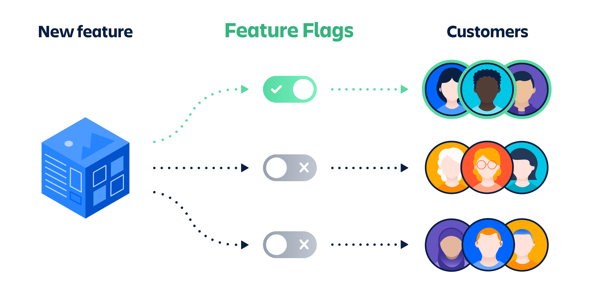

[^1]: Source - Attlassian

---

^ We have also the frontend repository, which also relay on multiple environment we release it to control different feature flags for various users and so on.
And we have more a open source libraries libraries that deployed to various application and library registries. And we have our special repsoitories where we maintain infrastructure as code for users who want to have their environment seperated from our general SaaS offering.

[.build-lists: true]
[.header: alignment(left)]
[.list: bullet-character(-)]
# We're Not Done Yet
- :rocket: Frontend
- :rocket: OSS Side Cars
- :rocket: SDKs
- :rocket: Customer's IaC

---

^ Isn't that amazing? Even if we are not looking on multi-stages deployements we have more than 50 deployment points in our organization. Each of them potentially could have insecure code in it.

# 1 Organization
# :point_down:
# >50 :rocket: Launch Facilities

---

^ With all the tools that we will run to check the code, how can we make sure non of the developrs was in need to deploy very urgent some private version just to check something on NPM?

> I believe I have Read permissions for our secret manager. I'll grab the key and deploy the updated version to NPM.
-- Every developer at some weekend in 2023

---

^ Do our deployement phase now more secured than 20 years ago? It maybe look like that, but in the real world we have no easy way to proof it!
So, what we can do for streamlining our deployment process into one one source of truth, one point of truth?

# The world of DevSecOps as we want to imagine


---

^ The answer for that, could be complex, but a trend coming up, and that could help us in streamlining are deployment process, this trend called GitOps.

# 42

---

# GitOps

---

^ In short, there is no short way to explain what GitOps is, because the same as any other methodology that we knows around software, you know, agile, TDD, (?), whatever it is, it has lot of meaning, a lot of ways to explain it.


---

^ But for me, the most strict line to explain GitOps is about streamlining the deployment process, create a one point or method of truth for all your deployments.

# The goal of GitOps is to streamline all our deployment processes

---

^ Instead of having a lot of buttons, piplelines, scripts, command and approval flows that deploy something to somewhere in some stage, we have one method of truth which is a git or multiple git repositories that declare the deployements we want to to deliver. By this point of truth, all our code deployements aimed to be streamlined conceptually into one process.


---

^ The good news is that if you already have some IaC and automated CI/CD pipelines such Circle CI or GitHub Actions, you can have your starter template to get GitOps infrastructure, now we should think how we streamlining it.

# The Good News
## Probably you're already halfway there.

---

^ The key of streamlining the process, is following an Inversion of Control pattern but for deployment. If you think of the standard pipelines you have now they are taking the code at some step and pushing it to an environment, and this is what we want to achieve. Using code in git that declare infrastructure that our pipelines pulling into the relevant environment.

[.text: alignment(left)]
> We pushed the change to production
-- Developer

---

[.header: alignment(left)]
[.header-strong: #fff]
[.text-strong: #fff]
[.text: alignment(left)]
> **We** pulled
> We ~~pushed~~ the change to production
-- Better Developer

---

^If you are in the Cloud Native world, you may heard about one of the two kings of the GitOps world. ArgoCD and Flux. Those two are mostly relevant for kubernetes clusters but their princple is exactly this depency injection like principle for everything runs in production or any other enviornemnt. The only thing they do is run in a real environment and check for new versions of code to pull it into the environment.


# x

---

^ Having this inversion of control in our CI/CD gives us the same promise we get as the code pattern, we verifieing that our deployment process became immutable. There is no way for any developer, no matter how senior they are to grab a secret from somewhere and deploy a new npm package or docker image to a registry. The only entity that could do it is our GitOps controller that looking for one source of truth for this package.

# Deployment Process Should Be Immutable

---

^ The GitOps pattern is the only way to ensure we are managing into a a question of What should be in Production, and not what is in production. Because if we only know what is in production we take all this automated DevSecOps infrastructure we work hard to implement and waste it by one command runs from a special interchange we have no control of.

# What is in production.

---

# ~~What is in production.~~
# What should be in production!

---

^ How do we develop such GitOps controllers in the real world? They are actually could be based on the standard CI/CD pipeline but following the pattern.

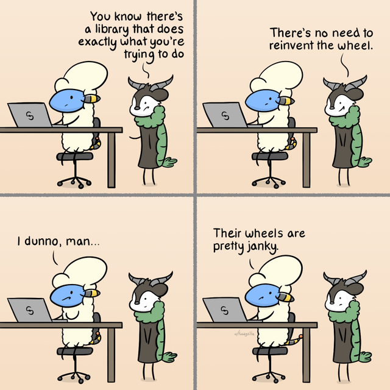

---

^ Easy to say, right? Hard to implement. So here are some best practices helped us to reach the pattern on our CI/CD pipelines.
First, we are trying to do anything related to code management as code.
We are managing our GitHub organization in Terraform files so even the fundmental part of our GitOps process is manage by declerations that help us control the pipelines on each repository and also orchestrate those pipelines.
We having dedicated repositories that are controlled only by chain of approval flows into them. For example, there is no person that can push code to our production client repositiory infrastructure as code. This repository actually always "pulling" it's code after having a proper pipeline that verifies everything is in place.
We enforced ourselves to do not include any manual 'Deploy' buttons on our CI/CD system. If we are challanging automatic deployments and need a real person to do something, it means we are having backdoor into our one source of truth.
We are never look on a pipeline as an end-to-end pipeline, in the GitOps flavor, pipelines are always only one part in the long "pulling" deployment chain. Having that flavor, could also help you to map the most critical parts of the deployment process and try to have them only half-way to full GitOps operated deployments.

[.build-lists: true]
# Best Practices for Reinventing Wheels
- Do everything as code
- Manage your Git infrastructure as code, too
- Create immutable repositories as "agent"
- Do not allow any "Deploy" button in the CI/CD
- Avoid end-to-end pipelines

---

^ So, GitOps are fine for streamlining, and I'm sure you already think of your own GitOps controller implementation, but is it indeed safe enough?

# I :purple_heart: GitOps

---

^ And when I'm saying safe, I mean that we have now a master key that can potentially do some mistake when they got a desicion to pull something to somewhere, right?

# :bulb: Controller Still Have a Master Key

---

^ So you said again, I don't have any worries, because I have this huge DevSecOps automated tools that checks but it has three problems. If you not aware of them, let me tell you.

> We spent three month to develop spectecular DevSecOps orchestration around our pipelines, we safe!
-- Every development leader in 2023

---

^ First, your developers are not happy. And I'm saying that as a developer because the thing that most frustrate me as a developer is depend on tools that do irrelevant tests and slow my delivery in 30 minutes (same for lunch, I know).
Second, since the key to GitOps is chaining your pipelines blocks as much as you can, you must run same tests again and again and again. Don't you wanna do that? So why did you spent so much time in developing this spectecular DevSecOps orchestration?
What if, same environments and setups needs to run different pipelines to get things done? What if the same decleration need to run over a different set of tests because we need to have special tools running in Europe deployments for GDPR?

# A Trio of GitOps Problems

[.header: alignment(center)]
[.column]
<br>
<br>
# :angry:
## Developers

[.column]
<br>
<br>
# :turtle:
## Efficency

[.column]
<br>
<br>
# :dromedary_camel:
## Redundancy

---

^ So we don't like GitOps? It is too problematic? Well, no, WE LOVE GITOPS, and the same way we are building authorization and permissions in other applications, we will also want to build it into our GitOps controller so they will be able to get smart desicions. And this is where policy agents get into the picture.

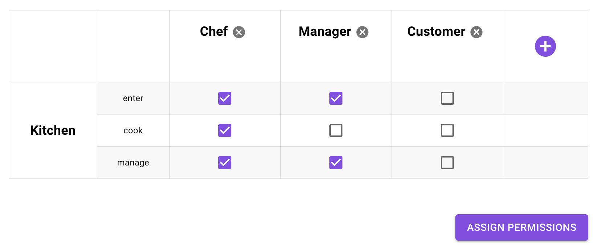

---

^ Policy engines has become very popular lately because of the willing of software to be cross everything. When you try to do cloud native, for example, you want your application to be able to run everywhere, be agnostic to cloud providers, environments, external dependencies. 

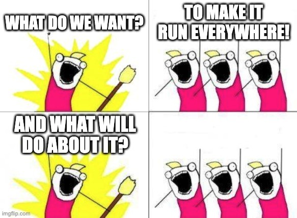

---

^ An engine that that can take anything from everywhere and get desicion based on it.


---

^ There are two main flavors of such policy engines, the first one is based on a famous protcol known as Google Zanzibar that using a graph to do policy deisions, every piece of software can handle a piece of policy and make the right deiscions.


---

^ The other flavor, is policy as code based desicion makers, and the most famous of them Open Policy Agent.


# Policy as Code
## Open Policy Agent

---

^ Open Policy agent is combined from some components where its basics are the agent itself, a piece of software that can sits everywhere and get deiscions and Rego a policy language that we can write rules with and letting the agent get deiscions based on the rules and data we transfer to.

<br>

[.column]
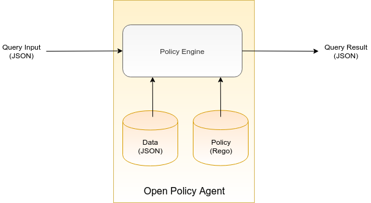

[.column]
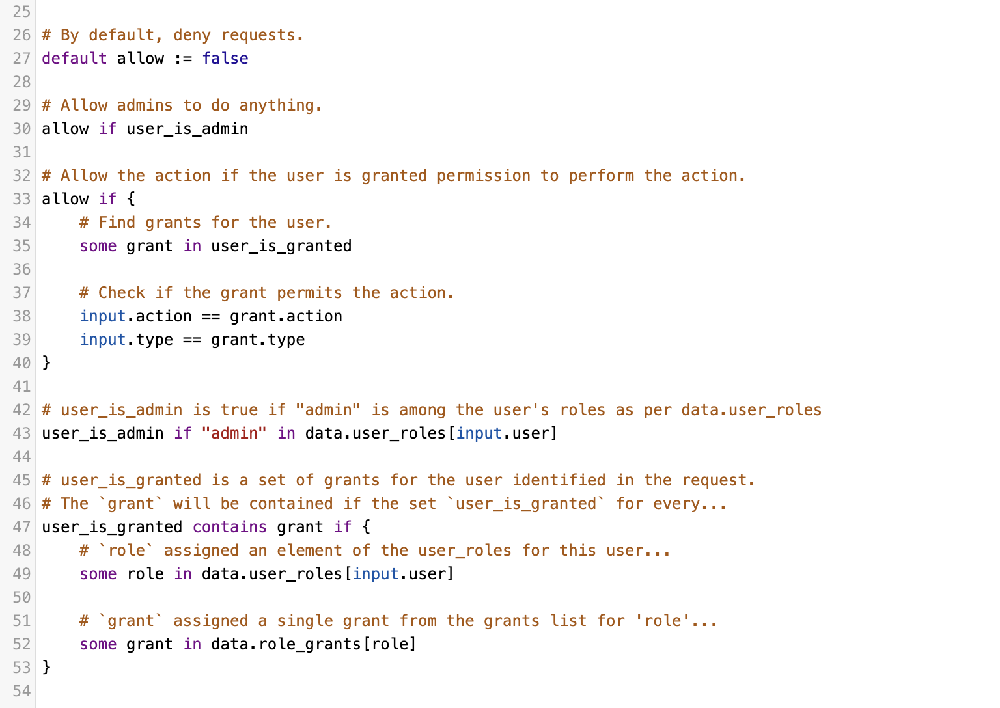

---

^ Since our deployment deiscions need to be more asynchrounous and also be streamlined as part of our GitOps strucutre, we will want to go with the the second one, the Policy as Code policy engines. Such kind of engines are work great for us because you remember, we want our GitOps controllers to be deterministic by data we can validate. In this way, all our CI/CD and GitOps controller desicions made by a one source of truth which is part of our code.

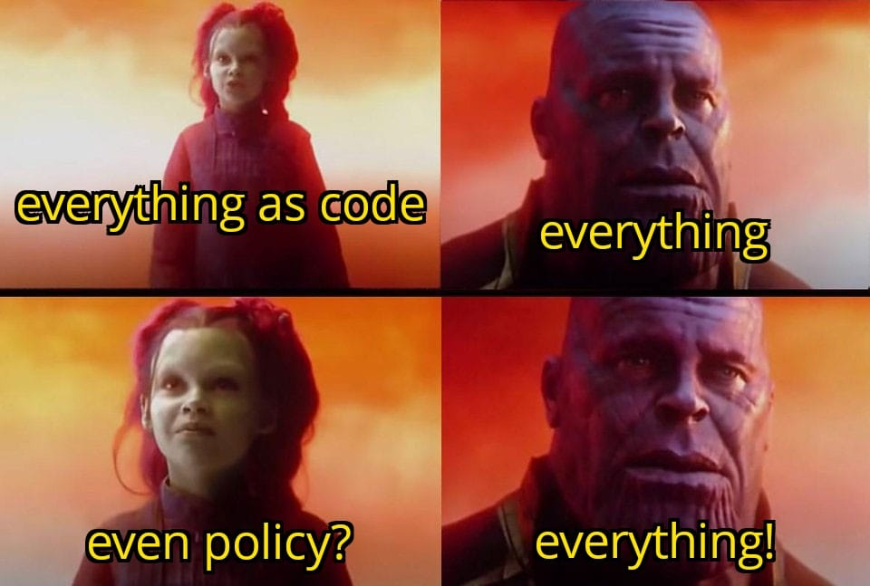

---

^ Once we have our policy implemented as part of our code, we just left to get a policy desicion that knows to take our rules and together with the deployment data the GitOps controller get the right desicions for our mapped deployment steps.


---

^ Let see how a simple deployment desicion can made with OPA.
First, we are having an agent run in our CI/CD. That can run by the GitOps controller in the last step of the deployment but also run on the steps themselves to ask the right question for every step in the CI/CD chain. The best practice is to run the agent as a side car to your application, and that true for CI/CD infrastructure too, just attach the container as a desicion point to the relevant step and asking it questions.


---

^ Now that we set with the agent, let look how we implementing policy on it. So the laguage that you use for writing policiy rules called Rego and this is a declerative language that helps you to write policy. Here is a very simple decleration that return true in case a user has _____ You can use playground.opa.com to try rego yourself.

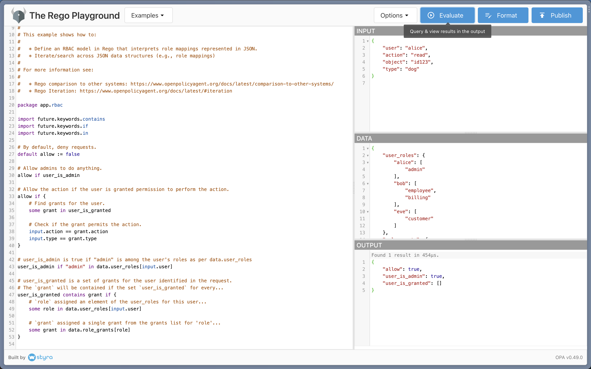

---

^ How does deployment policy could look like for CI/CD and GitOps desicions? Well, simple as any other RBAC model.
The basic RBAC model assume we have three building blocks to ask a desicion question, `Does ___ allowed to perform ___ on ___` those three entities also known as Role, Action, and Resource.

[.header: alignment(center)]
[.text: alignment(center)]

<br>
<br>
`Does ___ allowed to perform ___ on ___`
<br>
<br>

[.column]
# :man_with_turban: 
## Role

[.column]
# :pencil: 
## Action

[.column]
# :notebook_with_decorative_cover:
## Resource

---

^ In the case of CI/CD, the developers and job initiators are the roles, the resources are the pull requests or other delerative plans we are trying to deploy, and the action is the deployment type, a cloud environment, package registry, and so on.


[.text: alignment(center)]
[.text-strong: #9B5EE5, Avenir Next Regular]
<br>
Does **developer** allowed to perform **deploy** to **production_environment**?
<br>
Does **production_branch_e2e_job** allowed to perform **image_push** to **docker_registry**?

---

^ Now, that we have policy queries as part of our GitOps structure, let try to write a simple rego query for our GitOps. Assuming that we have a medtech customer who enforce our deployment to be reviewed by three code approvals, we can write something like that _______, whenever the GitOps controller will have to deploy this environment they will run the check. Allowed? Great, not allowed? continue to ask for approvals or do other some actions.

```go
default allow := false

allow if {
	some grant in user_is_developer

	input.action == operation.type
	input.environment == operation.destination
}
```

---

^ I know, I know, you look into my eyes now and say `no medtech company care about three approvals, this is not a relevant desicion.` and you right. RBAC is too simple for the desicions our app will usually want to get. So let's get back again to look what we do in a real application when RBAC not working? We do ABAC.


---

^ Attribute based access control, is actually the next step for us of making smart permissions desicions. Instead of just asking Does Role allowed to perform Action on Resource, we are looking into the details of each of the blocks and made our desicions based on the attributes of each entity. 

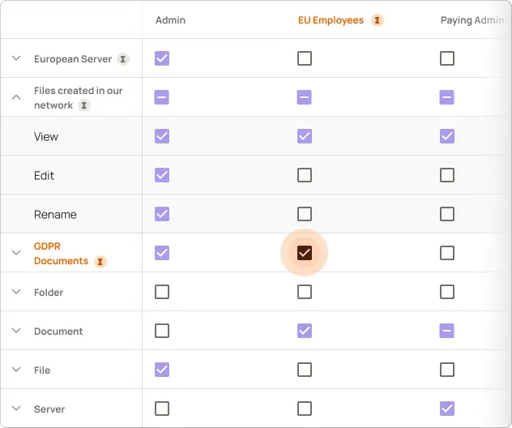

---

^ Let's look on some example for policy we can combined that fit the real world and see how smart could ABAC queries can work with those agent.
`Does (user.new) allowed to (deploy.production) a (code.critical)`
`Does (user) allowed to (deploy.docker) a (code.didn't_dast) and (code.has_public_opened_apis)`
`Does ()___`

[.text: alignment(center)]
[.text-strong: #9B5EE5, , Avenir Next Regular]
<br>
Does **(user.new)** allowed to **(deploy.production)** a **(code.critical)**?
<br>
Does **(user)** allowed to **(deploy.docker)** a **(code.didn't_dast)** and **(code.has\_public\_opened_apis)**?

---

^ Amazing, ah? But I know what you thinking `this regos are impressive, but how this guy know what code has public open APIs or that code considered critical`, right? the answer is static analysis.

# Static Analysis

---

^ If you are running any automated tool on your CI/CD, you must be aware of static analysis tools. There are tools specific for languages and stacks. There are tools that specific for security tests as SAST, and others for coding standards such as PyLint and ESLint.

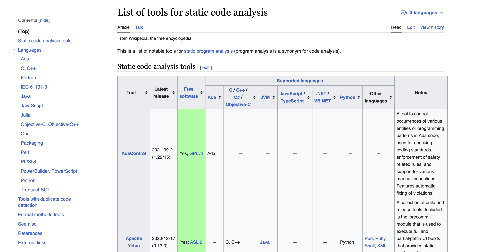

---

^ At a first look, we are thinking of them as a useful tools that answers a binary factor on our code quality, passed or failed. Actually the benefit we can get from them by tagging our resources, are meaningful. 

[.column]

:white_check_mark: Passed

[.code: auto(32)]
```javascript
const { Permit } = require("permitio");

const express = require("express");
const app = express();
const port = 4000;

const permit = new Permit({
  pdp: "http://localhost:7766",
  token: env.PERMIT_SDK
});

app.get("/", async (req, res) => {
  const user = {
    id: "03b45ca28e5b4ea3823de5431f2dc36d",
    firstName: "Joe",
    lastName: "Doe",
    email: "user@example.com",
  }

  const permitted = await permit.check(user.id, "action", "resource");
  if (permitted) {
    res.status(200).json({});
  } else {
    res.status(403).json({});
  }
});

app.listen(port, () => {
  console.log(`Example app listening at http://localhost:${port}`);
});
```

[.column]

:no_entry_sign: Failed

[.code: auto(32)]
```javascript
const { Permit } = require("permitio");

const express = require("express");
const app = express();
const port = 4000;

const permit = new Permit({
  pdp: "http://localhost:7766",
  token: env.PERMIT_SDK
});

app.get("/", async (req, res) => {
  const user = {
    id: "03b45ca28e5b4ea3823de5431f2dc36d",
    firstName: "Joe",
    lastName: "Doe",
    email: "user@example.com",
  }

  const permitted = await permit.check(user.id, "action", "resource");
  if (permitted) {
    res.status(200);
  } else {
    res.status(403);
  }
});

app.listen(port, () => {
  console.log(`Example app listening at http://localhost:${port}`);
});
```


---

^ You asked how I know code is critical? because I created a rule define what is critical code. How do I now code has opened APIs? Cause I tagged it when I ran the static analysis tool just after the delivery.

[.column]
[.code: auto(32)]
[.code-highlight: 1, 9, 12, 28]
[.code-highlight: 9]
[.code-highlight: 16]
[.code-highlight: 18]
```javascript
const { Permit } = require("permitio");

const express = require("express");
const app = express();
const port = 4000;

const permit = new Permit({
  pdp: "http://localhost:7766",
  token: env.PERMIT_SDK
});

app.get("/", async (req, res) => {
  const user = {
    id: "03b45ca28e5b4ea3823de5431f2dc36d",
    firstName: "Joe",
    lastName: "Doe",
    email: "user@example.com",
  }

  const permitted = await permit.check(user.id, "action", "resource");
  if (permitted) {
    res.status(200);
  } else {
    res.status(403);
  }
});

app.listen(port, () => {
  console.log(`Example app listening at http://localhost:${port}`);
});
```

[.list: bullet-character(-)]
[.column]
- import\_new\_library
- use\_environment\_variable
- has\_public\_api
- creating\_server

---

^ You tagged it? You created a rule? Yes, and it's just much more simple than you think.


---

^ The tool that I mostly like for having such custom rules is SemGrep, a very popular static analysis tool (also sponsored the conference here) that support wide range of programming languages and offer a very smart and simple way to create your own static analysis rules.

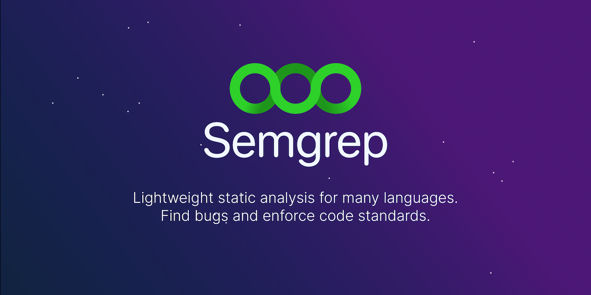

---

^ How do you get started? Let look on the example here, there is an online SemGrep tool to create custom rule and having such rule that check for any API that open to public is just such easy! _____ This is a very powerful way to tag our resources once and having better desicions ahead on time when we need to get them in OPA.

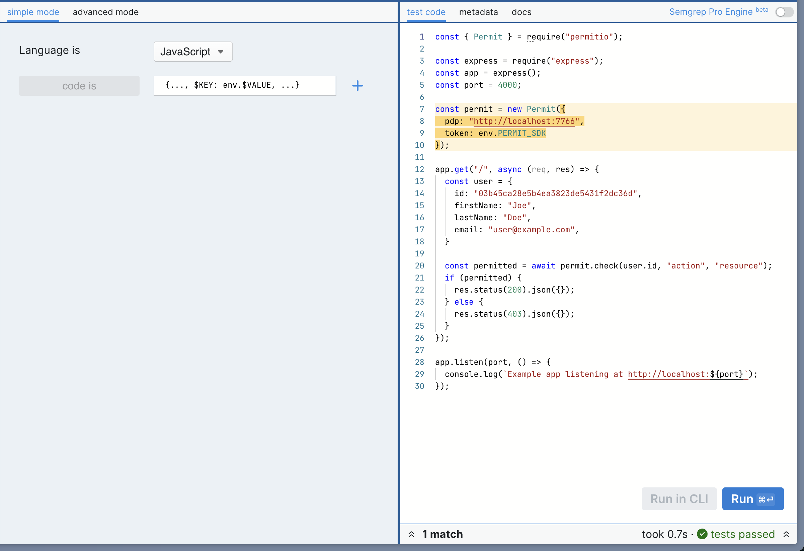

<br>
<br>
<br>


---

^ Something feels strange, right? On one hand, I'm saying that we don't want to run extensive checks and tests on the resource for every decision, and on the other, he gets very sophisticated attributes on the code. and you are correct. This is where we need to add an administration layer for our policy agents.


---

^ Policy administration layer solutions like opal (which is an OSS tool we backed at Permit) came into place because they allow you to manage easily the data in OPA.


# OPAL
## Open Policy Administration Layer

---

^ The architecture of OPAL is fairly simple, it has a client sitting in the same container as the agent itself and a server that uses fetchers to get the right data into the different clients. This way, we can make sure all the data that we collected along the way of our asynchronous pipeline is kept for us to the stage where we will need this data.

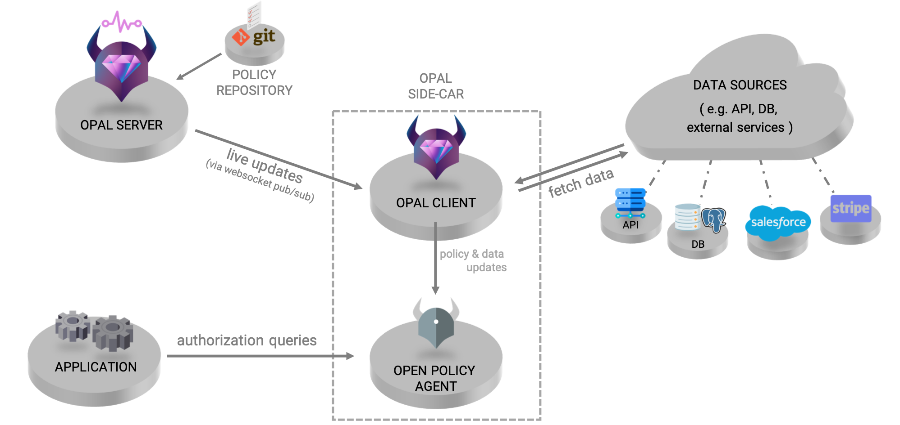

---

^ Using OPAL together with OPA over our GitOps architecture gives us a very powerful pipeline that balances the security decision and the velocity of our deployment capabilities.

#  OPA + OPAL + GitOps = :purple_heart:

---

^ Now, let's get back to the answers I've got. If you had one thing to do for better application security? I know what's in your head now, we would add better authorization in the deployment.


---

^ Thank you for listening, Bye!

[.header: alignment(left)]


<br>
<br>
# Thank You :pray:
## Show your love to OPAL with a GitHub Star :star: :point_right:
### Find more about OPAL on opal.ac
#### Follow me on Twitter @gemanor