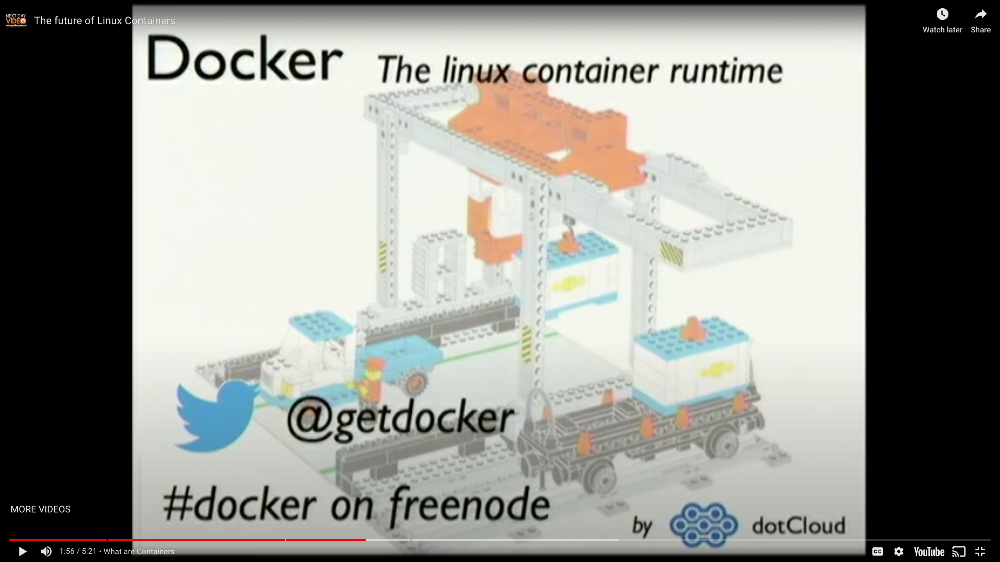
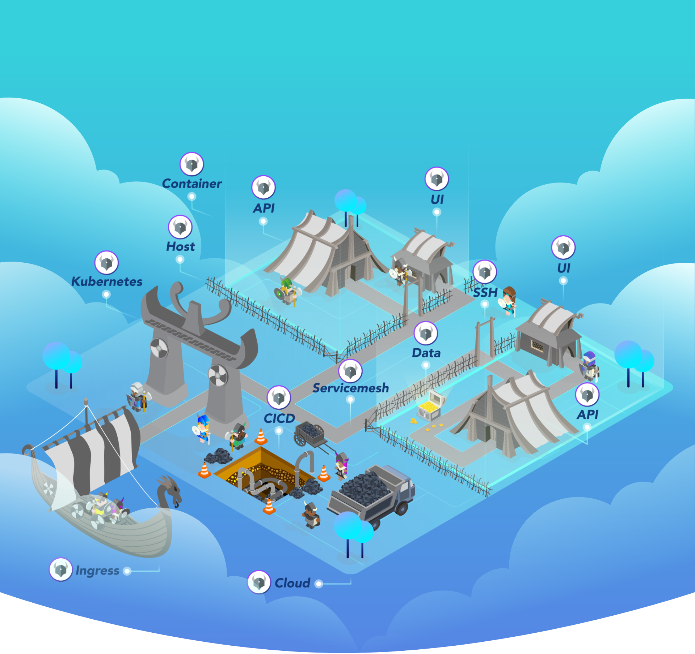

theme: Plain Jane
footer: 
slide-transition: true

[.header: alignment(left)]

^ Welcome
Thanks to Liran and Yoav

<br>
<br>
<br>
# OPAL: The Open Source GitOps Enabled Platform
## Gabriel L. Manor


---

[.footer: ]
[.header: alignment(left)]


^ Talk about my job, what I'm doing, OSS, Permit as a company, GTM
Next: I have some questions

<br>
<br>
<br>
<br>

## Gabriel L. Manor
### Director of DevRel @ Permit.io
#### Not an ethical hacker, zero awards winner, dark mode hater.

---

^ Start with docker questienray
Who don't know what Docker is?
Is there somone who never run Docker command?
Everyone knows what is docker
Is it a public company?
Is it a decacorn?
Is it above 5b$?


---

^ A news piece about Docker funding in 2022


---

[.footer: ]

^ To understand why docker fail in their GTM let's go back in 2013, the cloud start to grow in traditional companies
The cost of installations, VM, was cut together with the automate CI/CD



---

^ The problem that docker solved, is running everywhere I want it to work everywhere


---

^ The process of paying for installations, operations, integrations, reduced to zero. But docker inc. continued to do it


---

^ Docker model called open core, mean you're main IP is open and you buy license
Open core creates cannibilization. Selling software not as a service, is not just bad, it is worth when you cannibalize yourself

# open core

---

^ Other companies like MongoDB and Elastic, succeed with their open core because they we're always aware for the *service* they sell and not the license or the product.

<br>
<br>


---

^ Docker tried this approach too with Docker swarm, but failed as it was too late, too small, documented bad and, they haven't any deep pockets for cloud infrastructure to sell that service.


--- 

^ This is the reason why k8s took over, because google has the good operational infrastructure to promote it with their GCP offering.


---

^ What we can learn from that? Open core is dead. So what would work? Open Foundation, let me share our case there.

# ~~Open Core~~
# Open Foundation

---

^ This is the key for open foundation, open everything from your granular stuff.
How to do Open Foundation?
## Be Authentic
## Avoid conflicts of interest
## Make the project independent

---

^ Access control affect many apsects of the software development landscape. Application, Adminssion, Infrastructure, IT, Hardware

[.header: alignment(left), color(#9B5EE5)]
[.build-lists: true]

# Access Control

- Applications
- Admissions
- Infrastructure
- IT
- Hardware

---

^ Policy engine, is the trouble maker of every access control product, while the real value comes from other components of the software

[.header-strong: Avenir Next Regular, color(#9B5EE5)]

# **Data** > Decision > **Enforcement**

---

^ Open policy agent solved the problem with two components. Rego / Policy as Code and Agents.

[.header: alignment(left)]
<br>

[.column]
## Agent


[.column]
## Policy as Code
```lua
allowed := {"customer", "admin"}

allow {
    every role in input.roles {
        role.name in allowed
    }
}
```

---

^ Open policy agent becomes a very popular among CNCF project and k8s admissions



---

^ an 18m ago, Or and Asaf decided to build a commercial product for Authoirzaiton as a service


---

^ Instead of build yourself, never build permissions again


---

^ Stareted develop around OPA, but found they can take the granularity one step foreward
Show the OPAL diagram that add administration layer on top of OPA


---

^ The usage starts grow


---

^ Large users started to use OPAL

<br>
<br>
<br>


---

^ We see that many OPA community questions became somehting that we solve with OPAL


---

^ Here are the keys to convince your manager to do OSS

# What have we learned so far?

---

^ Community
Engagement

# 🪢 Community

---

^ Content
Organic
SEO
Not only devtools, APIs, employee branding

# 📓 Content

---

^ Growth Channel
Conversion
Paid subscriptions
Take time, do not cannibalize

# 🌱 Growth Channels

---

^ Large Customers

# 🦄 Users

---

^ Engineering Branding

# 👾 Engineering Happiness

---

^ Market acceleration

# 🚀 Trend Acceleration

---

^ How do I measure OSS? Topic for next talk. GitHub stars


---

[.header: alignment(left)]


<br>
<br>
# Thank You :pray:
## Show your love to OPAL with a GitHub Star :star: :point_right:
### Find more about OPAL on opal.ac
#### Follow me on Twitter @gemanor